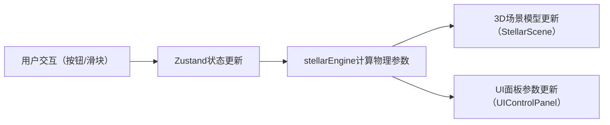

## 1. 产品概述
恒星生命周期3D交互可视化应用，面向天文教育场景，通过沉浸式三维交互帮助学生直观理解恒星从星云到致密天体的完整演化路径。
- 核心价值：将抽象的天体物理概念转化为可交互、可探索的3D可视化体验，解决传统教材静态图片难以展示动态演化过程的痛点
- 目标用户：天文教育者、初高中及大学天文课程学生、天文爱好者

## 2. 核心功能

### 2.1 用户角色
| 角色 | 使用方式 | 核心需求 |
|------|----------|----------|
| 教育者/学生 | 浏览器交互演示 | 清晰的阶段划分、实时物理参数展示、流畅的过渡动画 |

### 2.2 功能模块
1. **主场景页面**：3D恒星演化场景、阶段控制按钮、物理参数面板、时间轴滑块、致密天体对比模式

### 2.3 页面详情
| 页面名称 | 模块名称 | 功能描述 |
|-----------|-------------|---------------------|
| 主场景 | 3D恒星场景 | Three.js渲染的恒星模型、星云粒子系统、光晕特效、自动旋转、超新星爆炸粒子特效 |
| 主场景 | 阶段控制按钮 | 垂直排列的圆形图标按钮（星云/主序星/红巨星/超新星/致密天体），当前阶段脉冲发光动画，点击切换阶段 |
| 主场景 | 物理参数面板 | 右侧半透明卡片，实时显示温度（开尔文+渐变色条）、光度（L☉）、半径（R☉），数值翻牌动画 |
| 主场景 | 时间轴滑块 | 底部渐变色轨道，白色圆点滑块，拖拽显示百万年时间标签 |
| 主场景 | 致密天体对比 | 点击对比按钮，并排显示白矮星/中子星/黑洞3D模型，点击弹出详细数据卡片 |

## 3. 核心流程
用户通过左侧阶段按钮或底部时间轴选择恒星演化阶段 → 状态管理更新当前阶段 → 恒星物理引擎计算该阶段的温度、光度、半径等参数 → 3D场景更新模型材质、大小、粒子特效和旋转速度 → 右侧UI面板实时更新物理参数读数

## 4. 用户界面设计

### 4.1 设计风格
- **主色调**：深空背景 #0a0e27，星云紫 #7b68ee，主序金 #ffd700，红巨星红 #dc143c，超新星橙 #ff8c00，致密银灰 #c0c0c0
- **按钮风格**：圆形图标按钮，当前阶段外圈脉冲发光动画（透明度0.3→0.8循环）
- **字体**：采用现代无衬线字体，数字显示等宽字体
- **布局风格**：桌面端左右分栏+底部时间轴，移动端垂直堆叠
- **动效**：阶段切换2秒平滑过渡，超新星3秒粒子爆炸特效，参数数值0.5秒翻牌动画

### 4.2 页面设计概述
| 页面名称 | 模块名称 | UI元素 |
|-----------|-------------|-------------|
| 主场景 | 3D场景区域 | 占据85%宽度，深空背景，居中恒星模型，自动旋转，星云粒子环绕 |
| 主场景 | 左侧阶段控制 | 垂直排列5个圆形彩色按钮，带脉冲选中态 |
| 主场景 | 右侧参数面板 | 半透明圆角卡片 rgba(255,255,255,0.1)，三项水平渐变长条图 |
| 主场景 | 底部时间轴 | 紫→银灰渐变轨道，白色圆点滑块，拖拽显示时间标签 |
| 主场景 | 致密天体对比层 | 三栏并排模型，点击浮层详细卡片 |

### 4.3 响应式设计
- 桌面端（>768px）：3D场景主体，左侧按钮栏，右侧参数面板，底部时间轴
- 移动端（≤768px）：所有组件垂直堆叠，尺寸整体缩小，触控优化

### 4.4 3D场景指导
- **环境**：纯深空黑色背景，添加远处星空粒子点缀
- **光照**：以恒星自发光为主，辅以弱环境光确保场景可见
- **相机**：透视相机，默认距离居中，允许轨道缩放旋转
- **动画**：恒星自动旋转（阶段不同速度不同），超新星阶段快速旋转+爆炸粒子扩散带拖尾
- **后处理**：发光效果（Bloom）增强恒星和粒子的光感，吸积盘使用自定义Shader
- **性能**：60FPS基准，超新星粒子特效不低于45FPS，物理计算单次<5ms
