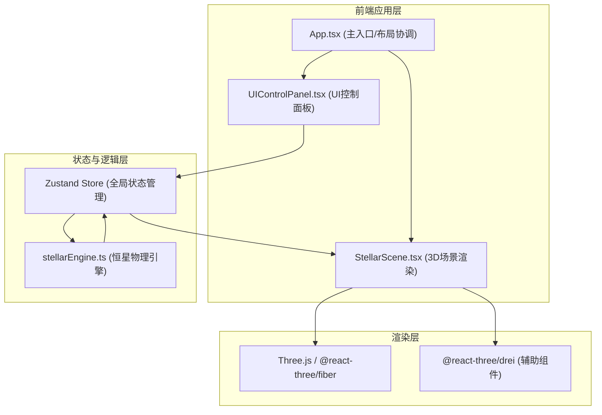

## 1. 架构设计


## 2. 技术描述
- **前端框架**：React 18 + TypeScript（严格模式）
- **构建工具**：Vite（配置路径别名 @ → src）
- **3D渲染**：Three.js + @react-three/fiber + @react-three/drei
- **状态管理**：Zustand
- **其他依赖**：uuid（唯一标识生成）
- **样式方案**：原生CSS + CSS变量，响应式布局

## 3. 文件结构与调用关系
```
项目根目录/
├── package.json              # 依赖与脚本配置
├── vite.config.js            # Vite构建配置（路径别名）
├── tsconfig.json             # TypeScript严格模式配置
├── index.html                # 入口页面，React挂载点
└── src/
    ├── App.tsx               # 应用主入口，布局管理
    │   ├── 引入 StellarScene.tsx
    │   ├── 引入 UIControlPanel.tsx
    │   └── 引入 useStellarStore
    ├── core/
    │   └── stellarEngine.ts  # 纯TS恒星物理引擎
    │       ├── 输入：阶段标识/时间进度
    │       ├── 输出：物理参数（温度/光度/半径）+ 特效信号
    │       └── 被 Zustand Store 调用
    ├── store/
    │   └── useStellarStore.ts # Zustand全局状态
    │       ├── 持有当前阶段、时间、物理参数
    │       ├── 调用 stellarEngine 计算
    │       └── 被 App.tsx / 组件订阅
    └── components/
        ├── StellarScene.tsx  # 3D场景（R3F）
        │   ├── 恒星模型（Sphere + ShaderMaterial）
        │   ├── 星云粒子系统（Points）
        │   ├── 超新星爆炸粒子
        │   ├── 致密天体模型（白矮星/中子星/黑洞+吸积盘）
        │   └── 订阅 useStellarStore 更新渲染
        └── UIControlPanel.tsx # 2D UI控制面板
            ├── 阶段选择按钮组
            ├── 时间轴滑块
            ├── 物理参数读数卡片
            ├── 致密天体对比模式
            └── 调用 useStellarStore 触发状态变更
```

## 4. 数据模型
### 4.1 恒星演化阶段枚举
```typescript
type StellarPhase = 'nebula' | 'mainSequence' | 'redGiant' | 'supernova' | 'compact';
type CompactType = 'whiteDwarf' | 'neutronStar' | 'blackHole';
```

### 4.2 物理参数结构
```typescript
interface StellarPhysics {
  temperature: number;      // 开尔文 K
  luminosity: number;       // 太阳光度 L☉
  radius: number;           // 太阳半径 R☉
  color: string;            // 对应温度的颜色
  rotationSpeed: number;    // 旋转速度系数
}
```

### 4.3 全局状态
```typescript
interface StellarState {
  currentPhase: StellarPhase;
  timeProgress: number;     // 0~1 总演化时间进度
  transitionProgress: number; // 0~1 阶段过渡动画进度
  physics: StellarPhysics;
  isSupernovaExploding: boolean;
  showCompactComparison: boolean;
  selectedCompact: CompactType | null;
  setPhase: (phase: StellarPhase) => void;
  setTimeProgress: (progress: number) => void;
  triggerSupernova: () => void;
  toggleCompactComparison: () => void;
  selectCompact: (type: CompactType | null) => void;
}
```

## 5. 核心算法
### 5.1 恒星物理参数计算（stellarEngine）
- **星云阶段**：温度低(~20K)，半径极大，光度极低
- **主序星阶段**：温度~5800K（太阳型），半径1 R☉，光度1 L☉
- **红巨星阶段**：温度降低(~3500K)，半径膨胀~100 R☉，光度~2000 L☉
- **超新星阶段**：温度剧增(~100000K)，短时半径膨胀，光度爆发式增长
- **致密天体**：
  - 白矮星：温度高(~10000K)，半径极小(~0.01 R☉)，光度低
  - 中子星：温度极高(~10^6 K)，半径极小(~10^-5 R☉)
  - 黑洞：无温度/光度，事件视界半径定义

### 5.2 温度-颜色映射
使用黑体辐射近似：从红(2000K)→橙黄→白→蓝(30000K)的渐变

## 6. 性能优化策略
- **粒子系统**：使用 BufferGeometry + PointsMaterial，避免逐粒子DOM操作
- **过渡动画**：requestAnimationFrame 线性插值，单帧计算<5ms
- **状态更新**：Zustand 选择性订阅，避免不必要的重渲染
- **3D材质**：复用 ShaderMaterial，减少 WebGL 上下文切换
- **响应式**：CSS Media Query + 自适应尺寸，移动端降低粒子数量
