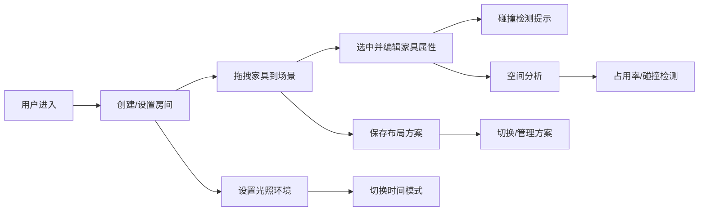

## 1. 产品概述

空间家具布局与光照模拟应用，帮助建筑师和室内设计师在三维空间中快速布置和调整家具布局，并进行实时光照模拟，解决传统二维方案难以直观感受空间比例、家具尺寸与环境不匹配、以及光照对室内氛围影响难以预测的问题。

### 1.1 目标用户
- 建筑师
- 室内设计师
- 家装设计师

### 1.2 核心价值
- 三维可视化直观呈现空间布局
- 实时家具调整与碰撞检测
- 多时段光照环境模拟
- 方案保存与空间分析

## 2. 核心功能

### 2.1 功能模块

| 模块名称 | 功能描述 |
|---------|---------|
| 3D房间与家具管理 | 创建自定义房间，从家具库拖拽放置家具，支持吸附网格与放置动画 |
| 家具属性编辑 | 位置/旋转/缩放/颜色调节，实时平滑过渡，碰撞高亮提示 |
| 光照环境模拟 | 虚拟窗户与室内灯具，色温/亮度调节，四时段光照模式切换 |
| 布局保存与空间分析 | 多方案保存切换，家具占用率仪表盘，碰撞检测与定位 |

### 2.2 页面详情

| 页面名称 | 模块名称 | 功能描述 |
|---------|---------|---------|
| 主场景页 | 3D场景区 | Three.js渲染房间、家具、光照，支持视角控制 |
| 主场景页 | 左侧家具库 | 家具分类图标列表，支持拖拽添加到场景 |
| 主场景页 | 右侧属性面板 | 选中家具的参数调节，默认收起，悬停展开 |
| 主场景页 | 顶部导航栏 | 面包屑导航、时间模式切换 |
| 主场景页 | 底部状态栏 | 帧率显示、家具总数、方案管理 |
| 主场景页 | 空间分析面板 | 占用率仪表盘、碰撞列表 |

## 3. 核心流程

### 3.1 家具布置流程
用户进入应用 → 查看/设置房间参数 → 从左侧家具库拖拽家具 → 家具跟随鼠标半透明显示 → 释放鼠标放置（吸附网格+淡入动画）→ 点击选中家具 → 右侧面板调整属性 → 实时更新场景

### 3.2 光照模拟流程
选择时间模式 → 场景光照自动调整 → 添加窗户/灯具 → 调节色温/亮度 → 观察光照效果

### 3.3 方案管理流程
点击保存方案 → 生成房间名+时间戳命名 → 切换方案 → 淡入淡出过渡 → 查看空间分析

## 4. 用户界面设计

### 4.1 设计风格
- **整体风格**：专业工具类应用，深灰侧边栏配浅灰主场景
- **主色调**：深灰#2C2C2C（侧边栏）、浅灰#F5F5F5（主背景）
- **强调色**：淡蓝#4A9EFF（选中态）、红色#FF4A4A（碰撞提示）
- **圆角**：统一4px圆角
- **阴影层级**：卡片阴影 box-shadow: 0 2px 8px rgba(0,0,0,0.1)
- **字体**：无衬线字体，清晰易读
- **图标风格**：线条风格描边，白色图标

### 4.2 页面设计概览

| 页面名称 | 模块名称 | UI元素 |
|---------|---------|-------|
| 主场景页 | 左侧工具栏 | 240px宽，#2C2C2C背景，白色线条图标，选中填充#4A9EFF |
| 主场景页 | 3D场景区 | 浅灰背景，网格地面，可旋转/缩放视角 |
| 主场景页 | 右侧属性面板 | 默认40px宽标签，悬停展开280px，0.3s ease-out动画 |
| 主场景页 | 顶部面包屑 | 房间 > 家具列表 > 当前选中家具 |
| 主场景页 | 底部状态栏 | 帧率、家具总数、方案按钮 |
| 主场景页 | 空间分析仪表盘 | 右下角小圆盘，指针0-100%平滑旋转 |

### 4.3 交互动效
- 家具放置：0.2秒淡入动画
- 属性调整：0.3秒平滑过渡
- 面板展开：0.3秒 ease-out 曲线
- 按钮点击：0.15秒线性缩放（95%→100%）
- 方案切换：1秒淡入淡出
- 碰撞闪烁：2秒红色高亮闪烁
- 滑块交互：拖拽时阴影放大

### 4.4 响应式设计
- **桌面端**（≥900px）：左侧240px工具栏 + 中间场景 + 右侧属性面板
- **移动端**（<900px）：左侧工具栏改为底部60px固定条，图标横向排列32x32px

### 4.5 3D场景指引
- **环境**：根据时间模式切换天空色渐变背景
- **光照**：环境光+方向光模拟自然光，点光源/聚光灯模拟灯具
- **相机**：透视相机，默认45度俯视视角，支持OrbitControls
- **材质**：低多边形风格，MeshStandardMaterial
- **性能**：20家具+4光源时帧率≥45fps
