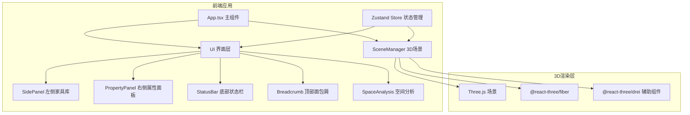

## 1. 架构设计



## 2. 技术描述

### 2.1 技术栈
- **前端框架**：React 18 + TypeScript
- **构建工具**：Vite
- **3D渲染**：Three.js + @react-three/fiber + @react-three/drei
- **状态管理**：Zustand
- **样式方案**：Emotion (CSS-in-JS)
- **唯一ID**：uuid

### 2.2 项目依赖
| 依赖包 | 用途 |
|-------|------|
| react / react-dom | React 框架 |
| @react-three/fiber | Three.js React 渲染器 |
| @react-three/drei | R3F 辅助组件库 |
| three | Three.js 核心库 |
| zustand | 状态管理 |
| uuid | 唯一标识符生成 |
| @emotion/react / @emotion/styled | CSS-in-JS 样式 |

## 3. 目录结构

```
src/
├── main.tsx              # React入口
├── App.tsx               # 主组件，布局管理
├── SceneManager.tsx      # 3D场景管理器
├── FurnitureStore.ts     # Zustand状态仓库
├── UI/
│   ├── SidePanel.tsx     # 左侧家具库面板
│   ├── PropertyPanel.tsx # 右侧属性面板
│   ├── StatusBar.tsx     # 底部状态栏
│   ├── Breadcrumb.tsx    # 顶部面包屑
│   └── SpaceAnalysis.tsx # 空间分析组件
└── components/
    ├── furniture/        # 家具3D模型组件
    └── controls/         # UI控制组件
```

## 4. 数据模型

### 4.1 家具数据模型
```typescript
interface Furniture {
  id: string;
  type: 'sofa' | 'table' | 'desk' | 'chair' | 'bed' | 'lamp' | 'plant';
  position: { x: number; y: number; z: number };
  rotation: { x: number; y: number; z: number };
  scale: number;
  color: string;
}
```

### 4.2 房间参数模型
```typescript
interface RoomParams {
  dimensions: { width: number; height: number; depth: number };
  wallColor: string;
  floorTexture: 'wood' | 'tile' | 'carpet';
}
```

### 4.3 光照参数模型
```typescript
interface LightingParams {
  windowSize: { width: number; height: number };
  windowDirection: 'north' | 'south' | 'east' | 'west';
  lamps: Lamp[];
  timeMode: 'morning' | 'noon' | 'evening' | 'night';
}

interface Lamp {
  id: string;
  type: 'ceiling' | 'floor' | 'table';
  position: { x: number; y: number; z: number };
  colorTemp: number; // 2700K - 6500K
  intensity: number; // 0 - 100
}
```

### 4.4 方案模型
```typescript
interface Scheme {
  id: string;
  name: string;
  timestamp: number;
  furniture: Furniture[];
  roomParams: RoomParams;
  lighting: LightingParams;
}
```

## 5. Store 方法定义

### FurnitureStore
- `furniture: Furniture[]` - 家具列表
- `selectedId: string | null` - 当前选中家具ID
- `roomParams: RoomParams` - 房间参数
- `lighting: LightingParams` - 光照参数
- `schemes: Scheme[]` - 保存的方案列表
- `addFurniture(type, position)` - 添加家具
- `updateFurniture(id, updates)` - 更新家具属性
- `removeFurniture(id)` - 删除家具
- `selectFurniture(id)` - 选中家具
- `saveScheme(name)` - 保存当前布局为方案
- `loadScheme(id)` - 加载方案
- `detectCollisions()` - 检测碰撞
- `calculateOccupancy()` - 计算家具占用面积

## 6. 性能优化

1. **InstancedMesh**：同类家具使用实例化网格
2. **按需渲染**：仅在状态变化时触发重渲染
3. **阴影优化**：使用柔和阴影贴图，限制阴影距离
4. **LOD**：远处家具使用简化模型
5. **内存管理**：及时清理Three.js资源
6. **React 优化**：使用 memo、useMemo、useCallback 减少重渲染
