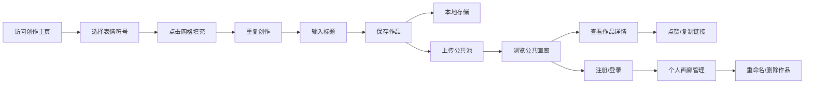

## 1. 产品概述

一个基于Web的在线表情符号像素画生成器，允许用户在16x16网格画布上使用预置表情符号（笑脸、爱心、星星、动物、食物等）作为像素块，自由拼贴创作独特的像素画作品，支持本地保存、作品分享和公共画廊浏览。

- 主要面向喜欢创意涂鸦、像素艺术、表情符号爱好者的普通互联网用户
- 产品价值：提供零门槛的创意表达工具，通过表情符号的趣味性降低艺术创作门槛，打造社交分享的社区氛围

## 2. 核心功能

### 2.1 用户角色

| 角色 | 注册方式 | 核心权限 |
|------|----------|----------|
| 访客用户 | 无需注册 | 使用画布创作、浏览公共画廊、保存作品到本地 |
| 注册用户 | 昵称+预设头像选择 | 访客全部权限 + 上传作品到公共池、管理个人画廊、点赞作品 |

### 2.2 功能模块

1. **创作主页面**：表情符号选择工具栏、16x16像素网格画布、当前选中表情预览、标题输入与保存
2. **公共画廊页面**：横向瀑布流作品卡片展示、作品详情页、点赞与复制分享链接
3. **个人画廊页面**：用户注册登录入口、个人作品网格列表、作品重命名/删除管理

### 2.3 页面详情

| 页面名称 | 模块名称 | 功能描述 |
|----------|----------|----------|
| 创作主页 | 表情选择工具栏 | 分类展示表情（笑脸黄/爱心粉/星星金/动物棕/食物橙），悬停放大光晕，选中脉冲虚线圈动画 |
| 创作主页 | 16x16像素网格 | Canvas渲染，点击填充表情，涟漪扩散动画(0.25s)，半透明分割线，填充后白底 |
| 创作主页 | 选中表情预览 | 右侧大号展示当前选中表情 |
| 创作主页 | 标题与保存 | 30字符限制圆角输入框+画笔图标，焦点渐变蓝下划线流动，保存至本地+公共池 |
| 公共画廊 | 瀑布流卡片 | 圆角米白卡片，悬停上浮3px加深阴影，展示缩略图/标题/作者 |
| 公共画廊 | 作品详情页 | 大图展示、爱心弹性点赞动画、复制链接绿色对勾提示(0.8s) |
| 个人画廊 | 用户注册 | 昵称输入+12个卡通动物圆形头像选择，选中头像旋转彩色虚线环(1s) |
| 个人画廊 | 作品管理 | 网格展示+创建日期/点赞数，重命名，删除确认框(半透明覆盖+圆角卡片+向下折叠动画) |

## 3. 核心流程

用户打开创作主页 → 从左侧工具栏选择表情符号 → 在中央16x16网格上点击填充（可重复选择不同表情）→ 输入作品标题 → 点击保存按钮（本地持久化+上传公共池）→ 导航至公共画廊浏览他人作品 → 点击作品卡片进入详情页点赞/分享 → 注册账号后进入个人画廊管理自己的作品

## 4. 用户界面设计

### 4.1 设计风格

- **主色调**：浅蓝到浅粉的渐变底色 (#E0F4FF → #FFE4EC)
- **卡片毛玻璃**：半透明白色 (rgba(255,255,255,0.75))，背景模糊10px，边框微白 (rgba(255,255,255,0.8))
- **表情分类色**：笑脸类 #FFE066、爱心类 #FFB6C1、星星类 #FFD700、动物类 #D4A574、食物类 #FFCC99
- **按钮样式**：柔和圆角（12-16px），悬停过渡 0.2-0.3s 缓动
- **字体**：标题使用 "Nunito" 或 "Quicksand" 圆润无衬线字体，正文使用系统无衬线体
- **图标风格**：使用系统原生 Emoji，圆形图标背景按分类着色

### 4.2 页面设计概述

| 页面名称 | 模块名称 | UI元素 |
|----------|----------|--------|
| 创作主页 | 表情工具栏 | 错落排列左对齐，圆形图标，悬停放大1.15倍+光晕，选中脉冲虚线圈0.6s |
| 创作主页 | 网格画布 | 居中布局，格子分割线 #E5E7EB (半透明)，空格底色 #F9FAFB，填充后白底 |
| 创作主页 | 表情预览区 | 右侧固定区域，大号显示，毛玻璃卡片 |
| 公共画廊 | 瀑布流卡片 | 米白 #FFFBF5 圆角16px，阴影 0 4px 20px rgba(0,0,0,0.06)，悬停 translateY(-3px) 阴影加深 |
| 公共画廊 | 详情页 | 半透明遮罩，大图居中，爱心按钮弹性动画 (scale 0.8 → 1) |
| 个人画廊 | 头像选择 | 12个圆形头像网格，选中时彩色虚线环旋转1s渐隐 |
| 个人画廊 | 删除确认 | 全屏半透明 rgba(0,0,0,0.4)，圆角卡片，红色删除按钮 + 灰色取消按钮，点击删除后高度折叠动画 |

### 4.3 响应式

- 桌面端优先设计（1280px+）
- 平板端（768-1024px）：表情工具栏改为顶部水平滚动，画布居中缩小，预览区移至底部
- 移动端（<768px）：单列布局，网格画布自适应宽度，触摸优化点击区域

### 4.4 性能要求

- 画布操作帧率 ≥ 50fps
- 表情填充涟漪动画使用 Canvas requestAnimationFrame
- 毛玻璃效果使用 CSS backdrop-filter，必要时降级为半透明纯色
- 公共画廊瀑布流使用虚拟滚动（作品数量>50时）
