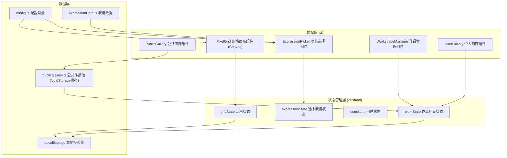
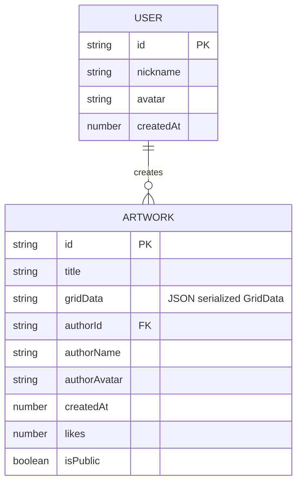

## 1. 架构设计



## 2. 技术描述

- **前端框架**：React 18 + TypeScript（严格模式）
- **构建工具**：Vite 5.x
- **状态管理**：Zustand 4.x
- **图形渲染**：HTML5 Canvas API（requestAnimationFrame 动画）
- **路由**：React 状态驱动视图切换（无需 react-router，SPA 单页面内切换）
- **唯一ID**：uuid 9.x
- **样式方案**：CSS Modules + 内联样式（动态样式）
- **数据持久化**：localStorage API（模拟后端）
- **字体**：Google Fonts - Nunito（标题圆润字体）

## 3. 视图路由（状态驱动）

| 视图标识 | 页面用途 | 切换方式 |
|----------|----------|----------|
| VIEW_CREATE | 创作主页：表情选择+网格画布+保存 | 导航栏"创作"按钮 |
| VIEW_GALLERY | 公共画廊：瀑布流作品展示 | 导航栏"画廊"按钮 |
| VIEW_DETAIL | 作品详情：大图+点赞+分享 | 点击画廊卡片 |
| VIEW_PROFILE | 个人画廊：注册+我的作品管理 | 导航栏"我的"按钮 |

## 4. 核心类型定义

```typescript
// 表情类型
interface ExpressionItem {
  id: string;
  emoji: string;
  category: 'smile' | 'heart' | 'star' | 'animal' | 'food';
  label: string;
}

// 格子数据
type GridCell = string | null; // expression id or null
type GridData = GridCell[][]; // [row][col]

// 作品
interface Artwork {
  id: string;
  title: string;
  gridData: GridData;
  authorId: string;
  authorName: string;
  authorAvatar: string;
  createdAt: number;
  likes: number;
  isPublic: boolean;
}

// 用户
interface User {
  id: string;
  nickname: string;
  avatar: string; // emoji string
  createdAt: number;
}
```

## 5. 数据模型



### 5.1 本地存储键名

| Key | 数据结构 | 说明 |
|-----|----------|------|
| `emoji_art_user` | `User \| null` | 当前登录用户 |
| `emoji_art_my_works` | `Artwork[]` | 个人作品列表 |
| `emoji_art_public_works` | `Artwork[]` | 公共作品池（含预置示例作品） |
| `emoji_art_liked_{workId}` | `boolean` | 是否已点赞某作品 |

## 6. 文件结构

```
auto160/
├── package.json
├── index.html
├── vite.config.js
├── tsconfig.json
└── src/
    ├── main.tsx              # React 入口
    ├── App.tsx               # 主组件（视图路由+导航栏）
    ├── App.css               # 全局样式（渐变背景、毛玻璃、字体）
    ├── config/
    │   └── config.ts         # 配置常量（网格尺寸、颜色、动画时长）
    ├── expressionPicker/
    │   ├── expressionData.ts # 表情数据定义
    │   ├── index.tsx         # 表情选择工具栏组件
    │   └── styles.module.css # 表情组件样式
    ├── pixelGrid/
    │   ├── gridState.ts      # Zustand 网格状态 Store
    │   ├── index.tsx         # Canvas 网格画布组件
    │   └── styles.module.css # 网格组件样式
    ├── workspaceManager/
    │   ├── publicGallery.ts  # 公共作品池数据模块
    │   ├── index.tsx         # 作品管理组件（保存/分享/删除/点赞）
    │   └── styles.module.css # 管理组件样式
    ├── userProfile/
    │   ├── avatars.ts        # 12个预设头像数据
    │   ├── index.tsx         # 用户注册+个人画廊组件
    │   └── styles.module.css # 用户组件样式
    ├── gallery/
    │   ├── index.tsx         # 公共画廊瀑布流组件
    │   ├── detail.tsx        # 作品详情弹窗组件
    │   └── styles.module.css # 画廊组件样式
    └── store/
        └── useAppStore.ts    # 全局应用状态（视图切换、用户信息）
```

## 7. 性能优化策略

1. **Canvas 渲染优化**：
   - 使用离屏 Canvas（OffscreenCanvas）预渲染表情符号
   - 脏矩形重绘：仅重绘发生变化的格子及其涟漪动画区域
   - 涟漪动画使用 requestAnimationFrame，独立于 React 渲染

2. **状态优化**：
   - Zustand selector 避免不必要的组件重渲染
   - 网格状态变更仅触发 Canvas 重绘，不触发组件树 reconciliation

3. **列表渲染**：
   - 公共画廊作品卡片使用 React.memo
   - 超过50件作品时使用 IntersectionObserver 实现懒加载

4. **CSS 优化**：
   - 使用 transform / opacity 做动画，不触发 layout/paint
   - 毛玻璃效果 will-change: backdrop-filter 浏览器优化提示
