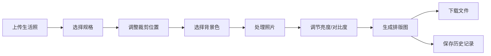

## 1. 产品概述

证件照工坊是一款线上证件照自动生成与排版应用，用户上传普通生活照后，系统自动识别并裁剪出符合规范的证件照，支持背景更换、亮度对比度调节，并生成可打印的A4纸排版图。

- 目标用户：需要快速制作标准证件照的个人用户
- 核心价值：省去线下照相馆的繁琐流程，在家即可生成符合各类规格的专业证件照

## 2. 核心功能

### 2.1 功能模块
1. **照片上传模块**：支持点击和拖拽上传 JPEG/PNG 格式生活照
2. **规格选择模块**：一寸、二寸、护照、签证四种标准规格
3. **照片编辑模块**：智能裁剪、背景色更换、亮度/对比度调节
4. **排版生成模块**：自动计算A4纸排版，生成高分辨率打印图
5. **历史记录模块**：本地保存最近20条生成记录

### 2.3 页面详情

| 页面名称 | 模块名称 | 功能描述 |
|---------|---------|---------|
| 主应用 | 导航栏 | 深灰色导航，包含应用名称和上传/编辑/排版/历史导航链接 |
| 主应用 | 上传区域 | 拖拽/点击上传区域，上传后显示缩略图 |
| 主应用 | 规格选择 | 下拉选择证件照规格，预览裁剪框比例 |
| 主应用 | 编辑区域 | 裁剪框拖动、背景色选择、亮度对比度滑杆 |
| 主应用 | 排版预览 | A4排版图缩略预览，支持下载 |
| 主应用 | 历史记录 | 20条历史记录卡片，点击可重新查看下载 |

## 3. 核心流程

用户上传生活照 → 选择证件照规格 → 调整裁剪位置 → 选择背景色 → 点击处理照片 → 调节亮度对比度 → 生成排版图 → 下载高分辨率文件

## 4. 用户界面设计

### 4.1 设计风格
- **主色调**：蓝紫渐变（#4F46E5 到 #7C3AED）
- **文字颜色**：深灰（#1E293B）
- **背景色**：浅灰（#F8FAFC）
- **卡片样式**：白色圆角卡片（border-radius: 12px, box-shadow: 0 4px 6px rgba(0,0,0,0.05)）
- **按钮样式**：圆角 8px，点击缩放 95% 弹回动画
- **字体**：现代无衬线字体，清晰专业

### 4.2 页面设计概览

| 页面名称 | 模块名称 | UI元素 |
|---------|---------|--------|
| 主应用 | 导航栏 | 64px高，深灰背景，白色文字，下划线悬停动画 |
| 主应用 | 上传卡片 | 拖拽区域，虚线边框，上传缩略图 |
| 主应用 | 编辑卡片 | 裁剪框（蓝色虚线/实线脉冲光晕），背景色色块，滑杆 |
| 主应用 | 排版卡片 | A4预览缩略图，浅灰留白，下载按钮渐变蓝紫 |
| 主应用 | 历史卡片 | 150x200px缩略图卡片，悬停上浮5px |

### 4.3 响应式设计
- 桌面端：多列卡片布局，最大宽度 1200px
- 移动端（<768px）：单列布局，卡片自适应宽度，按钮和滑杆文字缩小

### 4.4 动效设计
- 加载圆环：渐变蓝紫旋转，1.5秒一圈
- 裁剪框选中：蓝色实线 + 脉冲光晕
- 背景色色块：悬停上浮阴影，选中旋转虚线环
- 下载按钮：悬停颜色反转，箭头右移动画
- 滑杆滑块：圆形带阴影，拖拽放大1.1倍 + 光晕
