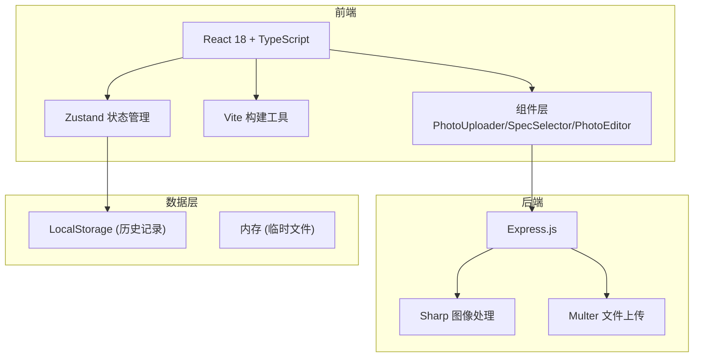

## 1. 架构设计



## 2. 技术说明

- **前端**：React 18 + TypeScript + Vite
- **状态管理**：Zustand
- **后端**：Express 4
- **图像处理**：Sharp
- **文件上传**：Multer
- **跨域**：CORS
- **ID生成**：UUID

## 3. 文件结构

```
.
├── package.json
├── index.html
├── vite.config.js
├── tsconfig.json
├── src/
│   ├── main.tsx
│   ├── App.tsx
│   ├── store.ts
│   ├── api.ts
│   ├── types.ts
│   └── components/
│       ├── PhotoUploader.tsx
│       ├── SpecSelector.tsx
│       └── PhotoEditor.tsx
└── server/
    └── server.js
```

## 4. API 定义

### 4.1 上传照片
- **POST** `/api/upload`
- Request: `multipart/form-data` (file: JPEG/PNG)
- Response: `{ id: string, previewUrl: string, width: number, height: number }`

### 4.2 处理照片（裁剪+换背景）
- **POST** `/api/process`
- Request:
```typescript
{
  imageId: string,
  spec: 'one-inch' | 'two-inch' | 'passport' | 'visa',
  cropArea: { x: number, y: number, width: number, height: number },
  backgroundColor: string,
  brightness: number,
  contrast: number
}
```
- Response: `{ id: string, photoUrl: string }`

### 4.3 生成排版图
- **POST** `/api/layout`
- Request:
```typescript
{
  photoId: string,
  spec: 'one-inch' | 'two-inch' | 'passport' | 'visa'
}
```
- Response: `{ id: string, layoutUrl: string, cols: number, rows: number }`

### 4.4 下载文件
- **GET** `/api/download/:id`
- Response: 二进制 JPEG 文件 (300dpi)

## 5. 证件照规格定义

| 规格标识 | 名称 | 尺寸(mm) | DPI下像素(300dpi) |
|---------|-----|---------|-----------------|
| one-inch | 一寸 | 25x35 | 295x413 |
| two-inch | 二寸 | 35x49 | 413x579 |
| passport | 护照 | 33x48 | 390x567 |
| visa | 签证 | 35x45 | 413x531 |

## 6. A4排版计算

- A4尺寸：210x297mm (2480x3508px @300dpi)
- 外边距：5mm
- 照片间距：2mm
- 计算公式：`cols = floor((210 - 2*5 + 2) / (width_mm + 2))`
- 例如：一寸照可排 8行 x 4列 = 32张

## 7. 数据模型

### 7.1 状态管理 (Zustand Store)
```typescript
interface PhotoState {
  originalImage: { id: string; url: string; width: number; height: number } | null;
  selectedSpec: PhotoSpec;
  cropArea: { x: number; y: number; width: number; height: number };
  backgroundColor: string;
  brightness: number;
  contrast: number;
  processedPhoto: { id: string; url: string } | null;
  layoutImage: { id: string; url: string; cols: number; rows: number } | null;
  history: HistoryItem[];
  isProcessing: boolean;
}
```

### 7.2 历史记录
```typescript
interface HistoryItem {
  id: string;
  createdAt: number;
  spec: PhotoSpec;
  backgroundColor: string;
  photoUrl: string;
  layoutUrl: string;
  thumbnailUrl: string;
}
```
