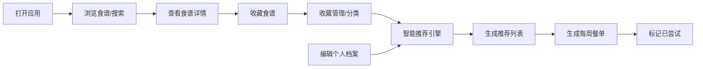

## 1. 产品概述
线上食谱收藏与智能推荐应用，帮助用户搜索、收藏和管理食谱，并基于口味偏好提供个性化推荐和每周餐单定制。解决用户"今天吃什么"的决策难题，提升烹饪体验。

### 1.1 产品目标
- 提供便捷的食谱搜索与筛选体验
- 帮助用户建立个人食谱收藏库
- 通过智能推荐发现新菜品
- 自动化生成每周餐单，减少决策负担

### 1.2 目标用户
- 家庭主妇/主夫
- 烹饪爱好者
- 需要健康饮食管理的人群
- 忙碌的上班族

---

## 2. 核心功能

### 2.1 用户角色
| 角色 | 注册方式 | 核心权限 |
|------|----------|----------|
| 普通用户 | 本地存储（无需注册） | 搜索食谱、收藏管理、查看推荐、生成餐单、编辑个人档案 |

### 2.2 功能模块
1. **首页/搜索页**：食谱搜索、多维度筛选、食谱卡片网格展示
2. **收藏管理页**：已收藏食谱列表、标签分类、拖拽归类
3. **推荐页**：个性化推荐食谱、推荐理由展示
4. **每周餐单页**：7天餐单轮播、已尝试标记
5. **个人档案页**：昵称头像编辑、饮食偏好设置

### 2.3 页面详情
| 页面名称 | 模块名称 | 功能描述 |
|---------|---------|---------|
| 首页/搜索页 | 搜索过滤栏 | 关键词搜索、菜系下拉、烹饪时间滑动条、难度单选，300ms防抖实时更新 |
| 首页/搜索页 | 食谱卡片网格 | 2列布局展示食谱，卡片包含渐变封面、名称、烹饪时间、难度星级、收藏按钮 |
| 首页/搜索页 | 加载更多 | 点击按钮向下展开加载更多食谱，带动画效果 |
| 收藏管理页 | 标签栏 | 横向滚动标签栏，默认标签：家常、宴客、减脂、懒人，支持新建标签 |
| 收藏管理页 | 食谱拖拽归类 | 拖拽食谱到不同标签分类，当前选中标签下划线滑入动画 |
| 推荐页 | 推荐卡片 | 5张推荐卡片，从下方淡入上移动画，显示推荐理由 |
| 每周餐单页 | 7天轮播 | 横向轮播展示7天，每天2张卡片（午餐/晚餐），背景色逐日渐变 |
| 每周餐单页 | 已尝试标记 | 点击标记已尝试，右上角绿色对勾呼吸动画 |
| 个人档案页 | 头像选择 | 6个预设卡通头像，悬停放大1.1倍外发光 |
| 个人档案页 | 饮食偏好 | 多选：素食、无辣、低糖、健身增肌，保存时绿色对勾弹跳动画 |

---

## 3. 核心流程

### 3.1 推荐流程
1. 用户收藏食谱 → 系统分析偏好（菜系、烹饪时间、食材）
2. 用户设置饮食偏好 → 输入到推荐引擎
3. 推荐引擎计算相似度 → 返回Top5推荐
4. 生成每周餐单 → 考虑荤素搭配、耗时限制、避免食材

### 3.2 搜索流程
1. 用户输入关键词/选择筛选条件 → 300ms防抖
2. 发送筛选请求到后端
3. 后端返回匹配结果 → 前端淡入渲染

---

## 4. 用户界面设计

### 4.1 设计风格
- **主背景色**：暖白色（#FFF8F0）
- **主色调**：橙色渐变（#FF6B35 到 #FF8C42）
- **卡片圆角**：16px，浅阴影，hover时阴影加深至8px，上移3px
- **导航栏**：暖色到透明渐变
- **按钮**：默认圆角8px，悬停缩放1.05倍
- **字体**：无衬线字体
- **菜系渐变**：中餐红色系、西餐绿色系、日韩蓝色系、东南亚橙黄色系

### 4.2 动画效果
- 收藏按钮：空心变实心 + 金色光芒扩散（0.4秒）
- 搜索结果：列表项淡入（0.3秒）
- 推荐卡片：从下方淡入上移（0.5秒）
- 标签选中：下划线从左侧滑入（0.2秒）
- 已尝试标记：绿色对勾呼吸动画
- 按钮按下：波纹扩散反馈
- 保存成功：绿色对勾弹跳（0.3秒）

### 4.3 页面设计概览
| 页面名称 | 模块名称 | UI元素 |
|---------|---------|--------|
| 首页 | 搜索过滤栏 | 输入框、下拉菜单、滑动条、单选按钮组 |
| 首页 | 食谱卡片 | 渐变封面、名称、时间、星级、爱心收藏按钮 |
| 收藏页 | 标签栏 | 横向滚动、下划线动画、新建标签按钮 |
| 收藏页 | 食谱网格 | 支持拖拽、2列布局 |
| 推荐页 | 推荐卡片 | 5张卡片、推荐理由、淡入动画 |
| 餐单页 | 日期轮播 | 7天横向排列、背景色渐变 |
| 餐单页 | 餐食卡片 | 午餐/晚餐、已尝试标记、呼吸动画 |
| 档案页 | 头像选择 | 6个头像、悬停放大发光 |
| 档案页 | 偏好设置 | 多选框、保存按钮、成功动画 |

### 4.4 响应式设计
- **桌面端**：2列网格布局，筛选栏完整展示
- **移动端（<768px）**：单列布局，筛选栏改为折叠式汉堡菜单
- **卡片宽度**：自适应屏幕宽度

### 4.5 特殊视觉效果
- 无结果状态：彩色渐变插画 + 友好提示语
- 菜系渐变封面：根据菜系展示不同色系渐变
- 一周背景渐变：周一暖黄 → 周日淡紫

---

## 5. 性能要求
- 首次渲染时间：≤1.5秒
- 滚动帧率：≥30fps
- 搜索响应时间：≤800ms（从请求到渲染完成）
