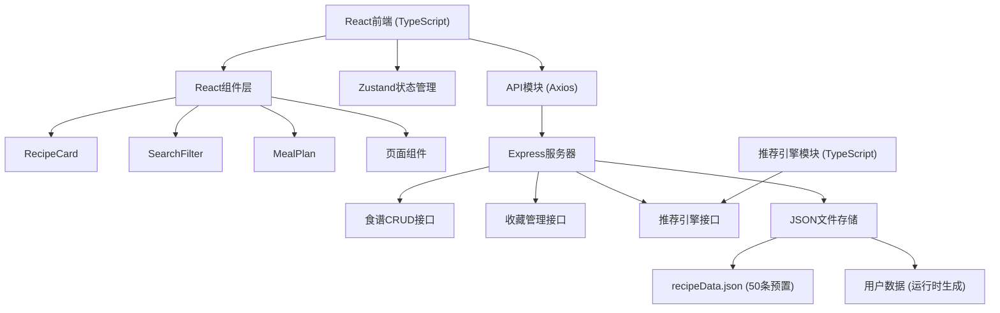

## 1. 架构设计



---

## 2. 技术栈描述

### 2.1 前端技术栈
- **框架**: React 18 + TypeScript
- **构建工具**: Vite
- **状态管理**: Zustand
- **HTTP客户端**: Axios
- **路由**: React Router DOM
- **图标**: Lucide React
- **CSS**: 原生CSS + CSS变量 + 动画关键帧

### 2.2 后端技术栈
- **框架**: Express 4
- **运行时**: Node.js
- **数据存储**: JSON文件持久化
- **CORS**: cors中间件
- **ID生成**: uuid

### 2.3 项目初始化
使用 Vite + React + TypeScript 模板初始化，添加 Express 后端支持。

---

## 3. 路由定义

| 路由 | 页面 | 功能 |
|------|------|------|
| `/` | 首页/搜索页 | 食谱搜索、筛选、展示、收藏 |
| `/favorites` | 收藏管理页 | 已收藏食谱、标签分类、拖拽归类 |
| `/recommendations` | 推荐页 | 个性化推荐食谱展示 |
| `/mealplan` | 每周餐单页 | 7天餐单、已尝试标记 |
| `/profile` | 个人档案页 | 昵称、头像、饮食偏好设置 |

---

## 4. API 定义

### 4.1 类型定义

```typescript
interface Recipe {
  id: string;
  name: string;
  cuisine: '中餐' | '西餐' | '日韩' | '东南亚' | '其他';
  cookTime: number; // 分钟
  mainIngredients: string[];
  difficulty: '简单' | '中等' | '困难';
  imageDescription: string;
  steps: string;
}

interface FavoriteRecipe extends Recipe {
  tags: string[];
  addedAt: string;
}

interface UserProfile {
  nickname: string;
  avatar: string;
  preferences: {
    avoidIngredients: string[];
    maxCookTime: number;
    vegetarian: boolean;
    noSpicy: boolean;
    lowSugar: boolean;
    fitness: boolean;
  };
}

interface MealPlanDay {
  date: string;
  lunch: Recipe;
  dinner: Recipe;
  lunchTried: boolean;
  dinnerTried: boolean;
}

interface RecommendationResult {
  recipe: Recipe;
  score: number;
  reason: string;
}
```

### 4