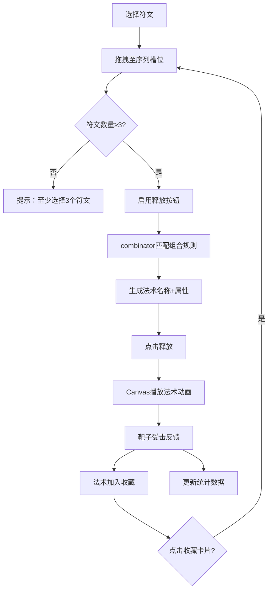

## 1. 产品概述

符文铸造与法术释放模拟器——一款面向独立roguelike游戏的动态法术铭文系统前端应用。玩家可从12种基础符文中选取3-5种排列成咒语序列，组合生成独特法术，并在靶场中释放观察效果。

- 目标用户：roguelike游戏玩家与独立游戏开发者
- 核心价值：提供直观的符文组合交互体验，让法术创造过程充满探索乐趣

## 2. 核心功能

### 2.1 功能模块

1. **符文工坊页**：符文选择面板、咒语序列构建、法术组合计算、法术释放、靶场动画、法术收藏、释放统计

### 2.2 页面详情

| 页面名称 | 模块名称 | 功能描述 |
|---------|---------|---------|
| 符文工坊 | 符文面板 | 展示12种基础符文图标，支持拖拽到序列槽位，悬停放大1.1倍，底色对应元素色 |
| 符文工坊 | 序列槽位 | 横向排列5个槽位（80x100px圆角矩形），空槽虚线框，填充后显示符文图标+元素色背景，选中外发光 |
| 符文工坊 | 法术属性面板 | 展示组合法术名称、等级，三色属性条（伤害红、消耗蓝、冷却绿） |
| 符文工坊 | 靶场Canvas | 600x400px深灰渐变背景，白色圆点靶子随机移动，法术粒子动画（火焰/冰晶/闪电），冲击波圆环，法术名称标签渐入渐出 |
| 符文工坊 | 法术收藏列表 | 卡片式展示已组合法术（最多20个），含名称、元素序列、伤害值、移除按钮，点击可重新加载序列 |
| 符文工坊 | 释放统计面板 | 显示总释放次数、最常用符文、最高伤害法术名称，实时更新 |

## 3. 核心流程

## 4. 界面设计

### 4.1 设计风格

- 主色调：深蓝暗色主题（背景#1a1a2e，面板#16213e）
- 强调色：冰蓝#00d2ff（选中发光）、各元素专属色（火#FF4500、冰#00BFFF、雷#FFD700等）
- 按钮风格：圆角矩形，hover弹性缩放动画
- 字体：等宽字体用于法术名称标签（20px #ffffff），UI字体简洁现代
- 布局：符文面板居中，序列槽位横向排列，靶场在下方，收藏和统计在底部
- 图标风格：简洁几何符文图标，搭配元素色

### 4.2 页面设计概览

| 页面名称 | 模块名称 | UI元素 |
|---------|---------|---------|
| 符文工坊 | 符文面板 | 4x3网格，符文卡片60x60px，元素色底色，hover放大1.1倍，拖拽跟随鼠标 |
| 符文工坊 | 序列槽位 | 横向5个槽位80x100px，虚线空位，填充后元素色背景，选中#00d2ff发光blur8px |
| 符文工坊 | 法术属性 | 法术名称+三色属性条（伤害红/消耗蓝/冷却绿） |
| 符文工坊 | 靶场Canvas | 600x400px深灰渐变，白色靶点，粒子特效，冲击波圆环，法术名标签 |
| 符文工坊 | 收藏列表 | 横向滚动卡片，含移除按钮 |
| 符文工坊 | 统计面板 | 底部栏，三列数据 |

### 4.3 响应式设计

- 桌面优先（≥768px）：序列槽位每行5个，符文图标标准尺寸
- 移动端（<768px）：序列槽位每行3个，符文图标缩小20%

### 4.4 动画规范

- 弹性缩放：0.3s transform scale(0.95→1.05→1)
- 透明度过渡：0.2s
- 法术动画持续1.5秒渐隐
- 法术名称标签渐入渐出
