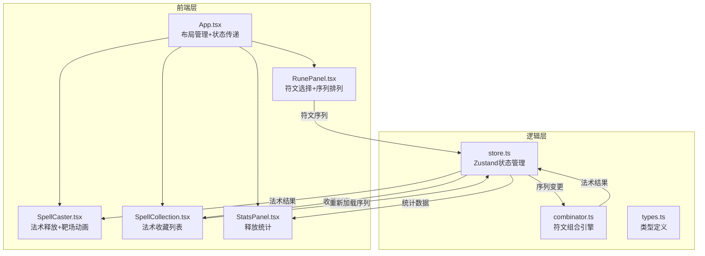

## 1. 架构设计



## 2. 技术说明

- 前端：React@18 + TypeScript + Vite
- 状态管理：Zustand
- 样式：Tailwind CSS + CSS Modules（动画部分）
- 初始化工具：vite-init (react-ts模板)
- 后端：无（纯前端应用）
- 数据库：无（状态保存在内存中）

## 3. 路由定义

| 路由 | 用途 |
|------|------|
| / | 符文工坊主页面（单页应用） |

## 4. 数据模型

### 4.1 核心类型定义

```typescript
type RuneType = 'fire' | 'ice' | 'thunder' | 'wind' | 'earth' | 'light' | 'dark' | 'poison' | 'blood' | 'rock' | 'sound' | 'illusion'

interface Rune {
  id: string
  type: RuneType
  name: string
  color: string
  icon: string
}

interface Spell {
  name: string
  level: number
  damage: number
  manaCost: number
  cooldown: number
  elementTypes: RuneType[]
  sequence: RuneType[]
}

interface CastRecord {
  spell: Spell
  timestamp: number
}
```

### 4.2 Zustand Store 数据结构

```typescript
interface RuneStore {
  selectedRunes: RuneType[]
  currentSpell: Spell | null
  collection: Spell[]
  castHistory: CastRecord[]
  isCasting: boolean
  
  addRune: (rune: RuneType) => void
  removeRune: (index: number) => void
  reorderRunes: (from: number, to: number) => void
  castSpell: () => void
  addToCollection: (spell: Spell) => void
  removeFromCollection: (index: number) => void
  loadFromCollection: (spell: Spell) => void
  clearSequence: () => void
}
```

## 5. 文件结构与调用关系

```
src/
  App.tsx          ← 主布局，整合所有组件
  main.tsx         ← 入口，挂载React
  types.ts         ← 类型定义（被所有模块引用）
  combinator.ts    ← 符文组合引擎（被store调用）
  store.ts         ← Zustand状态管理（被组件调用）
  RunePanel.tsx    ← 符文面板组件
  SpellCaster.tsx  ← 靶场动画组件
  SpellCollection.tsx ← 法术收藏组件
  StatsPanel.tsx   ← 统计面板组件
  index.css        ← 全局样式
```

数据流向：
- RunePanel → store.addRune/removeRune/reorderRunes → store.selectedRunes
- store.selectedRunes → combinator.combine() → store.currentSpell
- store.currentSpell → SpellCaster（Canvas渲染）
- SpellCaster释放 → store.castSpell() → store.castHistory更新
- store.castHistory → StatsPanel（统计计算）
- store.collection → SpellCollection（展示）
- SpellCollection点击 → store.loadFromCollection() → store.selectedRunes

## 6. 性能约束

- 靶场Canvas动画保持60FPS
- 粒子数量上限200
- 单帧渲染计算≤16ms
- 使用requestAnimationFrame驱动动画循环
- 粒子对象池复用避免GC
