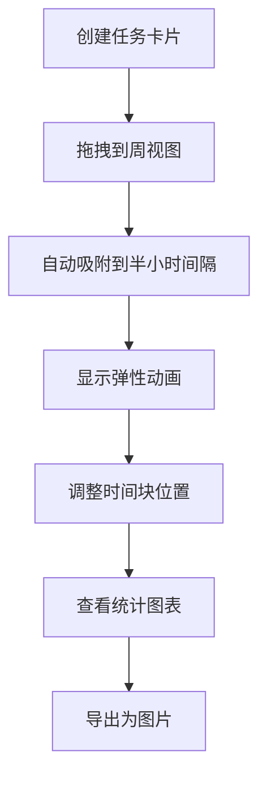

## 1. 产品概述

交互式时间块管理应用，帮助用户直观规划和可视化个人时间投入，解决日常工作中任务分散、时间分配不合理、一周结束后难以复盘时间去向的问题。

- 核心目标：通过可视化的时间块拖拽和统计图表，让用户清晰掌控时间分配
- 目标用户：需要管理工作时间、提升效率的职场人士和学生
- 市场价值：填补日历应用与任务管理应用之间的空白，专注于时间投入的可视化管理

## 2. 核心功能

### 2.1 用户角色
| 角色 | 注册方式 | 核心权限 |
|------|----------|----------|
| 普通用户 | 无需注册，本地使用 | 创建任务、拖拽分配时间、查看统计、导出图片 |

### 2.2 功能模块
1. **任务看板模块**：任务创建、任务卡片展示、拖拽源
2. **周视图网格模块**：7天×24小时网格、时间块放置、拖拽调整、快速事件、当前时间线
3. **统计洞察模块**：每日时长柱状图、任务类别占比环形图、数据刷新
4. **顶部导航**：应用标题、重置按钮、导出图片按钮

### 2.3 页面详情
| 页面名称 | 模块名称 | 功能描述 |
|---------|----------|----------|
| 主应用 | 任务看板 | 创建任务（名称、颜色、预估时长）、任务卡片展示、拖拽源 |
| 主应用 | 周视图网格 | 时间块放置、拖拽调整位置、快速事件创建、当前时间线指示 |
| 主应用 | 统计面板 | 每日投入时长柱状图、任务类别占比环形图、数据刷新 |
| 主应用 | 顶部导航 | 应用标题、重置按钮（360度旋转动画）、导出图片按钮 |

## 3. 核心流程

用户创建任务卡片 → 拖拽任务到周视图时间网格 → 自动吸附到半小时间隔 → 调整时间块位置 → 查看每日和分类统计 → 导出周计划图片

## 4. 用户界面设计

### 4.1 设计风格
- 主背景：暖灰色 #F5F0EB
- 卡片底色：白色 #FFFFFF
- 文字：深灰 #2D2D2D
- 强调色：橙色（当前时间线）#FF6B35
- 按钮风格：圆形按钮，点击时有 scale(0.95) 按压效果
- 字体：Inter（标题 ExtraBold 18px，正文 Regular 14px）
- 布局：三栏式布局（左任务面板 + 中周视图 + 下统计面板）
- 图标：使用 lucide-react 图标库
- 动画：所有过渡使用 transform 和 opacity 硬件加速

### 4.2 页面设计概述
| 页面名称 | 模块名称 | UI 元素 |
|---------|----------|----------|
| 主应用 | 任务看板 | 280px 宽浅灰面板、8px 圆角卡片、2px 色条、悬停上浮阴影、拖拽半透明 |
| 主应用 | 周视图网格 | 7×24 半小时网格、浅灰网格线、6px 圆角时间块、橙色脉冲时间线、虚线轮廓预览 |
| 主应用 | 统计面板 | 横向柱状图（从下向上生长动画）、环形饼图（悬停外扩）、刷新淡入动画 |
| 主应用 | 顶部导航 | 48px 高深灰导航栏、白色文字、圆形重置按钮（360度旋转） |

### 4.3 响应式设计
- 桌面端：三栏式固定布局
- 移动端（<768px）：左侧任务面板变为抽屉模式（左侧滑入，0.3s cubic-bezier 动画），周视图时间块自动拉伸填满

### 4.4 动画与交互
- 拖拽：帧率 ≥55fps，使用 transform 硬件加速
- 任务卡片悬停：上浮 2px，阴影加深，transition 0.2s ease
- 放置动画：弹性缩放 105% → 100%，0.3s
- 柱状图：从底部向上生长，0.5s
- 饼图扇区悬停：外扩 5 度
- 重置按钮：点击旋转 360 度，0.4s
- 当前时间线：橙色虚线每秒脉冲闪烁
- 所有可点击元素：悬停 cursor: pointer，点击 scale(0.95) 0.15s

## 5. 性能要求
- 拖拽操作帧率 ≥55fps
- 所有动画使用 transform 和 opacity 属性
- 无 JavaScript 驱动的动画卡顿
- 时间计算使用纯函数，避免不必要的重渲染
