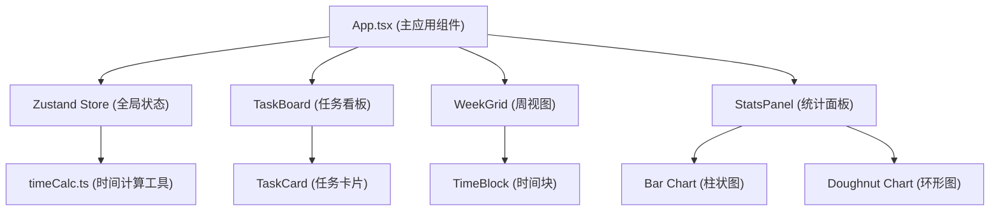

## 1. 架构设计



## 2. 技术描述
- 前端框架：React 18 + TypeScript
- 构建工具：Vite 5
- 状态管理：Zustand
- 拖拽库：react-dnd + react-dnd-html5-backend
- 图表库：Chart.js + react-chartjs-2
- 唯一ID：uuid
- 图标：lucide-react
- CSS：CSS Modules / 内联样式（使用硬件加速属性）

## 3. 目录结构

```
src/
├── taskManager/
│   ├── TaskBoard.tsx      # 左侧任务面板
│   └── TaskCard.tsx       # 单个任务卡片
├── timeGrid/
│   ├── WeekGrid.tsx       # 周视图网格
│   └── TimeBlock.tsx      # 单个时间块
├── statsPanel/
│   └── StatsPanel.tsx     # 底部统计面板
├── utils/
│   └── timeCalc.ts        # 时间计算纯函数
├── store/
│   └── useStore.ts        # Zustand 状态管理
├── types/
│   └── index.ts           # TypeScript 类型定义
├── App.tsx                # 主应用组件
├── main.tsx               # 应用入口
└── index.css              # 全局样式
```

## 4. 数据模型

### 4.1 类型定义

```typescript
interface Task {
  id: string;
  name: string;
  color: string;
  estimatedDuration: number; // 分钟
}

interface TimeBlock {
  id: string;
  taskId: string;
  dayIndex: number; // 0-6 (周一到周日)
  startSlot: number; // 0-47 (每半小时一格)
  endSlot: number;
  isQuickEvent?: boolean;
}

interface QuickEvent {
  id: string;
  name: string;
  dayIndex: number;
  slot: number;
}

interface DailyStats {
  day: string;
  hours: number;
}

interface TaskCategoryStats {
  taskName: string;
  color: string;
  duration: number;
  percentage: number;
}
```

### 4.2 Zustand Store

```typescript
interface AppState {
  tasks: Task[];
  timeBlocks: TimeBlock[];
  quickEvents: QuickEvent[];
  addTask: (task: Omit<Task, 'id'>) => void;
  removeTask: (taskId: string) => void;
  addTimeBlock: (block: Omit<TimeBlock, 'id'>) => void;
  updateTimeBlock: (id: string, updates: Partial<TimeBlock>) => void;
  removeTimeBlock: (id: string) => void;
  addQuickEvent: (event: Omit<QuickEvent, 'id'>) => void;
  updateQuickEvent: (id: string, updates: Partial<QuickEvent>) => void;
  removeQuickEvent: (id: string) => void;
  resetAll: () => void;
}
```

## 5. 核心数据流

1. **任务创建**：用户在 TaskBoard 创建任务 → 调用 store.addTask → 更新 tasks 数组
2. **任务拖拽**：TaskCard 作为拖拽源，携带 taskId → WeekGrid 作为放置目标
3. **时间块放置**：WeekGrid 接收拖拽 → 计算最近半小时间隔 → 调用 store.addTimeBlock
4. **时间块调整**：TimeBlock 拖拽 → 实时更新位置预览 → 松开后调用 store.updateTimeBlock
5. **统计计算**：App 监听 tasks 和 timeBlocks 变化 → 调用 timeCalc 计算统计数据 → 传递给 StatsPanel
6. **快速事件**：WeekGrid 空白格点击 → 输入名称 → 调用 store.addQuickEvent

## 6. 时间计算工具函数

```typescript
// 时间槽转换
slotToTime(slot: number): string
timeToSlot(time: string): number

// 计算时间块时长
calculateBlockDuration(startSlot: number, endSlot: number): number

// 生成一周日期标签
generateWeekLabels(): string[]

// 计算每日总投入
calculateDailyStats(timeBlocks: TimeBlock[], tasks: Task[]): DailyStats[]

// 计算任务类别占比
calculateTaskCategoryStats(timeBlocks: TimeBlock[], tasks: Task[]): TaskCategoryStats[]

// 吸附到最近半小时间隔
snapToNearestHalfHour(slot: number): number

// 获取当前时间槽
getCurrentTimeSlot(): number

// 获取当前星期索引
getCurrentDayIndex(): number
```

## 7. 拖拽类型定义

```typescript
// 拖拽源类型
const ItemTypes = {
  TASK: 'task',
  TIME_BLOCK: 'timeBlock',
};

// 拖拽源数据
interface TaskDragItem {
  type: typeof ItemTypes.TASK;
  taskId: string;
}

interface TimeBlockDragItem {
  type: typeof ItemTypes.TIME_BLOCK;
  blockId: string;
  originalStartSlot: number;
  originalEndSlot: number;
  originalDayIndex: number;
}
```

## 8. 导出图片实现

使用 html2canvas 库捕获周视图区域，转换为 PNG 图片下载。
