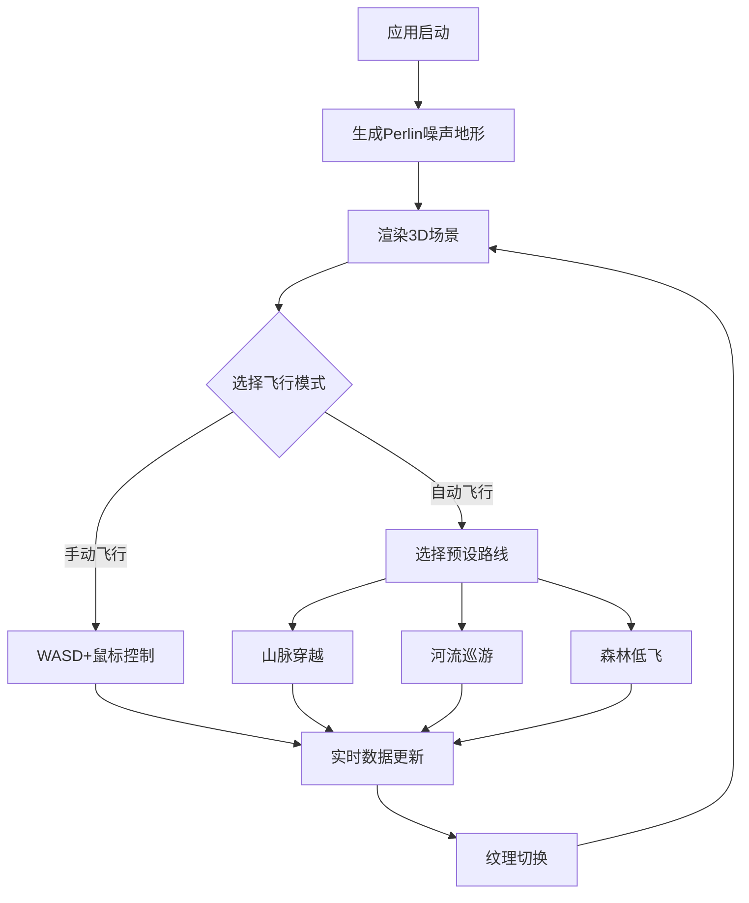

## 1. 产品概述

虚拟地貌飞行穿越可视化应用，让用户在程序生成的3D地形上自由飞行，观察山脉、平原、河流、森林等不同地貌细节，并实时查看高度、坡度等地理数据。
- 目标用户：地理爱好者、3D可视化开发者、教育场景使用者
- 核心价值：沉浸式地貌探索体验，实时地理数据展示，流畅的飞行操控

## 2. 核心功能

### 2.1 功能模块
1. **3D地形场景**：5x5公里Perlin噪声地形，包含山脉、平原、河流、森林，海拔0-500米
2. **自由飞行控制**：键盘WASD + 鼠标拖拽控制，摄像机离地10-50米，飞行速度10-50m/s可调
3. **实时数据面板**：经纬度、海拔、坡度、速度，每帧更新，等宽字体，淡入动画
4. **预设飞行路线**：山脉穿越、河流巡游、森林低飞，金色标记点，脉冲动画
5. **地形纹理切换**：卫星图风格 ↔ 等高线风格，1秒渐变过渡，等高线每50米棕色线
6. **环境效果**：动态天空盒渐变、高度自适应雾浓度、水面镜面反射

### 2.2 页面详情
| 页面名称 | 模块名称 | 功能描述 |
|----------|----------|----------|
| 主场景 | 3D地形渲染 | Perlin噪声生成地形网格与纹理，河流凹陷+半透明水面 |
| 主场景 | 飞行控制 | WASD键盘+鼠标拖拽控制飞行，速度可调，地形动态加载卸载 |
| 主场景 | 数据面板 | 右上角实时显示经纬度、海拔、坡度、速度，JetBrains Mono字体 |
| 主场景 | 控制面板 | 左上角半透明面板，飞行模式切换、速度滑块、路线按钮 |
| 主场景 | 预设路线 | 三种预设路线自动飞行，金色标记点+脉冲动画 |
| 主场景 | 纹理切换 | 卫星图/等高线两种纹理，1秒渐变过渡 |
| 主场景 | 罗盘 | 左下角方向罗盘，平滑旋转，阻尼0.1 |
| 主场景 | 环境效果 | 天空盒渐变、雾浓度自适应、水面反射 |

## 3. 核心流程

用户打开应用 → 3D地形场景加载渲染 → 用户通过键盘/鼠标控制飞行 → 实时数据面板更新 → 可切换飞行模式/预设路线 → 可切换纹理风格 → 持续探索地形

## 4. 界面设计

### 4.1 设计风格
- 主色调：深色科技风（深灰/深蓝背景 + 浅蓝数据文字 + 金色强调色）
- 辅助色：山脉棕 #8B6914、河流青 #00CED1、森林绿 #228B22
- 字体：JetBrains Mono（数据面板等宽字体）
- 布局：全视口3D场景 + 浮动半透明UI面板
- 图标：简洁线条风格图标

### 4.2 界面设计详情
| 页面名称 | 模块名称 | UI元素 |
|----------|----------|--------|
| 主场景 | 控制面板 | 左上角，圆角10px，rgba(20,20,30,0.8)背景，飞行模式按钮、速度滑块、路线按钮 |
| 主场景 | 数据面板 | 右上角，半透明背景，浅蓝色字体，JetBrains Mono，淡入动画 |
| 主场景 | 罗盘 | 左下角，北红色/其他灰色，平滑旋转阻尼0.1 |
| 主场景 | 速度滑块 | 圆形滑块，轨道渐变蓝→红 |
| 主场景 | 路线按钮 | 圆角矩形，对应主题色，弹性缩放0.3秒 |

### 4.3 响应式
- 桌面优先，全视口3D场景
- UI面板自适应窗口大小

### 4.4 3D场景指引
- 环境：动态渐变天空盒（地平线淡蓝→顶部深蓝）
- 灯光：环境光 + 方向光模拟日光
- 摄像机：透视摄像机，跟随飞行控制器
- 交互：键盘WASD + 鼠标拖拽控制飞行
- 后处理：高度自适应雾效
- 性能预算：1080p/60FPS，地形顶点≤100万
