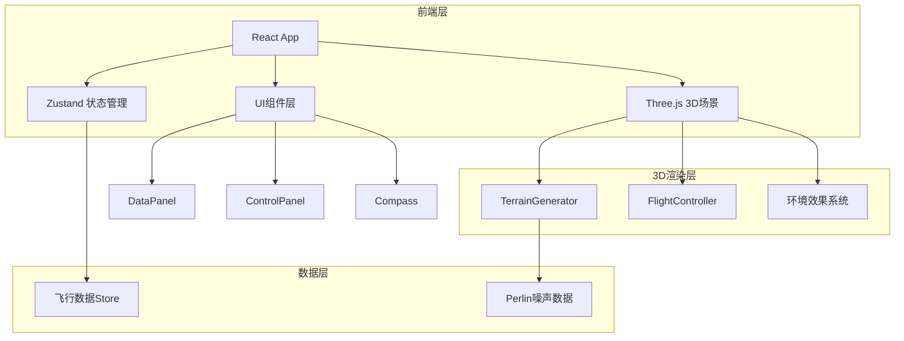

## 1. 架构设计



## 2. 技术说明
- 前端框架：React 18 + TypeScript（严格模式）
- 3D渲染：Three.js（直接使用，非R3F，以便精细控制渲染管线）
- 状态管理：Zustand
- 构建工具：Vite
- 样式：CSS Modules + Tailwind CSS
- 地形生成：自实现Perlin噪声算法
- 无后端，纯前端应用

## 3. 路由定义
| 路由 | 用途 |
|------|------|
| / | 主场景页面（全视口3D地形飞行） |

## 4. 文件结构

```
├── package.json
├── index.html
├── vite.config.js
├── tsconfig.json
├── src/
│   ├── main.tsx                    # React入口
│   ├── App.tsx                     # 根组件
│   ├── terrain/
│   │   └── TerrainGenerator.ts     # 地形生成器
│   ├── flight/
│   │   └── FlightController.ts     # 飞行控制器
│   ├── ui/
│   │   ├── DataPanel.tsx           # 数据面板
│   │   ├── ControlPanel.tsx        # 控制面板
│   │   └── Compass.tsx             # 罗盘组件
│   └── store/
│       └── useFlightStore.ts       # Zustand飞行状态
```

## 5. 核心模块设计

### 5.1 TerrainGenerator
- 使用Perlin噪声生成5x5公里高度图
- 多层噪声叠加（octaves）生成自然地貌
- 河流区域通过高度阈值凹陷+水面平面
- 两种纹理生成：卫星图风格（基于高度着色）、等高线风格（50米间隔棕色线）
- 提供getHeightAt(x, z)接口查询任意点高度
- 动态分块加载：以摄像机位置为中心加载周围区块

### 5.2 FlightController
- WASD控制前后左右移动
- 鼠标拖拽控制偏航/俯仰
- 摄像机高度跟随地形，保持在10-50米范围
- 速度滑块控制飞行速度10-50m/s
- 预设路线：三次贝塞尔曲线路径，沿路径自动移动摄像机
- 响应延迟<100ms

### 5.3 Zustand Store
```typescript
interface FlightState {
  position: { x: number; y: number; z: number }
  rotation: { yaw: number; pitch: number }
  speed: number
  altitude: number
  slope: number
  mode: 'keyboard' | 'auto'
  activeRoute: string | null
  textureMode: 'satellite' | 'contour'
}
```

### 5.4 环境效果
- 天空盒：自定义渐变着色器（地平线淡蓝→顶部深蓝）
- 雾效：指数雾，密度根据摄像机海拔动态调整
- 水面：半透明平面+镜面反射着色器
