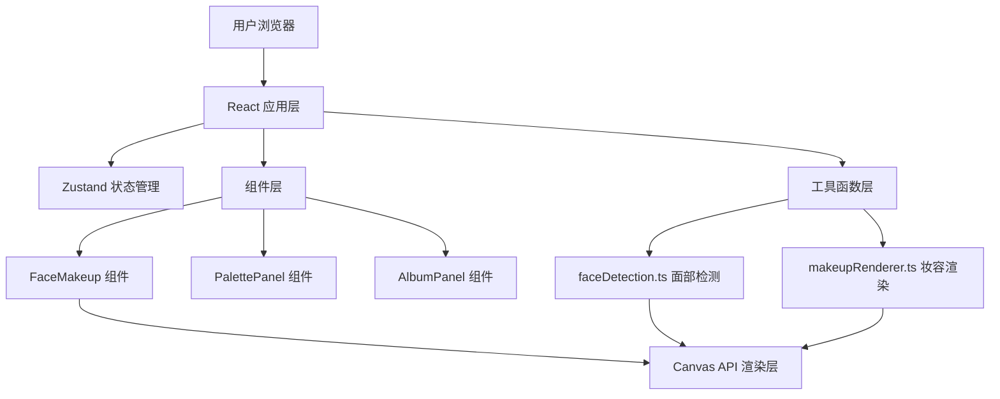

## 1. 架构设计



## 2. 技术描述

- **前端框架**：React 18 + TypeScript
- **构建工具**：Vite 5.x
- **状态管理**：Zustand 4.x
- **UI渲染**：原生 Canvas 2D API
- **唯一标识**：uuid
- **路径别名**：@ 指向 src 目录
- **无后端服务**：纯前端应用，数据存储在浏览器内存中

## 3. 项目文件结构

```
e:\solo\VersionFastPro\tasks\auto173\
├── package.json
├── index.html
├── vite.config.js
├── tsconfig.json
└── src/
    ├── App.tsx
    ├── store/
    │   └── useMakeupStore.ts
    ├── components/
    │   ├── FaceMakeup.tsx
    │   ├── PalettePanel.tsx
    │   └── AlbumPanel.tsx
    └── utils/
        ├── faceDetection.ts
        └── makeupRenderer.ts
```

## 4. 核心数据模型

### 4.1 状态管理类型定义

```typescript
interface MakeupState {
  // 当前选中的类别
  selectedCategory: 'lipstick' | 'eyeshadow' | 'blush';
  // 各类别选中的颜色
  selectedColors: {
    lipstick: string | null;
    eyeshadow: string | null;
    blush: string | null;
  };
  // 妆容透明度 0-100
  opacity: number;
  // 上传的原始图片
  originalImage: HTMLImageElement | null;
  // 面部关键点
  faceLandmarks: FaceLandmarks | null;
  // 检测状态
  isDetecting: boolean;
  // 相册列表（最多10张）
  album: AlbumItem[];
  // 分享弹窗状态
  shareModal: { visible: boolean; photoId: string | null };
  
  // Actions
  setCategory: (cat: MakeupCategory) => void;
  setColor: (cat: MakeupCategory, color: string) => void;
  setOpacity: (val: number) => void;
  setOriginalImage: (img: HTMLImageElement | null) => void;
  setFaceLandmarks: (lm: FaceLandmarks | null) => void;
  setIsDetecting: (v: boolean) => void;
  saveCurrentPhoto: (dataUrl: string) => void;
  loadAlbumPhoto: (id: string) => void;
  removeOldestPhoto: () => void;
  openShareModal: (id: string) => void;
  closeShareModal: () => void;
}

interface FaceLandmarks {
  leftEye: Point;
  rightEye: Point;
  mouth: Point[];  // 嘴唇轮廓点
  leftCheek: Point;
  rightCheek: Point;
}

interface AlbumItem {
  id: string;
  dataUrl: string;
  thumbnailUrl: string;
  colors: MakeupColors;
  opacity: number;
  createdAt: number;
}
```

### 4.2 工具函数导出

```typescript
// faceDetection.ts
export function detectFace(imageData: ImageData): FaceLandmarks;

// makeupRenderer.ts
export function applyMakeup(
  ctx: CanvasRenderingContext2D,
  landmarks: FaceLandmarks,
  category: MakeupCategory,
  color: string,
  opacity: number
): void;
```

## 5. 关键算法说明

### 5.1 面部关键点检测（纯TypeScript实现）

采用基于像素特征匹配的简化算法：
1. **肤色区域提取**：YCbCr色彩空间阈值分割获取人脸区域
2. **投影定位**：水平/垂直投影确定面部大致边界
3. **几何分区**：基于三庭五眼比例估算五官位置
4. **特征验证**：使用局部像素方差/边缘密度精调关键点位置

### 5.2 妆容渲染算法

基于Canvas 2D实现：
1. **路径定义**：根据关键点构建嘴唇/眼睑/脸颊区域路径
2. **颜色填充**：使用 globalCompositeOperation = 'multiply' 混合模式
3. **边缘柔化**：应用高斯模糊渐变，避免妆容边缘生硬
4. **透明度控制**：通过 globalAlpha 调节妆容浓度

### 5.3 性能优化目标

- 妆容叠加响应延迟 ≤ 50ms
- 照片保存响应时间 ≤ 200ms
- 相册容量限制 10 张，自动LRU淘汰
