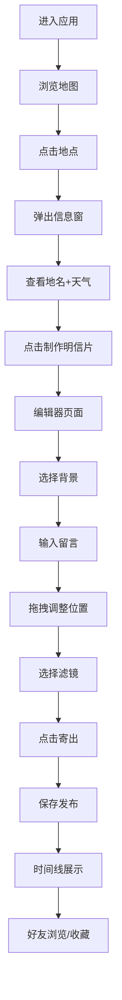

## 1. 产品概述

PostcardVoyage 是一款基于地理位置的虚拟明信片社交应用，让用户可以在地图上任意地点制作带有手写留言和当地天气的电子明信片，分享给好友并浏览他人的创作。

- 核心目标：将旅行的仪式感数字化，通过地理位置与天气信息赋予明信片独特的记忆价值
- 目标用户：旅行爱好者、喜欢手写明信片、追求仪式感的年轻群体

## 2. 核心功能

### 2.1 用户角色

| 角色 | 注册方式 | 核心权限 |
|------|----------|----------|
| 普通用户 | 用户名注册 | 浏览地图、制作明信片、发布动态、添加好友、收藏明信片 |

### 2.2 功能模块

1. **地图页面**：全屏Leaflet地图、地点选择、天气预览、明信片制作入口
2. **明信片编辑器**：Canvas画布、手写风格渲染、文字拖拽、复古滤镜、导出发布
3. **社交时间线**：瀑布流卡片展示、无限滚动、好友动态、公开明信片浏览
4. **好友管理**：用户搜索、好友请求、好友列表、快捷寄片入口
5. **个人画廊**：我的收藏、博物馆式布局展示

### 2.3 页面详情

| 页面名称 | 模块名称 | 功能描述 |
|----------|----------|----------|
| 地图页面 | 地图容器 | Leaflet全屏地图，北京为中心，淡蓝灰柔和配色 |
| 地图页面 | 地点选择器 | 点击地图弹出信息窗，显示地名和天气，提供制作按钮 |
| 编辑器页面 | 明信片画布 | 800x600 Canvas，背景图选择，天气图标，手写留言 |
| 编辑器页面 | 文字交互 | 所有文字可拖拽定位，0.2秒ease-out缓动 |
| 编辑器页面 | 滤镜系统 | 5种复古滤镜，颜色切换按钮 |
| 时间线页面 | 卡片列表 | 瀑布流布局，虚拟滚动，60fps流畅度 |
| 时间线页面 | 卡片详情 | 点击全屏查看，半透黑背景，淡入动画 |
| 好友页面 | 搜索添加 | 毛玻璃搜索框，即时搜索下拉结果 |
| 好友页面 | 好友列表 | 好友条目，爱心按钮跳转地图定位 |
| 个人页面 | 收藏画廊 | 300x200等大图片，博物馆白色背景布局 |

## 3. 核心流程

用户进入应用 → 浏览地图点击任意地点 → 查看地点名称与天气 → 点击制作明信片 → 选择背景图 → 输入手写留言调整位置 → 选择滤镜 → 点击寄出发布 → 好友在时间线看到新明信片 → 可收藏或查看详情

## 4. 用户界面设计

### 4.1 设计风格
- **主色调**：牛皮纸黄 #D4A76A、深棕色 #5D4037、米白色 #FFF8E1
- **按钮风格**：大圆角、柔和投影、悬停微动效
- **字体**：手写风格字体（留言区）、优雅衬线字体（标题）
- **布局**：卡片式、大量留白、柔和阴影
- **图标**：Lucide线条风格图标

### 4.2 页面设计概述

| 页面名称 | 模块名称 | UI元素 |
|----------|----------|--------|
| 全部页面 | 导航栏 | 固定顶部、毛玻璃背景、纸飞机LOGO、下划线动画 |
| 地图页面 | 信息窗 | 圆角弹窗、地名天气、土黄色制作按钮 |
| 编辑器页面 | 画布区 | 800x600 Canvas、拖拽半透明、0.2s缓动 |
| 编辑器页面 | 寄出按钮 | 信封样式、悬停翻起动画0.3s |
| 时间线页面 | 卡片 | 80px圆角、底部投影、悬停上浮4px |
| 时间线页面 | 收藏星 | 空心→实心金色、脉冲缩放动画0.3s |
| 好友页面 | 搜索框 | 毛玻璃效果、下拉即时结果 |
| 个人页面 | 画廊 | 等大300x200、白底色、等间距 |

### 4.3 响应式设计
- 桌面端：多列瀑布流、全屏地图
- 620px以下：单列卡片、纵滚动地图/编辑器、汉堡菜单导航

### 4.4 动画与交互
- 页面切换：0.3s淡入淡出
- 导航下划线：40%→100%宽度动画0.3s
- 卡片悬停：上浮4px+加深阴影
- 信封按钮：开口翻起0.3s
- 星星收藏：100%→120%→100%脉冲0.3s
- 详情模态：0.3s淡入
