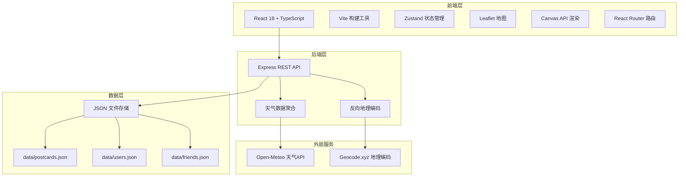
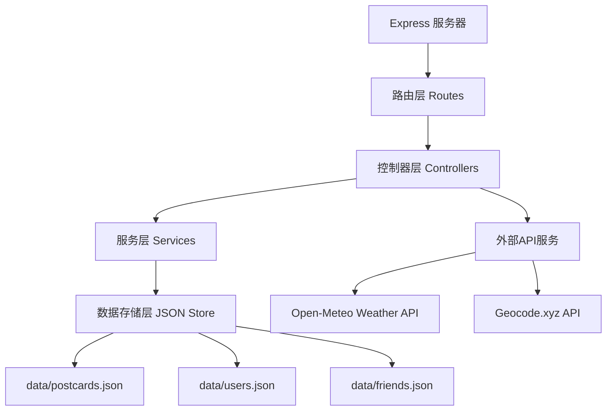
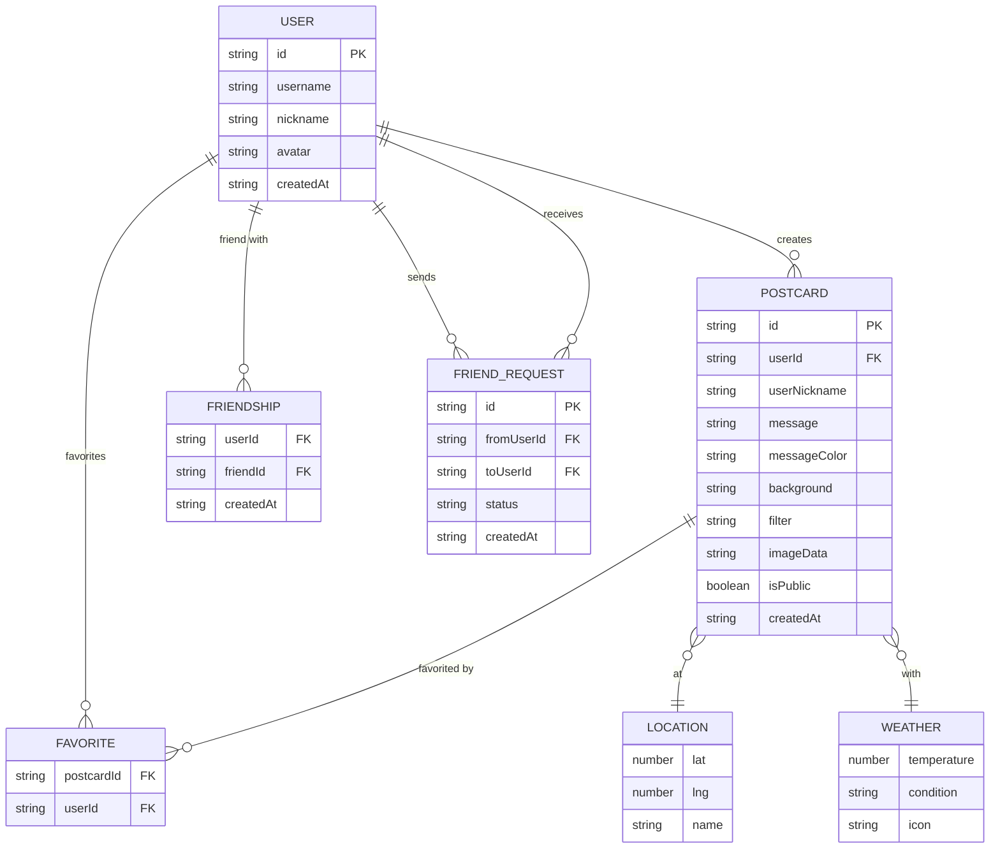

## 1. 架构设计



## 2. 技术描述

- **前端框架**：React 18 + TypeScript
- **构建工具**：Vite 5
- **状态管理**：Zustand 4
- **地图组件**：Leaflet 1.9 + react-leaflet
- **路由**：React Router DOM 6
- **样式方案**：原生 CSS + CSS 变量
- **图标库**：Lucide React
- **动效库**：canvas-confetti
- **HTTP客户端**：Axios
- **后端框架**：Express 4 + TypeScript
- **数据存储**：JSON 文件（data/目录）
- **ID生成**：UUID

## 3. 路由定义

| 路由 | 用途 |
|------|------|
| / | 地图首页，浏览和选择地点 |
| /editor | 明信片编辑器 |
| /timeline | 社交时间线，好友动态和公开明信片 |
| /friends | 好友管理页面 |
| /profile | 个人中心，我的收藏画廊 |

## 4. API 定义

### 4.1 类型定义

```typescript
interface Location {
  lat: number;
  lng: number;
  name: string;
}

interface Weather {
  temperature: number;
  condition: 'sunny' | 'cloudy' | 'rainy' | 'snowy';
  icon: string;
}

interface User {
  id: string;
  username: string;
  nickname: string;
  avatar: string;
  createdAt: string;
}

interface Postcard {
  id: string;
  userId: string;
  userNickname: string;
  location: Location;
  weather: Weather;
  message: string;
  messageColor: string;
  background: string;
  filter: string;
  imageData: string;
  isPublic: boolean;
  createdAt: string;
  favoritedBy: string[];
}

interface FriendRequest {
  id: string;
  fromUserId: string;
  toUserId: string;
  status: 'pending' | 'accepted' | 'rejected';
  createdAt: string;
}

interface Friendship {
  userId: string;
  friendId: string;
  createdAt: string;
}
```

### 4.2 API Endpoints

| 方法 | 路径 | 描述 | 请求参数 | 响应 |
|------|------|------|----------|------|
| GET | /api/weather | 获取天气 | lat, lng | Weather |
| GET | /api/geocode | 反向地理编码 | lat, lng | { name: string } |
| GET | /api/postcards | 获取明信片列表 | page, limit, type(friends/public) | Postcard[] |
| GET | /api/postcards/:id | 获取单张明信片 | - | Postcard |
| POST | /api/postcards | 创建明信片 | Postcard | Postcard |
| PUT | /api/postcards/:id/favorite | 收藏/取消收藏 | userId | Postcard |
| GET | /api/users/search | 搜索用户 | query | User[] |
| POST | /api/users/register | 用户注册 | username, nickname | User |
| POST | /api/users/login | 用户登录 | username | User |
| GET | /api/friends | 获取好友列表 | userId | User[] |
| GET | /api/friends/requests | 获取好友请求 | userId | FriendRequest[] |
| POST | /api/friends/request | 发送好友请求 | fromUserId, toUserId | FriendRequest |
| PUT | /api/friends/requests/:id | 处理好友请求 | status | FriendRequest |
| GET | /api/users/:id/favorites | 获取用户收藏 | userId | Postcard[] |

## 5. 服务端架构图



## 6. 数据模型

### 6.1 ER 图



### 6.2 JSON 数据文件结构

**data/users.json**
```json
{
  "users": [
    {
      "id": "uuid",
      "username": "traveler1",
      "nickname": "旅行家小明",
      "avatar": "emoji-or-url",
      "createdAt": "2024-01-01T00:00:00Z"
    }
  ]
}
```

**data/postcards.json**
```json
{
  "postcards": [
    {
      "id": "uuid",
      "userId": "user-uuid",
      "userNickname": "旅行家小明",
      "location": { "lat": 39.9, "lng": 116.4, "name": "北京天安门" },
      "weather": { "temperature": 22, "condition": "sunny", "icon": "☀️" },
      "message": "来自北京的问候！",
      "messageColor": "#5D4037",
      "background": "beach",
      "filter": "vintage",
      "imageData": "base64-image-data",
      "isPublic": true,
      "createdAt": "2024-01-01T12:00:00Z",
      "favoritedBy": ["user-id-1", "user-id-2"]
    }
  ]
}
```

**data/friends.json**
```json
{
  "friendships": [
    { "userId": "user1", "friendId": "user2", "createdAt": "..." }
  ],
  "requests": [
    {
      "id": "uuid",
      "fromUserId": "user1",
      "toUserId": "user2",
      "status": "pending",
      "createdAt": "..."
    }
  ]
}
```

## 7. 前端项目结构

```
src/
├── modules/
│   ├── map/
│   │   ├── MapContainer.tsx       # 地图主容器
│   │   └── LocationPicker.tsx     # 地点选择器
│   ├── postcard/
│   │   ├── PostcardEditor.tsx     # 明信片编辑器
│   │   └── PostcardCard.tsx       # 明信片展示卡片
│   └── social/
│       ├── UserTimeline.tsx       # 用户时间线
│       └── FriendManager.tsx      # 好友管理
├── store/
│   └── useAppStore.ts             # Zustand全局状态
├── api/
│   └── client.ts                  # API客户端封装
├── types/
│   └── index.ts                   # TypeScript类型定义
├── pages/
│   ├── MapPage.tsx
│   ├── EditorPage.tsx
│   ├── TimelinePage.tsx
│   ├── FriendsPage.tsx
│   └── ProfilePage.tsx
├── components/
│   ├── Navbar.tsx
│   └── PageTransition.tsx
├── utils/
│   ├── canvas.ts
│   └── filters.ts
├── App.tsx
├── main.tsx
└── index.css
```
