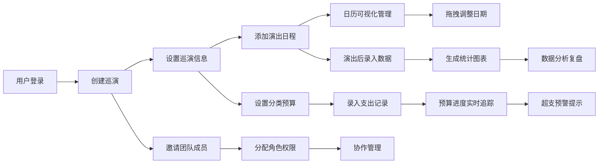

## 1. 产品概述
巡演管理应用 TourManager Pro 是一款专为独立音乐人打造的巡演全流程管理工具，解决巡演过程中场地协调困难、预算超支不可控、演出数据分散难以分析等核心痛点。
- 目标用户：独立音乐人、乐队经纪人、小型演出主办方
- 产品价值：通过可视化日历管理、实时预算追踪、数据统计分析三大核心能力，帮助用户高效管理巡演全程，降低运营成本，提升巡演数据化决策能力。

## 2. 核心功能

### 2.1 用户角色
| 角色 | 注册方式 | 核心权限 |
|------|----------|----------|
| 管理员 | 邮箱注册 | 全部权限：巡演/预算/数据管理、成员邀请与角色分配 |
| 成员 | 邀请链接加入 | 编辑权限：行程调整、支出录入、演出数据录入 |
| 仅查看 | 邀请链接加入 | 只读权限：查看全部信息，不可进行任何修改 |

### 2.2 功能模块
1. **巡演日历与行程管理页**：巡演创建、演出日程管理、日历可视化、拖拽调整日期、状态标记
2. **预算与支出追踪页**：总预算设置、分类预算管理、支出录入、进度条可视化、预警提示
3. **演出数据统计页**：数据录入、观众人数柱状图、周边销售饼图、数据对比分析
4. **团队协作功能**：成员邀请、角色分配、在线成员展示

### 2.3 页面详情
| 页面名称 | 模块名称 | 功能描述 |
|----------|----------|----------|
| 巡演日历页 | 巡演管理 | 创建巡演、设置起止日期和场馆数量、巡演切换 |
| 巡演日历页 | 日历视图 | 月视图日历、演出块颜色区分状态、色条标识、悬停详情卡片 |
| 巡演日历页 | 拖拽调整 | 拖拽演出块调整日期、半透明跟随、自动吸附 |
| 预算追踪页 | 预算概览 | 总预算设置、已用/剩余金额展示、总体进度条 |
| 预算追踪页 | 分类进度 | 交通/住宿/餐饮/设备/宣传五类进度条、颜色渐变预警、等宽字体金额 |
| 预算追踪页 | 支出管理 | 新增支出表单、分类选择、数字滚动动画 |
| 数据统计页 | 数据录入 | 观众人数、周边销售额、设备故障次数录入 |
| 数据统计页 | 柱状图 | 各场次观众人数对比、从左到右展开、柱子弹性升起动画 |
| 数据统计页 | 饼图 | 周边各品类销售额占比、从左到右展开动画 |
| 全局组件 | 团队协作 | 邀请成员弹窗、在线成员头像、+N溢出标签、角色管理 |

## 3. 核心流程
用户创建巡演 → 设置巡演基本信息 → 在日历上添加演出并标记状态 → 录入预算分类和支出记录 → 演出后录入数据并查看统计图表 → 邀请团队成员协作管理。

## 4. 用户界面设计

### 4.1 设计风格
- 主色调：青色 #00b4d8、暖橙色 #ff7f3f
- 深色主题：背景 #1a1a2e、卡片 #16213e
- 字体：标题使用 Orbitron（具有科技感的数字显示字体），正文使用 Space Grotesk
- 按钮：渐变背景（青→橙）、悬停亮度+10%、点击 scale(0.95) 过渡
- 卡片：圆角 12px、1px 浅边框、box-shadow 0 4px 12px rgba(0,0,0,0.3)
- 图标：使用 Lucide 图标库
- 加载状态：青→橙渐变环形进度条，1秒一圈旋转

### 4.2 页面设计概述
| 页面名称 | 模块名称 | UI 元素 |
|----------|----------|----------|
| 巡演日历页 | 巡演管理 | 巡演名称标签、日期范围、场馆计数、创建按钮 |
| 巡演日历页 | 日历视图 | 月历网格、彩色圆角演出块（绿/黄/灰）、3px色条、悬停详情卡片（上移3px） |
| 预算追踪页 | 预算概览 | 大号总金额卡片、总体进度条、已用/剩余数字 |
| 预算追踪页 | 分类进度 | 五类进度条（绿→橙→红渐变）、95%+红色闪烁、等宽字体金额 |
| 预算追踪页 | 支出管理 | 新增支出浮动按钮、表单弹窗、数字向上滚动动画（0.3s） |
| 数据统计页 | 柱状图 | 0.5s从左到右展开、柱子底部弹性升起效果 |
| 数据统计页 | 饼图 | 0.5s从左到右展开、扇区悬停高亮 |
| 全局组件 | 侧边栏 | 60px左侧窄边栏、图标悬停半透明白底、<768px折叠为底部导航 |
| 全局组件 | 成员展示 | 右上角头像缩略图、绿色在线圆点、+N溢出标签（浅灰底深灰字） |

### 4.3 响应式
- 桌面端（>768px）：左侧60px边栏 + 右侧主内容区
- 移动端（≤768px）：边栏折叠为底部导航栏，主内容区全宽展示
- 拖拽操作在移动端改为长按后调整日期弹窗
- 日历在移动端紧凑展示，详情改为点击弹出

### 4.4 性能指标
- 日历视图切换月份：页面更新响应时间 ≤ 200ms
- 图表渲染（10场演出数据）：≤ 500ms
- 预算进度条更新：即时响应，数字滚动动画 0.3s 完成
