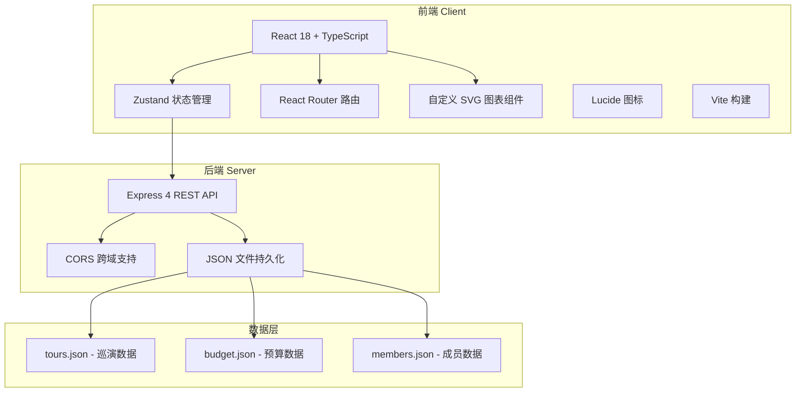
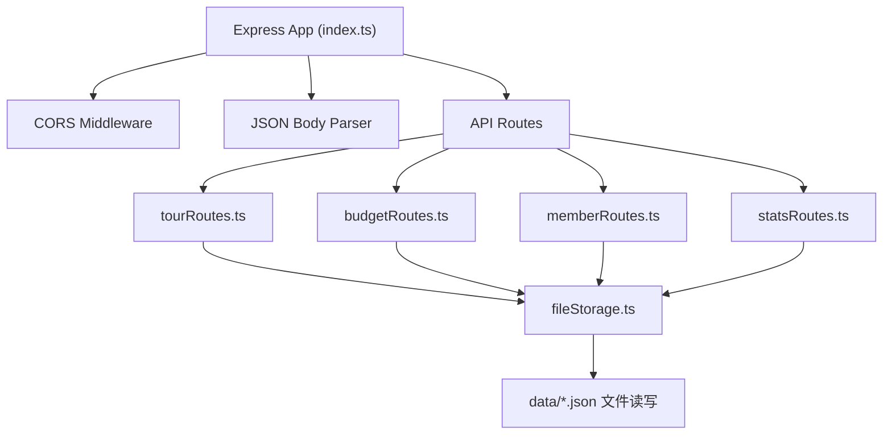
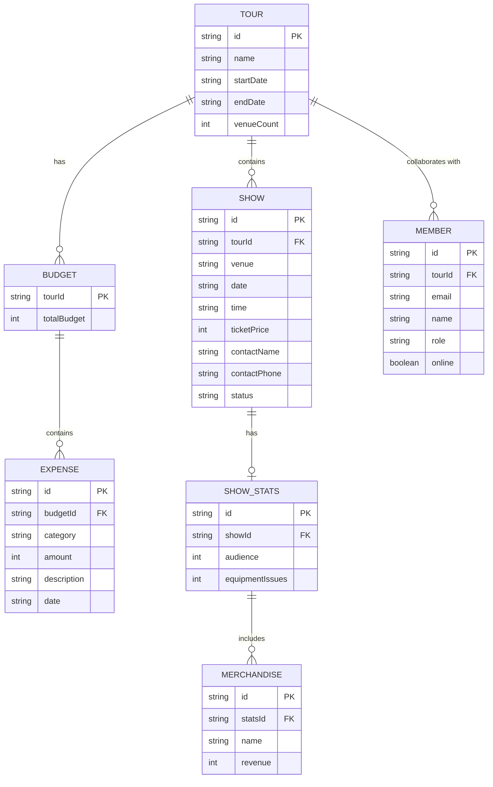

## 1. 架构设计



## 2. 技术说明
- 前端：React 18 + TypeScript + Vite + React Router + Zustand
- 后端：Express 4 + CORS + UUID
- 数据持久化：JSON 文件（data/ 目录）
- 图表：纯 SVG 自定义实现（无第三方图表库依赖）
- 样式：CSS Modules / 全局 CSS 变量（不使用 Tailwind，按用户指定配色方案实现）
- HTTP 客户端：Axios
- 图标库：lucide-react

## 3. 路由定义
| 路由路径 | 页面组件 | 用途 |
|----------|----------|------|
| / | CalendarPage | 巡演日历与行程管理（首页） |
| /budget | BudgetPage | 预算与支出追踪 |
| /statistics | StatisticsPage | 演出数据统计 |
| /team | TeamPage | 团队协作与成员管理 |

## 4. API 定义

### 4.1 巡演相关 API

| 方法 | 路径 | 说明 | 请求体 | 响应 |
|------|------|------|--------|------|
| GET | /api/tours | 获取所有巡演列表 | - | Tour[] |
| POST | /api/tours | 创建新巡演 | { name, startDate, endDate, venueCount } | Tour |
| PUT | /api/tours/:id | 更新巡演信息 | Partial<Tour> | Tour |
| DELETE | /api/tours/:id | 删除巡演 | - | { success: true } |
| GET | /api/tours/:tourId/shows | 获取巡演下所有演出 | - | Show[] |
| POST | /api/tours/:tourId/shows | 添加演出 | ShowCreate | Show |
| PUT | /api/shows/:id | 更新演出（含拖拽调整日期） | Partial<Show> | Show |
| DELETE | /api/shows/:id | 删除演出 | - | { success: true } |

### 4.2 预算相关 API

| 方法 | 路径 | 说明 | 请求体 | 响应 |
|------|------|------|--------|------|
| GET | /api/tours/:tourId/budget | 获取巡演预算 | - | Budget |
| PUT | /api/tours/:tourId/budget | 更新总预算 | { totalBudget: number } | Budget |
| POST | /api/tours/:tourId/expenses | 添加支出 | ExpenseCreate | Expense |
| PUT | /api/expenses/:id | 更新支出 | Partial<Expense> | Expense |
| DELETE | /api/expenses/:id | 删除支出 | - | { success: true } |

### 4.3 演出数据与成员 API

| 方法 | 路径 | 说明 | 请求体 | 响应 |
|------|------|------|--------|------|
| PUT | /api/shows/:id/stats | 更新演出数据 | { audience, merchandise, equipmentIssues } | ShowStats |
| GET | /api/tours/:tourId/members | 获取团队成员 | - | Member[] |
| POST | /api/tours/:tourId/members/invite | 邀请成员 | { email, role } | { inviteToken } |

### 4.4 TypeScript 类型定义

```typescript
type Tour = {
  id: string;
  name: string;
  startDate: string;
  endDate: string;
  venueCount: number;
  createdAt: string;
};

type ShowStatus = 'confirmed' | 'pending' | 'cancelled';

type Show = {
  id: string;
  tourId: string;
  venue: string;
  date: string;
  time: string;
  ticketPrice: number;
  contactName: string;
  contactPhone: string;
  status: ShowStatus;
  stats?: ShowStats;
};

type Category = 'transport' | 'accommodation' | 'food' | 'equipment' | 'promotion';

type Budget = {
  tourId: string;
  totalBudget: number;
  categoryBudgets: Record<Category, number>;
  expenses: Expense[];
};

type Expense = {
  id: string;
  category: Category;
  amount: number;
  description: string;
  date: string;
};

type ShowStats = {
  audience: number;
  merchandise: MerchandiseItem[];
  equipmentIssues: number;
};

type MerchandiseItem = {
  name: string;
  revenue: number;
};

type MemberRole = 'admin' | 'member' | 'viewer';

type Member = {
  id: string;
  email: string;
  name: string;
  role: MemberRole;
  avatar?: string;
  online: boolean;
};
```

## 5. 服务器架构图



## 6. 数据模型

### 6.1 数据模型定义



### 6.2 初始数据结构

```json
{
  "tours": [
    {
      "id": "tour-001",
      "name": "2026 夏季全国巡演",
      "startDate": "2026-07-01",
      "endDate": "2026-07-31",
      "venueCount": 8
    }
  ],
  "shows": [
    {
      "id": "show-001",
      "tourId": "tour-001",
      "venue": "北京 MAO Livehouse",
      "date": "2026-07-05",
      "time": "20:00",
      "ticketPrice": 180,
      "contactName": "王经理",
      "contactPhone": "138****8888",
      "status": "confirmed"
    }
  ],
  "budget": {
    "tour-001": {
      "totalBudget": 80000,
      "categoryBudgets": {
        "transport": 20000,
        "accommodation": 20000,
        "food": 10000,
        "equipment": 15000,
        "promotion": 15000
      },
      "expenses": []
    }
  },
  "members": [
    {
      "id": "member-001",
      "tourId": "tour-001",
      "email": "artist@band.com",
      "name": "主唱小明",
      "role": "admin",
      "online": true
    }
  ]
}
```
