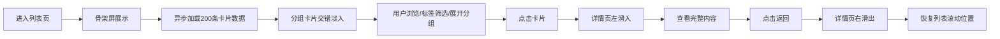

## 1. 产品概述

在线信息流卡片浏览应用，通过卡片分组展示与标签筛选，帮助用户高效浏览大量内容。采用毛玻璃风格与蓝紫渐变背景，提供沉浸式视觉体验。针对内容消费者，解决海量信息流快速浏览与精准筛选的痛点。

## 2. 核心功能

### 2.1 功能模块

1. **卡片列表页**：分组卡片网格、虚拟滚动、标签筛选栏、骨架屏加载、交错淡入动画、分组展开/收起
2. **卡片详情页**：大图展示、全文内容、标签列表、创建时间、左右滑入/滑出动画、返回按钮

### 2.2 页面详情

| 页面名称 | 模块名称 | 功能描述 |
|---------|---------|---------|
| 卡片列表页 | 筛选栏 | 顶部固定、毛玻璃效果、标签按钮组、选中高亮下划线滑动动画 |
| 卡片列表页 | 分组卡片网格 | 按标签自动分组、每组显示前6张、点击展开全部、响应式网格布局（桌面4列/平板2列/手机1列） |
| 卡片列表页 | 虚拟滚动 | 仅渲染可视区域卡片、单卡高度320px、滚动帧率≥120FPS |
| 卡片列表页 | 加载动画 | 骨架屏灰色脉冲闪烁、加载完成后卡片交错淡入（每张延迟100ms） |
| 卡片详情页 | 详情展示 | 大图占顶部40%、内容区可滚动、完整文本、标签列表、创建时间 |
| 卡片详情页 | 切换动画 | 进入左滑入（translateX 100%→0，0.4s ease-out）、返回右滑出 |
| 卡片详情页 | 滚动记忆 | 返回列表页时恢复之前滚动位置 |

## 3. 核心流程

用户进入列表页 → 骨架屏显示 → 200条模拟数据异步加载（500ms延迟）→ 卡片分组展示（交错淡入动画）→ 用户可选择标签筛选 → 点击分组标题展开/收起 → 点击卡片进入详情页（左滑入动画）→ 详情页展示完整内容 → 点击返回（右滑出动画）→ 恢复列表页滚动位置

## 4. 用户界面设计

### 4.1 设计风格

- **主色调**：蓝紫渐变背景（#1e1b4b → #4c1d95，左上到右下对角线）
- **卡片背景**：半透明白色 rgba(255,255,255,0.85)
- **卡片圆角**：16px
- **卡片阴影**：0 4px 20px rgba(0,0,0,0.08)
- **毛玻璃效果**：backdrop-filter: blur(10px)（筛选栏）
- **选中下划线**：#a855f7，过渡动画 0.3s ease
- **标签色**：浅紫色 #e9d5ff 圆角方块
- **摘要色**：灰色 #6b7280
- **卡片内标题**：bold 1.1rem
- **网格间距**：24px gap

### 4.2 页面设计概览

| 页面名称 | 模块名称 | UI元素 |
|---------|---------|--------|
| 列表页 | 筛选栏 | 毛玻璃背景、标签按钮、滑动高亮下划线、固定顶部 |
| 列表页 | 分组卡片 | 分组标题行（含展开按钮）、卡片网格、封面缩略图、标题、摘要、标签组 |
| 列表页 | 骨架屏 | 灰色方块脉冲闪烁动画 |
| 详情页 | 详情容器 | 全屏覆盖、顶部大图40%高度、滚动内容区、返回按钮、滑入滑出过渡 |

### 4.3 响应式

- **桌面端（最小宽屏）**：卡片网格每行4列
- **平板**：每行2列
- **手机**：每行1列
- 所有交互支持触摸操作
