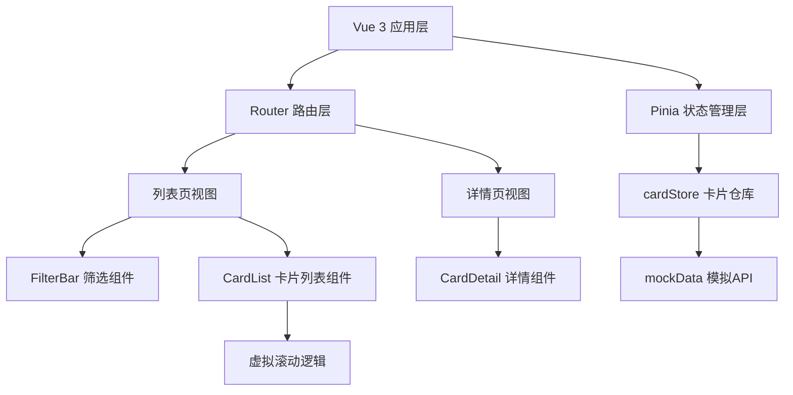

## 1. 架构设计

```mermaid
graph TB
    A["Vue 3 应用层"] --> B["Router 路由层"]
    A --> C["Pinia 状态管理层"]
    B --> D["列表页视图"]
    B --> E["详情页视图"]
    D --> F["FilterBar 筛选组件"]
    D --> G["CardList 卡片列表组件"]
    E --> H["CardDetail 详情组件"]
    C --> I["cardStore 卡片仓库"]
    I --> J["mockData 模拟API"]
    G --> K["虚拟滚动逻辑"]
```

## 2. 技术说明

- **前端框架**：Vue 3 + TypeScript
- **构建工具**：Vite
- **路由**：vue-router（懒加载路由）
- **状态管理**：Pinia
- **编译器**：@vue/compiler-sfc

## 3. 路由定义

