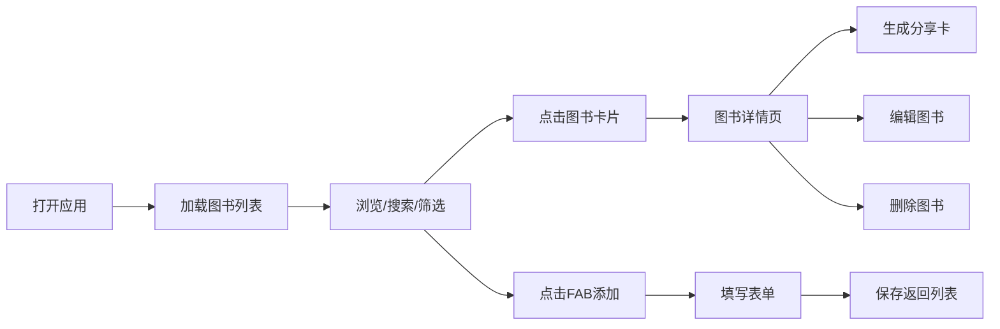

## 1. 产品概述

个人藏书管理与分享应用——帮助二手书店顾客管理个人藏书，支持自定义标签分类，并生成精美分享名片。
- 核心目标：解决顾客遗忘已购图书、无法便捷分享书店库存的痛点
- 目标用户：线下二手书店的藏书爱好者、经常淘书的读者群体

## 2. 核心功能

### 2.1 功能模块

1. **图书列表页**：卡片式展示全部藏书，支持搜索、标签筛选、数量统计、添加入口
2. **图书详情页**：展示完整图书信息，支持编辑、删除、生成分享名片
3. **添加/编辑页**：图书信息录入表单，支持星级评分、标签输入与自动补全
4. **分享名片**：生成带二维码的精美卡片，支持下载为 PNG 图片

### 2.2 页面详情

| 页面名称 | 模块名称 | 功能描述 |
|-----------|-------------|---------------------|
| 图书列表页 | 搜索栏 | 按书名或作者模糊搜索，防抖300ms |
| 图书列表页 | 标签筛选区 | 标签按钮多选筛选，多个标签取交集 |
| 图书列表页 | 图书卡片网格 | 卡片悬停上移效果，点击进入详情，删除动画淡出左滑 |
| 图书列表页 | 悬浮添加按钮 | FAB圆形按钮固定右下角，点击跳转添加页 |
| 图书详情页 | 信息展示区 | 封面色块、书名、作者、出版信息、评分、标签 |
| 图书详情页 | 操作区 | 编辑、删除、生成分享卡按钮 |
| 图书详情页 | 分享卡片模态框 | 淡奶油色卡片，二维码右上角，底部下载按钮 |
| 添加/编辑页 | 表单区 | 书名、作者、出版社、年份、星级评分输入 |
| 添加/编辑页 | 标签输入区 | 已有标签自动补全，支持新增标签，至少3个 |

## 3. 核心流程

用户打开应用 → 加载图书列表 → 浏览/搜索/筛选图书 → 点击图书查看详情 → 生成分享名片/编辑/删除 → 或点击FAB添加新书 → 填写表单 → 保存返回列表

## 4. 用户界面设计

### 4.1 设计风格

- **主色调**：深棕色(#3E2723)导航栏 + 暖木色浅色背景
- **卡片色**：米白色(#FFF8E1) + 细浅棕色边框 + 柔和阴影
- **标签配色**：墨绿(#2E7D32)与琥珀色(#FF8F00)交替
- **分享卡底色**：淡奶油色(#FFFDE7)
- **字体**：复古书籍感衬线字体 + 现代无衬线正文
- **按钮**：圆角矩形，悬停微上移加深阴影
- **布局**：卡片式网格，桌面双列/移动单列
- **图标**：使用 lucide-react 线性图标，保持简约复古感

### 4.2 页面设计概览

| 页面名称 | 模块名称 | UI元素 |
|-----------|-------------|-------------|
| 图书列表页 | 导航栏 | 深棕色背景，左侧Logo+标题，右侧移动端汉堡菜单 |
| 图书列表页 | 搜索筛选区 | 搜索框带放大镜图标，标签按钮行，匹配数量统计 |
| 图书列表页 | 卡片网格 | 米白卡片，封面色块+书名+作者+评星+标签缩略 |
| 图书列表页 | FAB按钮 | 深棕圆形+白色+号，固定右下，z-index层级高 |
| 图书详情页 | 详情卡 | 大幅封面色块+完整信息+标签组+操作按钮 |
| 图书详情页 | 分享模态框 | 居中遮罩，淡奶油色卡片，二维码右上，下载按钮 |
| 添加/编辑页 | 表单 | 标签分组，星级选择器，标签输入+下拉自动补全 |

### 4.3 响应式设计

- 桌面优先设计，≥768px 使用两列网格布局
- 移动端(<768px) 单列卡片，导航栏折叠为汉堡菜单
- 所有触摸交互区域≥44px，优化移动端操作体验

### 4.4 动画与微交互

- 卡片添加：底部淡入(opacity 0→1, 0.3s)
- 卡片删除：向左滑动20px+淡出(transform+opacity, 0.3s)
- 卡片悬停：上移3px + 加深阴影(transition 0.2s)
- 模态框弹出：缩放+淡入过渡
- 标签切换：颜色填充过渡动画
