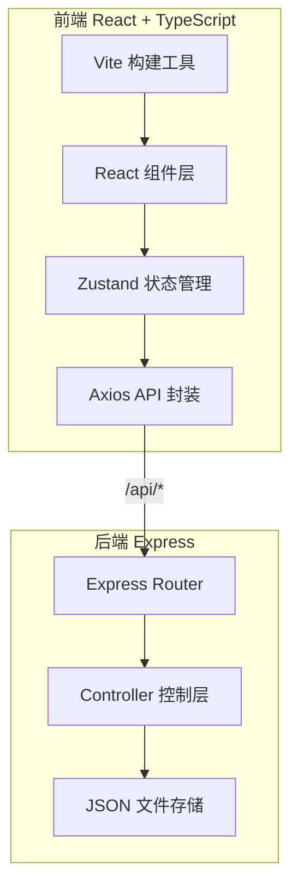
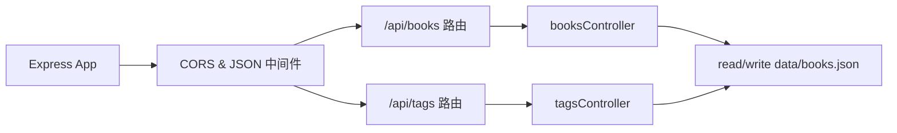
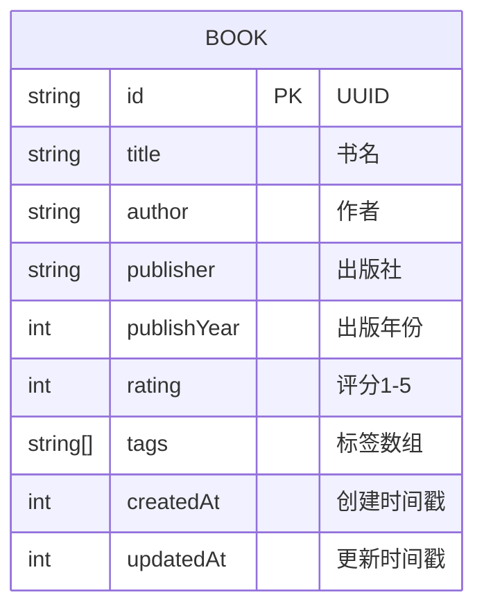

## 1. 架构设计



## 2. 技术栈说明

- **前端框架**：React@18 + TypeScript@5
- **状态管理**：Zustand@4
- **路由**：react-router-dom@6
- **HTTP客户端**：Axios@1
- **UI构建工具**：Vite@5
- **后端框架**：Express@4
- **二维码生成**：qrcode@1
- **图片下载**：html-to-image@1
- **数据存储**：JSON 文件本地持久化
- **启动脚本**：`npm run dev` (concurrently 同时启动前后端)

## 3. 路由定义

| 路由路径 | 页面组件 | 用途 |
|-------|---------|------|
| `/` | BookList | 首页图书列表 |
| `/book/:id` | BookDetail | 图书详情页 |
| `/add` | BookForm | 添加新图书 |
| `/edit/:id` | BookForm | 编辑已有图书 |

## 4. API 定义

### 4.1 TypeScript 类型

```typescript
interface Book {
  id: string;
  title: string;
  author: string;
  publisher: string;
  publishYear: number;
  rating: 1 | 2 | 3 | 4 | 5;
  tags: string[];
  createdAt: number;
  updatedAt: number;
}
```

### 4.2 REST API 接口

| 方法 | 路径 | 描述 | 请求体 | 响应 |
|------|------|------|--------|------|
| GET | `/api/books` | 获取所有图书 | - | `Book[]` |
| GET | `/api/books/:id` | 获取单本图书 | - | `Book` |
| POST | `/api/books` | 新增图书 | `Omit<Book, 'id'|'createdAt'|'updatedAt'>` | `Book` |
| PUT | `/api/books/:id` | 更新图书 | 同POST请求体 | `Book` |
| DELETE | `/api/books/:id` | 删除图书 | - | `{ success: true }` |
| GET | `/api/tags` | 获取所有已有标签 | - | `string[]` |

## 5. 服务器架构



后端结构：
- `api/server.ts` - Express 应用入口，中间件配置
- `api/controllers/booksController.ts` - 图书 CRUD 业务逻辑
- `api/controllers/tagsController.ts` - 标签聚合逻辑
- `api/data/books.json` - 图书数据持久化文件

## 6. 数据模型

### 6.1 实体关系



### 6.2 初始数据示例

```json
{
  "books": [
    {
      "id": "uuid-1",
      "title": "三体",
      "author": "刘慈欣",
      "publisher": "重庆出版社",
      "publishYear": 2008,
      "rating": 5,
      "tags": ["科幻", "经典", "绝版"],
      "createdAt": 1718304000000,
      "updatedAt": 1718304000000
    }
  ]
}
```

## 7. 前端数据流向

```
用户操作组件 → 调用 api.ts 函数 → 发送 HTTP 请求
    ↑                                       ↓
组件重渲染 ← Zustand store 更新 ← 接收响应数据
```

关键文件职责：
- `src/api.ts` - axios 实例封装 + 各 API 调用函数
- `src/store.ts` - Zustand store，管理 books 状态和 CRUD actions
- `src/App.tsx` - 路由配置和顶层布局
- `src/pages/*.tsx` - 各页面组件，从 store 取数据并触发 actions
- `src/components/*.tsx` - 可复用UI组件(图书卡片、星级选择器、标签输入等)
