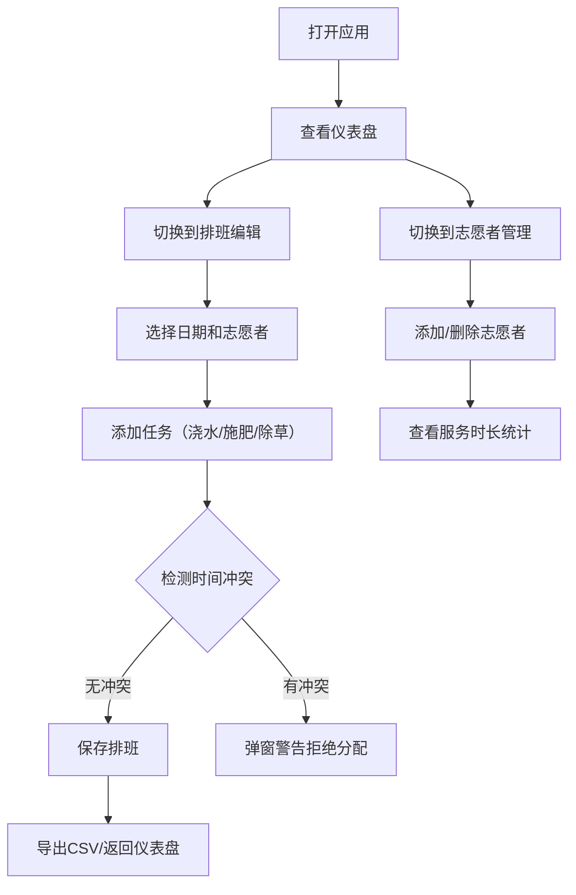

## 1. 产品概述

社区花园志愿者排班管理与服务时长统计应用，帮助志愿者协调花园维护任务（浇水、施肥、除草），解决纸质排班表混乱问题，提供自动提醒和统计功能。

- **目标用户**：社区花园的志愿者管理员和管理者
- **核心价值**：简化排班协调，自动统计服务时长，提升志愿者管理效率

---

## 2. 核心功能

### 2.1 用户角色

| 角色 | 注册方式 | 核心权限 |
|------|----------|----------|
| 志愿者管理员 | 无需注册，直接使用 | 管理志愿者、编辑排班、查看统计、导出数据 |

### 2.2 功能模块

1. **仪表盘页面**：本周排班概览、服务时长排行榜、待完成任务提示
2. **排班编辑页面**：按周选择日期、添加/移除任务、日历网格展示、冲突检测
3. **志愿者管理页面**：添加/删除志愿者、展示服务时长和任务数

### 2.3 页面详情

| 页面名称 | 模块名称 | 功能描述 |
|----------|----------|----------|
| 仪表盘 | 本周排班概览 | 以甘特条形式展示本周所有排班任务，带颜色标签和志愿者姓名 |
| 仪表盘 | 服务时长统计 | 柱状图展示前5名志愿者总服务时长，含入场动画 |
| 仪表盘 | 待完成任务 | 红色圆点提示待完成任务列表 |
| 排班编辑 | 周次切换 | 可前后切换查看不同周的排班 |
| 排班编辑 | 日历网格 | 每行志愿者、每列日期，点击单元格添加任务 |
| 排班编辑 | 冲突检测 | 同一日期同一小时重复分配时弹窗警告 |
| 排班编辑 | CSV导出 | 将当前周排班导出为CSV文件 |
| 志愿者管理 | 志愿者卡片 | 2列网格展示，显示姓名、服务时长、任务数 |
| 志愿者管理 | 添加志愿者 | 填写姓名和联系方式添加新志愿者 |
| 志愿者管理 | 删除志愿者 | 删除志愿者及其所有排班记录 |

---

## 3. 核心流程

### 主业务流程：

---

## 4. 用户界面设计

### 4.1 设计风格

- **主色调**：#4CAF50（暖绿色）
- **背景色**：#F5F5DC（米白色）
- **卡片背景**：白色带细微阴影
- **任务标签颜色**：浇水-蓝色、施肥-绿色、除草-橙色
- **按钮风格**：圆角按钮，200ms过渡动画
- **字体**：系统默认无衬线字体
- **整体风格**：自然、清新、有机感

### 4.2 页面设计概述

| 页面名称 | 模块名称 | UI元素 |
|----------|----------|----------|
| 仪表盘 | 排班概览 | 暖绿色背景、甘特条带渐变色、悬停放大效果 |
| 仪表盘 | 柱状图 | chart.js、从底部升起的入场动画、绿色系渐变柱子 |
| 仪表盘 | 待完成任务 | 红色圆点标记、列表布局 |
| 排班编辑 | 日历网格 | 可滚动网格、单元格悬停scale(1.05)、彩色任务标签 |
| 排班编辑 | 任务选择模态框 | 淡入动画、三个任务按钮 |
| 志愿者管理 | 卡片网格 | 2列网格、白色卡片、阴影效果 |
| 导航栏 | 顶部导航 | 固定导航栏、移动端汉堡菜单、周次切换按钮 |

### 4.3 响应式设计

- **桌面端（>1024px）**：完整布局，日历网格完整展示
- **平板端（768-1024px）**：网格变为1列
- **移动端（<768px）**：日历单元格缩小，柱状图添加横向滚动条，导航栏折叠为汉堡菜单

### 4.4 动画效果

- 所有交互（点击、悬停、页面切换）200ms ease-in-out过渡
- 页面加载时元素渐入
- 柱状图从底部升起动画
- 模态框淡入淡出
- 单元格悬停放大效果

---

## 5. 性能约束

- 排班操作响应时间 < 200ms
- 全量数据加载 < 1秒
- 同时渲染DOM元素 < 500个
- 超过4周数据分页加载，一次展示4周
