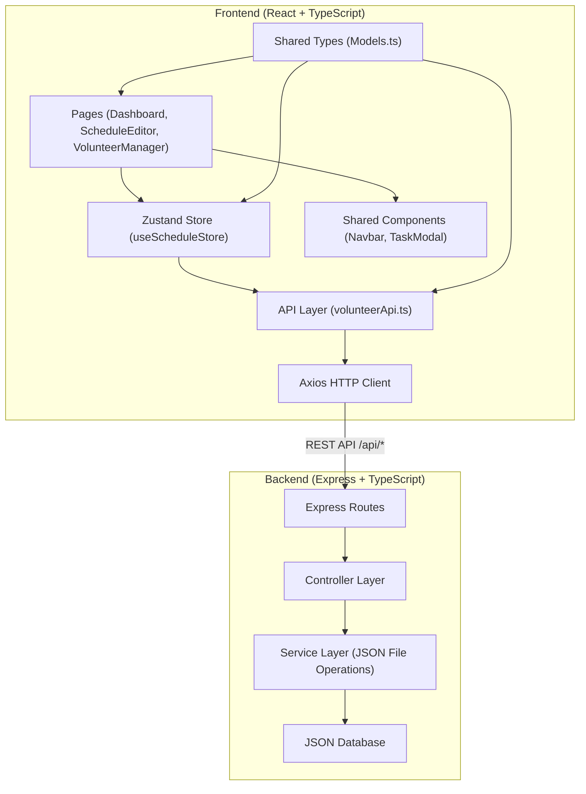
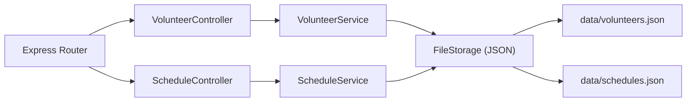
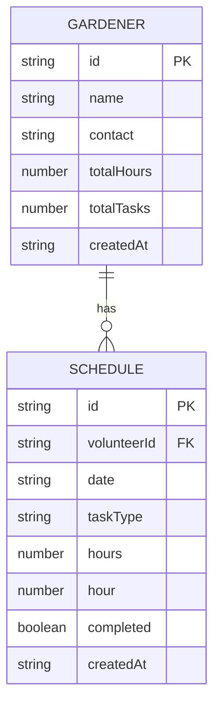

## 1. 架构设计



---

## 2. 技术描述

- **前端**：React 18 + TypeScript + Vite + React Router DOM + Zustand + Axios + date-fns + uuid + chart.js
- **后端**：Express 4 + TypeScript + CORS
- **状态管理**：Zustand
- **数据持久化**：JSON 文件（data/volunteers.json, data/schedules.json）
- **构建工具**：Vite
- **代理配置**：Vite 代理 /api 到后端 Express 服务

---

## 3. 路由定义

| 前端路由 | 页面组件 | 功能说明 |
|----------|----------|----------|
| / | Dashboard | 仪表盘首页 |
| /schedule | ScheduleEditor | 排班编辑页面 |
| /volunteers | VolunteerManager | 志愿者管理页面 |

---

## 4. API 定义

### 后端 REST API 接口

| 方法 | 路径 | 说明 | 请求体 | 响应 |
|------|------|------|--------|------|
| GET | /api/volunteers | 获取所有志愿者 | - | Gardener[] |
| POST | /api/volunteers | 添加志愿者 | { name, contact } | Gardener |
| DELETE | /api/volunteers/:id | 删除志愿者及其排班 | - | { success: boolean } |
| GET | /api/schedules | 获取所有排班 | - | Schedule[] |
| POST | /api/schedules | 添加排班任务 | { volunteerId, date, taskType, hours, hour } | Schedule |
| DELETE | /api/schedules/:id | 删除排班任务 | - | { success: boolean } |
| GET | /api/schedules/week/:weekStart | 获取指定周排班 | - | Schedule[] |
| POST | /api/schedules/:id/complete | 标记任务完成 | - | Schedule |

### 类型定义

```typescript
interface Gardener {
  id: string;
  name: string;
  contact: string;
  totalHours: number;
  totalTasks: number;
  createdAt: string;
}

interface Schedule {
  id: string;
  volunteerId: string;
  date: string;
  taskType: 'watering' | 'fertilizing' | 'weeding';
  hours: number;
  hour: number;
  completed: boolean;
  createdAt: string;
}

interface TaskType {
  water: 'watering';
  fertilizer: 'fertilizing';
  weed: 'weeding';
}
```

---

## 5. 服务器架构



---

## 6. 数据模型

### 6.1 数据模型 ER 图



### 6.2 JSON 数据结构

**data/volunteers.json:**
```json
{
  "volunteers": [
    {
      "id": "uuid-1",
      "name": "张三",
      "contact": "13800138000",
      "totalHours": 12.5,
      "totalTasks": 8,
      "createdAt": "2024-01-15T10:00:00Z"
    }
  ]
}
```

**data/schedules.json:**
```json
{
  "schedules": [
    {
      "id": "uuid-2",
      "volunteerId": "uuid-1",
      "date": "2024-06-14",
      "taskType": "watering",
      "hours": 1,
      "hour": 9,
      "completed": false,
      "createdAt": "2024-06-10T08:00:00Z"
    }
  ]
}
```

---

## 7. 项目文件结构

```
project/
├── package.json
├── vite.config.js
├── tsconfig.json
├── index.html
├── data/                          # JSON 数据存储
│   ├── volunteers.json
│   └── schedules.json
├── server/                        # Express 后端
│   ├── index.ts
│   ├── types.ts
│   ├── controllers/
│   │   ├── volunteerController.ts
│   │   └── scheduleController.ts
│   ├── services/
│   │   ├── volunteerService.ts
│   │   ├── scheduleService.ts
│   │   └── fileStorage.ts
│   └── routes/
│       ├── volunteerRoutes.ts
│       └── scheduleRoutes.ts
└── src/                           # React 前端
    ├── main.tsx
    ├── App.tsx
    ├── types/
    │   └── Models.ts             # 共享类型定义
    ├── api/
    │   └── volunteerApi.ts        # API 请求封装
    ├── stores/
    │   └── useScheduleStore.ts    # Zustand 状态管理
    ├── components/                # 通用组件
    │   ├── Navbar.tsx
    │   ├── TaskSelectModal.tsx
    │   └── TaskBadge.tsx
    ├── pages/                     # 页面组件
    │   ├── Dashboard.tsx
    │   ├── ScheduleEditor.tsx
    │   └── VolunteerManager.tsx
    └── styles/
        └── index.css
```

---

## 8. 数据流向说明

1. **组件 → Store → API → 后端 → JSON**
   - 用户在页面组件操作 → 调用 store 方法 → store 调用 API 层 → API 发送 HTTP 请求到 Express 后端 → 后端操作 JSON 文件

2. **后端 → API → Store → 组件**
   - JSON 文件数据 → 后端读取 → 返回 API 响应 → store 更新状态 → 组件自动重渲染

3. **共享类型引用**
   - `Models.ts` 被所有模块引用，确保类型一致性

---

## 9. 性能优化

- **分页加载**：超过 4 周数据分页，一次只加载 4 周
- **状态缓存**：Zustand store 缓存数据，避免重复请求
- **按需渲染**：使用 React.memo 优化组件渲染
- **DOM 限制**：确保同时渲染 DOM 元素 < 500 个
- **响应优化**：所有 API 操作响应时间 < 200ms
