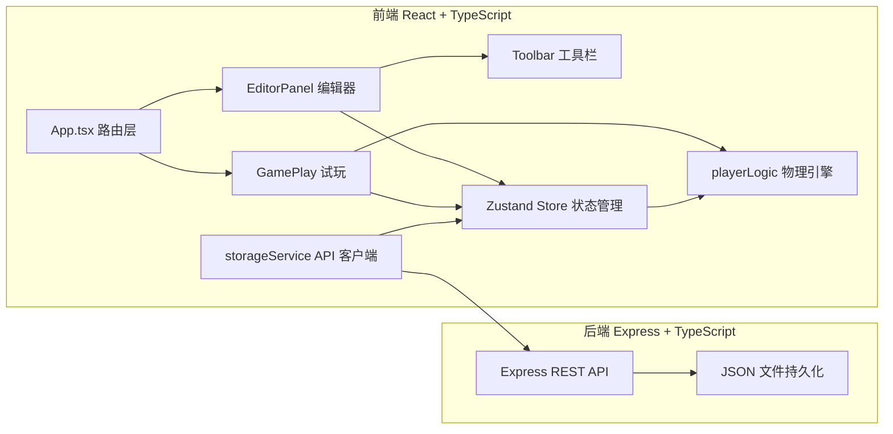
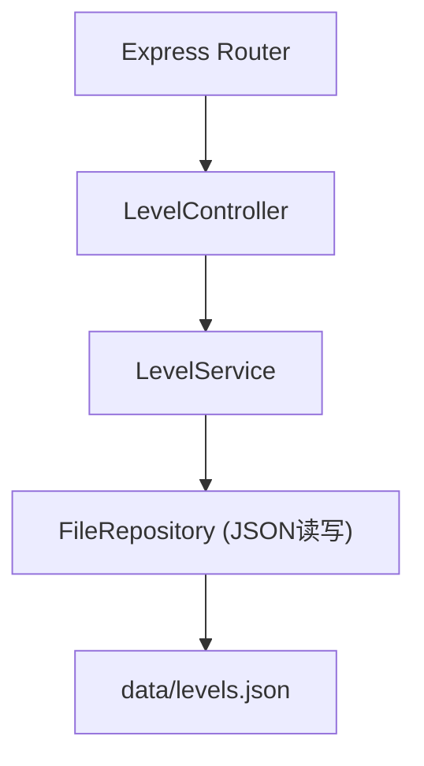
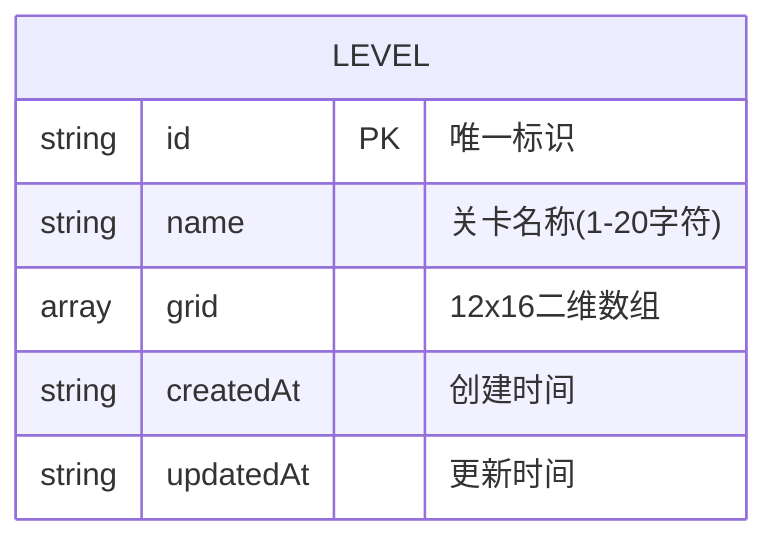

## 1. 架构设计



## 2. 技术选型

- **前端框架**：React@18 + TypeScript + Vite
- **状态管理**：Zustand（轻量级状态管理，编辑器和游戏状态共享）
- **路由**：React Router DOM v6
- **HTTP 客户端**：Axios
- **后端**：Express@4 + TypeScript
- **数据持久化**：JSON 文件存储（无需数据库）
- **唯一标识**：uuid

## 3. 路由定义

| 路由 | 用途 |
|-----|------|
| `/` | 首页，展示已保存关卡列表，支持新建和加载 |
| `/editor` | 编辑器模式，新建空白关卡进行编辑 |
| `/editor/:levelId` | 编辑器模式，加载指定关卡继续编辑 |
| `/play/:levelId` | 试玩模式，加载指定关卡进行游戏 |

## 4. API 定义

### 4.1 类型定义

```typescript
type TileType = 'empty' | 'ground' | 'trap' | 'coin' | 'goal';

interface LevelData {
  id: string;
  name: string;
  grid: TileType[][]; // 12行 x 16列
  createdAt: string;
  updatedAt: string;
}

interface LevelListItem {
  id: string;
  name: string;
  updatedAt: string;
}
```

### 4.2 接口列表

| 方法 | 路径 | 描述 | 请求体 | 响应 |
|-----|------|------|--------|------|
| GET | `/api/levels` | 获取所有关卡列表 | - | `LevelListItem[]` |
| GET | `/api/levels/:id` | 获取单个关卡详情 | - | `LevelData` |
| POST | `/api/levels` | 保存新关卡 | `{ name, grid }` | `LevelData` |
| PUT | `/api/levels/:id` | 更新已有关卡 | `{ name, grid }` | `LevelData` |
| DELETE | `/api/levels/:id` | 删除关卡 | - | `{ success: true }` |

## 5. 服务端架构



## 6. 数据模型

### 6.1 实体关系



### 6.2 网格数据结构

```typescript
// grid[row][col]，共12行16列
// 每个元素为 TileType: 'empty' | 'ground' | 'trap' | 'coin' | 'goal'
// 坐标约定：左上角为 grid[0][0]，右下角为 grid[11][15]
// 出生点固定：左侧第1列、倒数第2行（站在地面上）
```

## 7. 项目目录结构

```
├── src/
│   ├── App.tsx                 # 根组件 + 路由
│   ├── main.tsx                # 入口
│   ├── index.css               # 全局样式
│   ├── modules/
│   │   ├── editor/
│   │   │   ├── EditorPanel.tsx # 编辑器主视图
│   │   │   └── Toolbar.tsx     # 左侧工具栏
│   │   ├── game/
│   │   │   ├── GamePlay.tsx    # 试玩主视图
│   │   │   └── playerLogic.ts  # 玩家物理纯函数
│   │   └── storage/
│   │       └── storageService.ts # API请求封装
│   └── store/
│       └── gameStore.ts        # Zustand状态管理
├── api/
│   ├── index.ts                # Express服务入口
│   ├── routes/
│   │   └── levels.ts           # 关卡路由
│   ├── controllers/
│   │   └── levelController.ts  # 关卡控制器
│   └── data/
│       └── levels.json         # 数据持久化文件
├── shared/
│   └── types.ts                # 前后端共享类型
├── index.html
├── vite.config.ts
├── tsconfig.json
└── package.json
```
