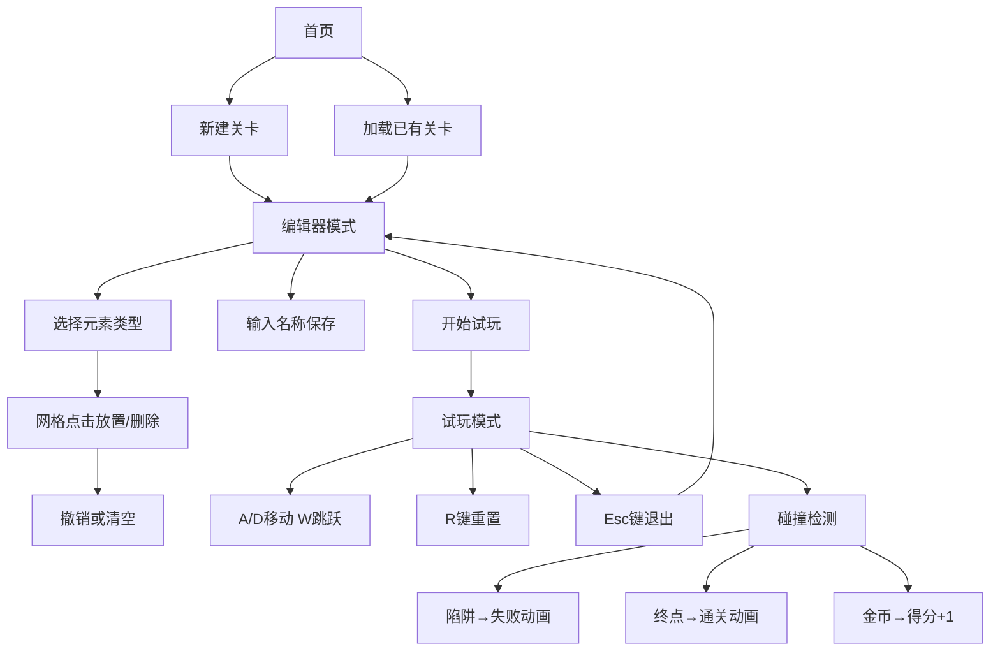

## 1. 产品概述

平台关卡编辑器是一款面向游戏开发爱好者和关卡设计师的浏览器应用，解决无编程环境下快速搭建和测试2D平台游戏关卡布局的问题。用户可以通过可视化网格编辑器放置元素，即时试玩并调整关卡设计，实现从构思到验证的完整闭环。

- 目标用户：游戏开发爱好者、独立游戏开发者、关卡设计师、教育场景下的编程学习者
- 产品价值：降低平台游戏关卡设计门槛，提供可视化、所见即所得的编辑体验，支持快速迭代验证

## 2. 核心功能

### 2.1 功能模块

1. **首页关卡列表**：展示已保存关卡（名称+最后编辑时间），支持进入编辑和删除
2. **关卡编辑器**：工具栏元素选择、16x12网格编辑区、撤销/清空操作、关卡保存
3. **试玩模式**：角色物理控制、碰撞检测、计分系统、失败/通关动画、计时器

### 2.2 页面详情

| 页面名称 | 模块名称 | 功能描述 |
|---------|---------|---------|
| 首页 | 关卡列表 | 展示所有已保存关卡，卡片式布局，显示名称和最后编辑时间，支持点击进入编辑 |
| 首页 | 新建按钮 | 点击创建空白新关卡，跳转到编辑器 |
| 编辑器页 | 工具栏 | 左侧200px固定宽度，包含地面/陷阱/金币/终点四种元素按钮，选中时外发光 |
| 编辑器页 | 网格编辑区 | 16x12网格，每格40x40像素，点击放置/删除选中元素，背景浅灰+半透明网格线 |
| 编辑器页 | 操作区 | 撤销（最多10步）、清空、保存（需输入1-20字符名称）、开始试玩按钮 |
| 试玩页 | 游戏画布 | 16:9自适应画布，渲染玩家角色和所有关卡元素 |
| 试玩页 | HUD | 左上角显示计时器（秒）和金币得分（黄色加粗数字） |
| 试玩页 | 结果遮罩 | 失败/通关时半透明黑色遮罩，中央大字配合缩放动画 |

## 3. 核心流程

用户在首页选择新建或加载关卡 → 进入编辑器通过工具栏选择元素并在网格上放置 → 完成编辑后保存关卡 → 点击开始试玩进入游戏模式 → 使用A/D移动、W跳跃控制角色 → 碰到陷阱失败、碰到终点通关、按R重置、按Esc退出 → 返回编辑器继续调整。

## 4. 用户界面设计

### 4.1 设计风格

- **主色调**：深色主题背景 `#1a1a2e`，编辑区背景 `#f0f0f0` 浅灰
- **元素配色**：地面深褐 `#8B4513`、陷阱红色 `#DC143C`、金币黄色 `#FFD700`、终点绿色 `#228B22`、玩家蓝色 `#4169E1`
- **按钮样式**：圆角矩形 8px 圆角，选中时对应颜色外发光（强度 0.4）
- **字体**：无衬线现代字体，标题加粗，正文常规
- **布局风格**：固定侧边栏 + 主内容区，卡片式列表
- **动效**：模式切换 0.3s 淡入淡出，结果弹窗 0.5s 缩放回弹动画

### 4.2 页面设计概览

| 页面名称 | 模块名称 | UI元素 |
|---------|---------|--------|
| 首页 | 关卡列表卡片 | 深色卡片、悬浮抬升、名称标题、时间副标题、删除按钮 |
| 首页 | 新建按钮 | 中央大号加号按钮、渐变背景、悬浮放大 |
| 编辑器页 | 工具栏 | 左侧深色面板、四个元素按钮垂直排列、选中发光 |
| 编辑器页 | 网格区 | 浅灰背景、细格线、悬浮高亮、点击放置动画 |
| 编辑器页 | 操作按钮 | 底部水平排列、不同语义色、悬浮过渡 |
| 试玩页 | 画布 | 居中16:9区域、两侧留白、深色背景填充 |
| 试玩页 | HUD | 左上角绝对定位、计时器白色、金币数黄色加粗 |
| 试玩页 | 结果遮罩 | 全屏半透明黑、中央大字、缩放动画、提示文字 |

### 4.3 响应式

采用桌面端优先设计，画布自动适应窗口宽度但保持 16:9 宽高比，两侧留白填充深色背景。最小支持宽度 1024px，确保 200px 工具栏 + 640px 画布（16格×40px）的最小布局空间。
