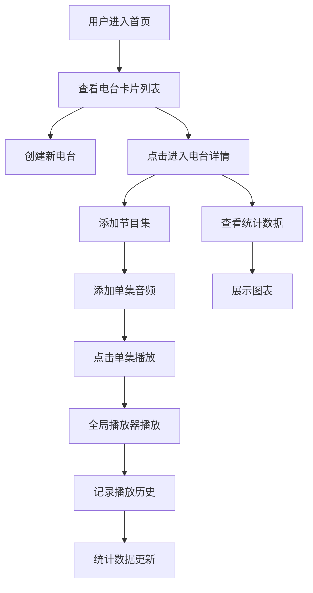

## 1. 产品概述

个人电台管理与音频播放应用，为播客爱好者社群提供统一的节目展示和收听管理平台，支持创建电台、上传音频节目、管理播放列表，并记录播放历史与收听统计。

- 目标用户：播客创作者和听众
- 核心价值：像经营小电台一样发布节目集、管理播放列表、与听众互动

## 2. 核心功能

### 2.1 用户角色

| 角色 | 注册方式 | 核心权限 |
|------|----------|----------|
| 普通用户 | 无需注册（本地应用） | 创建电台、管理节目、播放音频、查看统计 |

### 2.2 功能模块

1. **电台管理**：创建、编辑、删除电台，封面卡片展示
2. **节目集管理**：添加节目集，管理单集音频，拖拽排序
3. **音频播放器**：全局悬浮播放器，支持播放控制和循环模式
4. **收听统计**：播放历史记录，多维度统计图表

### 2.3 页面详情

| 页面名称 | 模块名称 | 功能描述 |
|----------|----------|----------|
| 首页 | 电台列表 | 瀑布流卡片网格展示所有电台，支持创建新电台 |
| 电台详情页 | 节目集Tab | 展示节目集列表，支持添加节目集和单集，拖拽排序 |
| 电台详情页 | 统计Tab | 展示总播放时长、热门单集柱状图、每日播放趋势折线图 |
| 全局播放器 | 播放控制 | 底部固定播放器，播放/暂停、进度条、音量、切歌、循环模式 |

## 3. 核心流程

## 4. 用户界面设计

### 4.1 设计风格

**设计方向：精致现代的音频应用风格**

- 主色调：深色背景（#1a1a2e）搭配渐变蓝色（#667eea → #764ba2）
- 分类标签色：音乐蓝（#3b82f6）、脱口秀绿（#10b981）、故事橙（#f59e0b）、知识紫（#8b5cf6）、其他灰（#6b7280）
- 字体：标题使用 "Poppins" 或现代无衬线字体，正文使用系统字体
- 布局：卡片式布局，毛玻璃效果（backdrop-filter），圆角8px
- 动画：所有交互0.2s缓动效果，页面切换平滑过渡

### 4.2 页面设计概述

| 页面名称 | 模块名称 | UI 元素 |
|----------|----------|---------|
| 首页 | 电台列表 | 瀑布流网格、封面卡片（圆角8px）、分类标签（右上角）、悬停缩放效果 |
| 电台详情 | 顶部横幅 | 全宽200px封面、渐变遮罩、电台名叠加 |
| 电台详情 | Tab切换 | "节目集" / "统计" Tab切换，下划线动画 |
| 电台详情 | 节目集列表 | 可折叠节目集、单集列表项、拖拽手柄 |
| 电台详情 | 统计图表 | 总播放时长卡片、柱状图（Top3单集）、折线图（7日趋势） |
| 全局播放器 | 底部控制栏 | 64px高度、半透明毛玻璃、渐变进度条、音量滑块波纹效果 |

### 4.3 响应式设计

- 桌面端：卡片多列网格布局
- 平板端（768px-1024px）：3列卡片
- 移动端（768px以下）：2列卡片，触控友好的进度条和按钮

### 4.4 性能约束

- 电台卡片到详情页渲染：≤ 1.2秒
- 播放器进度条拖拽响应：≤ 50ms
- 图表渲染时间：≤ 300ms
