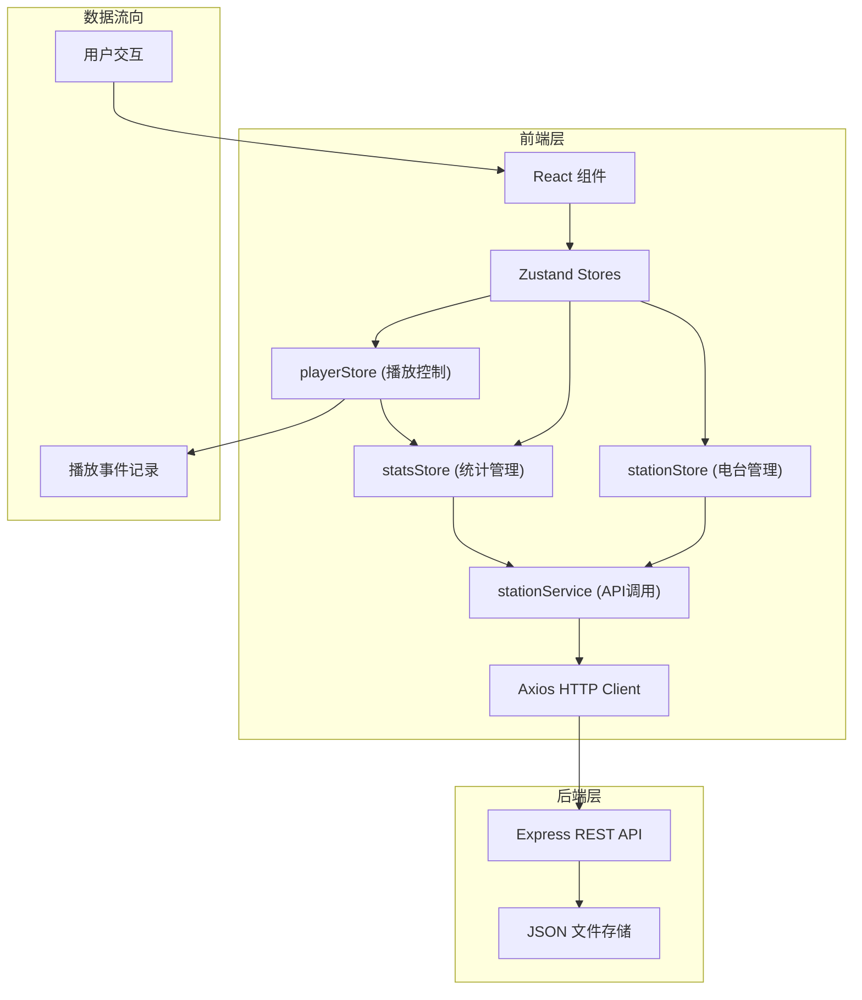
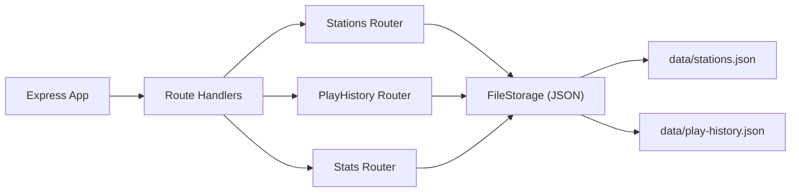
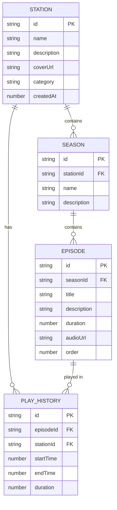

## 1. 架构设计



## 2. 技术描述

- 前端：React 18 + TypeScript + Vite 5
- 状态管理：Zustand 4
- 路由：React Router DOM 6
- HTTP客户端：Axios
- 后端：Express 4 + TypeScript
- 数据库：JSON 文件存储 (fs模块)
- 工具库：uuid (ID生成)、date-fns (日期处理)
- 样式：CSS Modules + 全局CSS变量
- 图表：原生SVG实现图表渲染（无需额外图表库）

## 3. 路由定义

| 路由路径 | 页面组件 | 功能 |
|----------|----------|------|
| `/` | HomePage | 首页电台列表 |
| `/station/:id` | StationDetailPage | 电台详情页（节目集/统计Tab） |

## 4. API 定义

### 4.1 类型定义

```typescript
// 电台分类
type StationCategory = 'music' | 'talk' | 'story' | 'education' | 'other';

// 循环模式
type LoopMode = 'none' | 'single' | 'list' | 'shuffle';

// 电台
interface Station {
  id: string;
  name: string;
  description: string;
  coverUrl: string;
  category: StationCategory;
  createdAt: number;
  seasons: Season[];
}

// 节目集
interface Season {
  id: string;
  name: string;
  description: string;
  episodes: Episode[];
}

// 单集音频
interface Episode {
  id: string;
  title: string;
  description: string;
  duration: number; // 秒
  audioUrl: string;
  order: number;
}

// 播放历史
interface PlayHistory {
  id: string;
  episodeId: string;
  stationId: string;
  startTime: number;
  endTime: number;
  duration: number;
}

// 播放状态
interface PlayerState {
  currentEpisode: Episode | null;
  currentStation: Station | null;
  isPlaying: boolean;
  currentTime: number;
  volume: number;
  loopMode: LoopMode;
  playlist: Episode[];
  currentIndex: number;
}

// 统计数据
interface StatsData {
  totalPlayTime: number;
  episodePlayCounts: Record<string, number>;
  dailyPlayTime: Record<string, number>;
}
```

### 4.2 API 端点

| 方法 | 路径 | 描述 | 请求体 | 响应 |
|------|------|------|--------|------|
| GET | `/api/stations` | 获取所有电台 | - | `Station[]` |
| POST | `/api/stations` | 创建新电台 | `{name, description, coverUrl, category}` | `Station` |
| PUT | `/api/stations/:id` | 更新电台 | `{name, description, coverUrl, category}` | `Station` |
| DELETE | `/api/stations/:id` | 删除电台 | - | `{success: boolean}` |
| POST | `/api/stations/:id/seasons` | 添加节目集 | `{name, description}` | `Season` |
| POST | `/api/stations/:id/seasons/:seasonId/episodes` | 添加单集 | `{title, description, duration, audioUrl}` | `Episode` |
| PUT | `/api/stations/:id/seasons/:seasonId/episodes/reorder` | 重排单集 | `{episodeIds: string[]}` | `{success: boolean}` |
| GET | `/api/play-history` | 获取播放历史 | - | `PlayHistory[]` |
| POST | `/api/play-history` | 记录播放历史 | `{episodeId, stationId, startTime, endTime, duration}` | `PlayHistory` |
| GET | `/api/stats` | 获取统计数据 | - | `StatsData` |

## 5. 服务器架构



## 6. 数据模型

### 6.1 ER图



### 6.2 数据文件结构

```
data/
├── stations.json       # 所有电台数据
└── play-history.json # 播放历史记录
```

## 7. 文件结构与调用关系

```
src/
├── modules/
│   ├── station/
│   │   ├── types.ts          # 数据类型定义（被所有模块引用）
│   │   ├── stationStore.ts   # Zustand store → 调用 stationService
│   │   └── stationService.ts # API调用 → axios → 后端API
│   ├── player/
│   │   ├── playerStore.ts    # Zustand store → 更新播放状态
│   │   └── audioPlayer.tsx # 播放器组件 → 调用 playerStore
│   └── stats/
│       └── statsStore.ts    # Zustand store → 订阅 playerStore 事件
├── pages/
│   ├── HomePage.tsx           # 电台列表页
│   └── StationDetailPage.tsx # 电台详情页
├── components/
│   ├── StationCard.tsx        # 电台卡片组件
│   ├── SeasonList.tsx         # 节目集列表
│   ├── EpisodeItem.tsx        # 单集列表项
│   ├── StatsCharts.tsx        # 统计图表
│   └── Modal.tsx              # 弹窗组件
├── App.tsx                      # 主应用 + 路由
└── main.tsx                     # 入口文件
api/
├── server.ts                     # Express 服务器入口
├── routes/
│   ├── stations.ts             # 电台路由
│   ├── playHistory.ts          # 播放历史路由
│   └── stats.ts                # 统计路由
└── storage/
│   └── fileStorage.ts         # JSON文件操作
└── data/
    ├── stations.json
    └── play-history.json
```

**调用关系：
1. 组件 → stationStore → stationService → axios → 后端API → JSON存储
2. 播放组件 → playerStore → 更新UI
3. playerStore → statsStore → 记录播放事件 → 后端API
