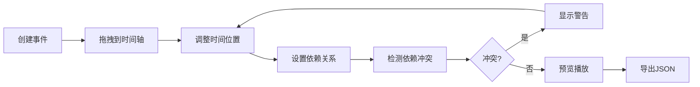

## 1. 产品概述

Web端交互式时间轴编辑工具，让用户能以拖拽方式创建和编辑多轨道时间序列，支持事件标记、时间范围调整和时间轴预览。

- 主要用途：可视化时间序列管理、事件调度与规划
- 目标用户：项目管理人员、内容创作者、视频剪辑师

## 2. 核心特性

### 2.1 功能模块

1. **时间轴编辑器页面**：多轨道时间轴展示、事件拖拽、时间缩放
2. **事件管理模块**：事件创建、编辑、删除、依赖关系管理
3. **预览播放模块**：时间轴播放、暂停、导出JSON

### 2.2 页面详情

| 页面名称 | 模块名称 | 功能描述 |
|-----------|-------------|---------------------|
| 时间轴编辑器 | 时间轴画布 | 多轨道展示、事件拖拽、缩放、刻度渲染 |
| 时间轴编辑器 | 事件列表 | 左侧边栏展示所有事件，支持拖拽到时间轴 |
| 时间轴编辑器 | 事件详情面板 | 编辑事件属性、设置前置依赖 |

## 3. 核心流程

### 3.1 主要用户流程

用户创建事件 → 拖拽事件到时间轴轨道 → 调整事件时间位置 → 设置事件依赖关系 → 预览时间轴播放 → 导出JSON数据

### 3.2 流程图

## 4. 用户界面设计

### 4.1 设计风格

- **主色调**：深色主题，侧边栏#1e1e2e，主区域#f8f9fa
- **配色方案**：
  - 背景色：#f0f0f0（时间轴背景）
  - 刻度线：#888（深灰）
  - 轨道分隔线：#c0d6f5（虚线浅蓝）
  - 选中高亮：#dbeafe（浅蓝）
- **按钮样式**：圆角矩形，悬停有颜色过渡动画（0.2s ease）
- **字体**：使用现代无衬线字体，清晰易读
- **布局风格**：三栏布局，可拖拽调整宽度

### 4.2 页面设计概述

| 页面名称 | 模块名称 | UI元素 |
|-----------|-------------|-------------|
| 时间轴编辑器 | 时间轴画布 | 多轨道、事件标记（圆角矩形30px高、颜色标签）、刻度线、播放头（红色竖线+三角）、依赖箭头（灰色虚线） |
| 时间轴编辑器 | 事件列表 | 卡片式展示，左侧颜色色块，名称和描述省略号，选中高亮 |
| 时间轴编辑器 | 事件详情面板 | 表单编辑、依赖选择、删除确认 |

### 4.3 响应式设计

- **桌面优先设计，三栏布局
- 左侧事件列表：280px，可拖拽调整
- 右侧详情面板：320px，可拖拽调整
- 中间时间轴区域：自适应剩余宽度

### 4.4 交互动效

- 事件拖拽：drop-shadow阴影（4px blur, rgba(0,0,0,0.2)，放大1.1倍
- 缩放动画：平滑插值（0.3s ease-out）
- 按钮悬停：颜色过渡（0.2s ease）
- 播放动画：事件半透明50%，当前播放事件放大1.2倍
