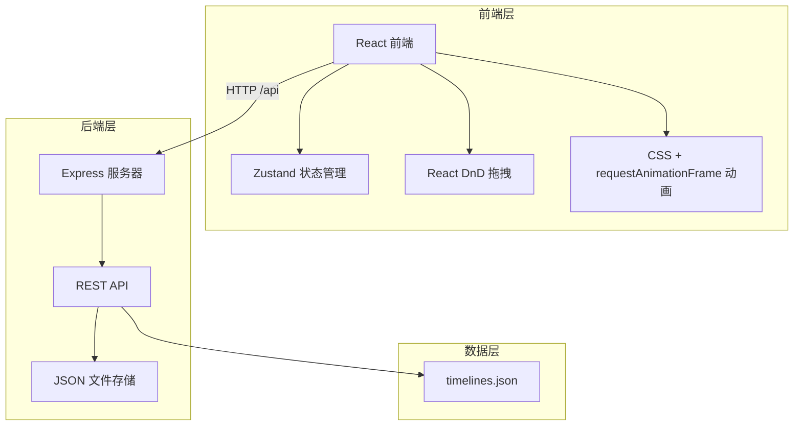
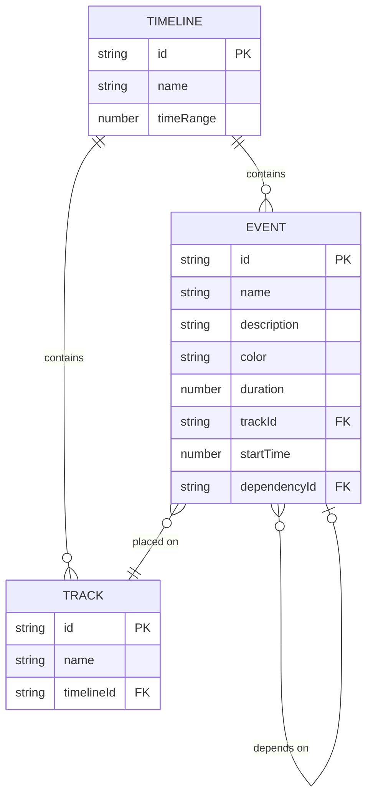

## 1. 架构设计



## 2. 技术描述

- **前端**：React@18 + TypeScript + Vite
- **状态管理**：Zustand
- **后端**：Express@4
- **HTTP客户端**：Axios
- **路由**：React Router DOM
- **拖拽**：React DnD
- **唯一ID**：uuid

## 3. 目录结构

```
.
├── src/
│   ├── components/
│   │   ├── EditorDisplay.tsx
│   │   ├── EventList.tsx
│   │   └── EventPanel.tsx
│   ├── pages/
│   │   └── Editor.tsx
│   ├── stores/
│   │   ├── useTimelineStore.ts
│   │   └── useEventStore.ts
│   ├── types/
│   │   └── index.ts
│   ├── utils/
│   │   └── api.ts
│   │   └── timeline.ts
│   ├── App.tsx
│   └── main.tsx
├── server.js
├── data/
│   └── timelines.json
├── package.json
├── vite.config.js
├── tsconfig.json
└── index.html
```

## 4. 路由定义

| 路由 | 用途 |
|-------|---------|
| / | 时间轴编辑器页面 |
| /editor | 时间轴编辑器页面 |

## 5. API 定义

### 5.1 数据类型定义

```typescript
interface TimelineEvent {
  id: string;
  name: string;
  description: string;
  color: string;
  duration: number;
  trackId: string | null;
  startTime: number | null;
  dependencyId: string | null;
}

interface Track {
  id: string;
  name: string;
}

interface Timeline {
  id: string;
  name: string;
  tracks: Track[];
  events: TimelineEvent[];
  timeRange: number;
  createdAt: string;
  updatedAt: string;
}
```

### 5.2 REST API

| 方法 | 路径 | 描述 |
|------|------|------|
| GET | /api/timelines | 获取所有时间轴 |
| POST | /api/timelines | 创建新时间轴 |
| PUT | /api/timelines/:id | 更新时间轴 |
| DELETE | /api/timelines/:id | 删除时间轴 |

### 5.3 响应格式

```typescript
// GET /api/timelines
Response: Timeline[]

// POST /api/timelines
Request: { name: string }
Response: Timeline

// PUT /api/timelines/:id
Request: Partial<Timeline>
Response: Timeline
```

## 6. 数据模型

### 6.1 实体关系图



### 6.2 文件存储结构

```json
{
  "timelines": [
    {
      "id": "uuid",
      "name": "默认时间轴",
      "tracks": [
        { "id": "track-a", "name": "轨道A" },
        { "id": "track-b", "name": "轨道B" },
        { "id": "track-c", "name": "轨道C" }
      ],
      "events": [],
      "timeRange": 30,
      "createdAt": "2026-06-14T00:00:00.000Z",
      "updatedAt": "2026-06-14T00:00:00.000Z"
    }
  ]
}
```

## 7. 状态管理

### 7.1 useTimelineStore

```typescript
- currentTimeline: Timeline | null
- selectedEventId: string | null
- zoomLevel: number
- visibleTimeRange: { start: number; end: number }
- scrollLeft: number
- isPlaying: boolean
- playbackPosition: number
- setCurrentTimeline()
- setSelectedEvent()
- setZoomLevel()
- setVisibleTimeRange()
- setScrollLeft()
- togglePlayback()
- setPlaybackPosition()
```

### 7.2 useEventStore

```typescript
- events: TimelineEvent[]
- dispatchQueue: Array<{ type: string; payload: any }>
- setEvents()
- addEvent()
- updateEvent()
- removeEvent()
- dispatchEventRequest()
- processDispatchQueue()
```

## 8. 组件调用关系

```
App.tsx (路由和全局状态)
    ↓
Editor.tsx (主页面)
    ├─→ EventList.tsx (左侧事件列表)
    │     └── 拖拽事件 → useEventStore
    ├─→ EditorDisplay.tsx (中间时间轴画布)
    │     ├── useTimelineStore
    │     └── useEventStore
    └─→ EventPanel.tsx (右侧事件详情)
          ├── useTimelineStore
          └── useEventStore
```

## 9. 数据流向

```
用户交互 → 组件事件 → Zustand Store → API 调用 → 后端更新 → JSON文件更新
      ↑                                                        ↓
      └────────────────────────────────────────────────────────┘
             状态同步更新
```
