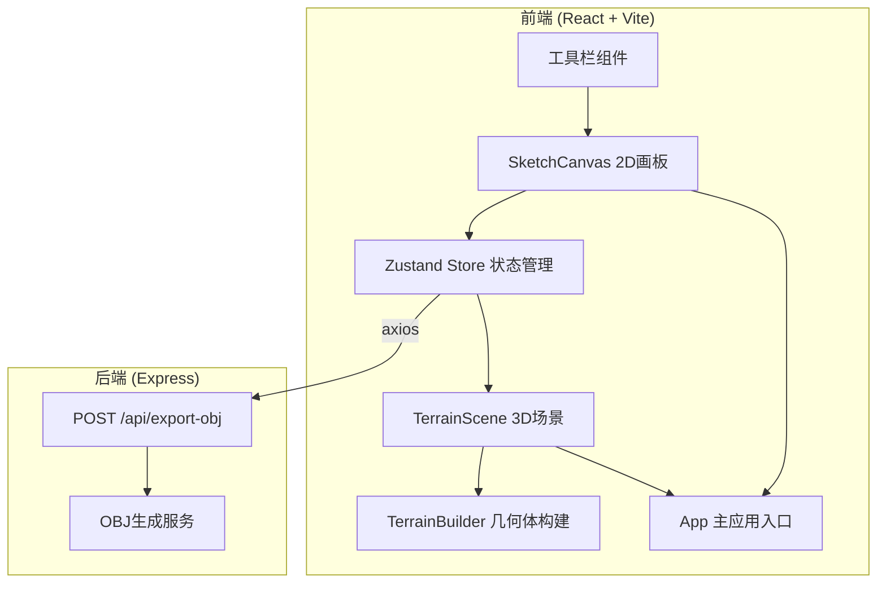

## 1. 架构设计



## 2. 技术选型

- **前端框架**：React 18 + TypeScript
- **构建工具**：Vite 5 + vite-plugin-react
- **3D渲染**：Three.js + @react-three/fiber + @react-three/drei
- **状态管理**：Zustand
- **后端框架**：Express 4
- **HTTP客户端**：Axios
- **代码规范**：TypeScript 严格模式

## 3. 项目文件结构

```
.
├── package.json
├── index.html
├── vite.config.js
├── tsconfig.json
├── src/
│   ├── main.tsx          # 应用入口
│   ├── App.tsx           # 主应用组件
│   ├── App.css           # 全局样式
│   ├── store/
│   │   └── useSketchStore.ts   # Zustand 状态管理
│   ├── 2d/
│   │   └── SketchCanvas.tsx    # 2D画板组件
│   └── 3d/
│       ├── TerrainScene.tsx    # 3D场景组件
│       └── TerrainBuilder.ts   # 几何体构建工具
└── server/
    └── index.ts          # Express 服务器
```

## 4. 数据模型

### 4.1 草图数据类型

```typescript
interface Point {
  x: number;
  y: number;
}

type ShapeType = 'line' | 'rect' | 'circle';
type ColorType = 'green' | 'blue' | 'gray' | 'brown';
type StrokeWidth = 'thin' | 'medium' | 'thick';

interface BaseShape {
  id: string;
  type: ShapeType;
  color: ColorType;
  strokeWidth: StrokeWidth;
}

interface LineShape extends BaseShape {
  type: 'line';
  points: Point[];
}

interface RectShape extends BaseShape {
  type: 'rect';
  x: number;
  y: number;
  width: number;
  height: number;
  height3d: number;
}

interface CircleShape extends BaseShape {
  type: 'circle';
  cx: number;
  cy: number;
  radius: number;
}

type Shape = LineShape | RectShape | CircleShape;

interface SketchState {
  shapes: Shape[];
  selectedTool: ShapeType;
  selectedColor: ColorType;
  selectedStrokeWidth: StrokeWidth;
  isGenerated: boolean;
  addShape: (shape: Shape) => void;
  removeShape: (id: string) => void;
  clearShapes: () => void;
  setTool: (tool: ShapeType) => void;
  setColor: (color: ColorType) => void;
  setStrokeWidth: (width: StrokeWidth) => void;
  setGenerated: (gen: boolean) => void;
}
```

## 5. API 定义

### 5.1 导出 OBJ 接口

**请求**：`POST /api/export-obj`

```typescript
interface ExportObjRequest {
  shapes: Shape[];
}

interface ExportObjResponse {
  success: boolean;
  filename: string;
}
```

**响应**：返回 OBJ 文件流（Content-Type: application/octet-stream）

## 6. 核心技术方案

### 6.1 2D 绘制方案
- 使用 Canvas 2D API 实现自由绘制
- 10x10 像素虚网格吸附：绘制结束时将坐标对齐到最近的网格点
- 工具模式：线条（自由路径）、矩形（拖拽起始点）、圆形（拖拽半径）
- 颜色映射：green(#22c55e) / blue(#3b82f6) / gray(#6b7280) / brown(#92400e)
- 笔触粗细映射：thin(2px) / medium(4px) / thick(8px)

### 6.2 3D 重建方案
- **线条 → 起伏三角形网格**：沿线条生成带宽度的平面，根据线条顶点高度生成起伏
- **矩形 → 立方体**：高度随机 1-3 单位
- **圆形 → 平面凹陷**：底部低于基准面 0.5 单位
- **材质**：顶点颜色根据高度渐变（低处绿色 → 高处棕色）
- **坐标映射**：2D 画布坐标映射到 3D 场景坐标，比例 1:0.1

### 6.3 增量更新方案
- 通过 shape.id 追踪每个几何体
- 新增：动态添加到场景，0.3s 淡入（opacity 0→1）
- 删除：0.3s 淡出后移除
- 修改：重建对应几何体

### 6.4 性能优化
- 3D 场景使用 InstancedMesh 优化同类几何体
- 2D 绘制使用 requestAnimationFrame 节流
- Zustand 选择器避免不必要重渲染
- 100 个几何体内保持 60FPS

## 7. 响应式布局

- 使用 Flexbox 实现左右分栏
- 使用 `@media (max-width: 768px)` 切换为上下布局
- 分割线拖拽：监听 mousedown/mousemove/mouseup 事件，动态调整面板宽度
