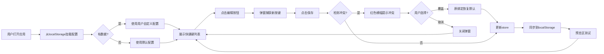

## 1. 产品概述

键盘快捷键可视化配置与实时预览应用，为个人网站用户提供轻量级的键盘交互管理工具。用户可在页面上可视化配置所有快捷键绑定，并实时预览测试效果，无需刷新页面即可生效。

- **核心价值**：解决个人网站键盘快捷键难以配置和调试的痛点，提供直观的可视化界面
- **目标用户**：个人网站开发者、希望自定义键盘交互的网站用户
- **市场定位**：开发者工具类产品，专注于键盘交互的可视化配置与测试

## 2. 核心功能

### 2.1 用户角色

| 角色 | 注册方式 | 核心权限 |
|------|---------|---------|
| 普通用户 | 无需注册 | 查看、编辑、测试快捷键绑定，配置自动保存到本地 |

### 2.2 功能模块

1. **快捷键配置面板**：左侧面板展示所有快捷键绑定卡片列表，支持搜索筛选
2. **快捷键编辑器**：弹窗组件，支持按键捕获、冲突检测与覆盖
3. **实时预览区**：右侧键盘矩阵图，支持按键测试与视觉反馈
4. **数据持久化**：自动保存用户配置到localStorage，刷新后自动恢复

### 2.3 页面详情

| 页面名称 | 模块名称 | 功能描述 |
|---------|---------|----------|
| 主页面 | 快捷键配置面板 | 3列网格展示快捷键卡片，支持搜索筛选，点击编辑按钮进入编辑模式 |
| 主页面 | 快捷键编辑弹窗 | 按键捕获区域实时显示按键组合，保存时检测冲突，支持覆盖或取消 |
| 主页面 | 键盘预览区 | 按功能分组的键盘矩阵图，按键触发时绿色闪烁，显示动作名称 |
| 主页面 | 全局按键监听 | 页面加载时初始化全局监听器，实时响应按键事件 |

## 3. 核心流程

用户打开应用 → 从localStorage加载配置（无数据则使用默认）→ 查看快捷键列表 → 点击编辑按钮 → 在弹窗中按下新的按键组合 → 保存时检测冲突 → 无冲突则保存并更新store → 有冲突则提示覆盖或取消 → 保存后自动同步到localStorage → 在预览区测试新绑定

## 4. 用户界面设计

### 4.1 设计风格

- **主题**：深色科技风格，营造专业工具感
- **主背景**：#1a1a2e
- **卡片背景**：#16213e
- **文字颜色**：#e0e0e0
- **强调色**：#0f3460
- **冲突提示色**：#ff4444
- **分组标签色**：#e94560
- **按钮样式**：圆角矩形，悬停时有上浮阴影效果
- **字体**：现代无衬线字体，等宽字体显示按键组合
- **布局风格**：左右分栏，左侧配置面板，右侧预览区域
- **动画效果**：卡片悬停上浮、弹窗淡入放大、按键绿色闪烁、冲突红色闪烁

### 4.2 页面设计概述

| 页面名称 | 模块名称 | UI元素 |
|---------|---------|--------|
| 主页面 | 快捷键配置面板 | 搜索框、3列网格布局、快捷键卡片（动作名+按键组合标签+编辑按钮）、卡片悬停动画 |
| 主页面 | 快捷键编辑弹窗 | 半透明遮罩、120x80px按键捕获区、修饰键标签（深灰）、主键标签（蓝色高亮）、保存/取消按钮、冲突提示横幅 |
| 主页面 | 键盘预览区 | 深色渐变背景、功能分组标签、键盘矩阵图（60x40px按键）、触发提示文字、按键闪烁动画 |
| 主页面 | 全局布局 | 左右分栏（40%/60%）、左侧最小宽度400px、响应式自适应 |

### 4.3 响应式

- **设计原则**：桌面优先（desktop-first），适配1366x768及以上分辨率
- **布局约束**：左侧配置面板最小宽度400px，右侧预览区域自动占据剩余空间
- **窗口缩放**：布局不变形，内容可滚动显示
- **触控优化**：按钮和可点击区域足够大，支持键盘导航操作

### 4.4 性能约束

- 按键捕获响应延迟 ≤ 50ms
- 弹窗开启动画60fps流畅运行
- 30个快捷键同时渲染时，修改后重渲染时间 ≤ 150ms
- 动画过渡时间统一为0.2s-0.3s，确保视觉流畅
