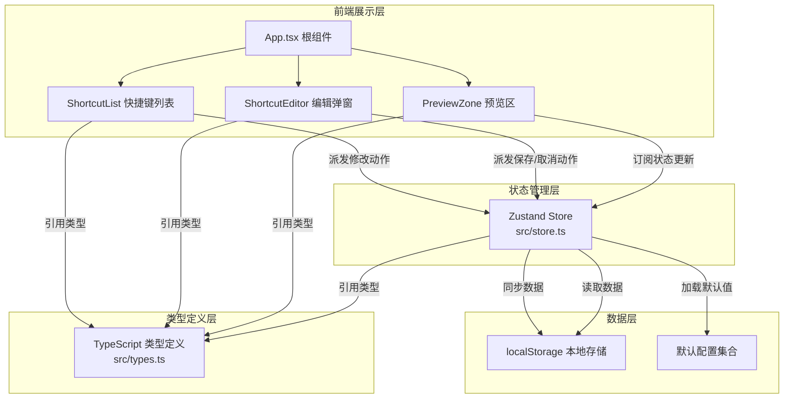
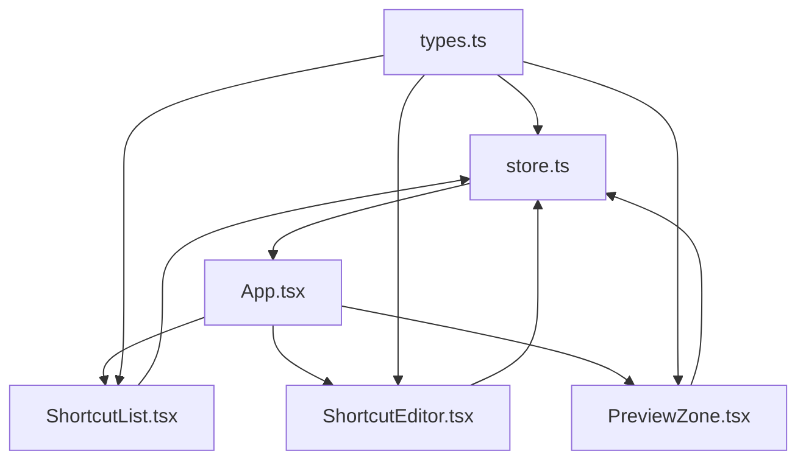
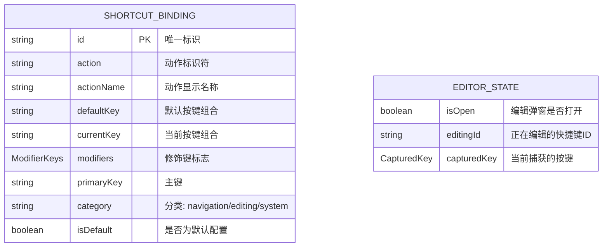

## 1. 架构设计



**数据流向说明：**
- 组件 → Store：用户交互通过组件派发动作到Store
- Store → 本地存储：Store更新后自动同步到localStorage
- 本地存储 → Store：应用初始化时从localStorage恢复数据
- Store → 组件：组件订阅Store状态，数据更新时自动重渲染
- 类型定义 → 所有模块：types.ts被store和所有组件引用

## 2. 技术描述

- **前端框架**：React@18 + TypeScript@5
- **构建工具**：Vite@5
- **状态管理**：Zustand@4
- **样式方案**：CSS Modules（模块化CSS，避免样式冲突）
- **路由管理**：react-router-dom@6（单页路由分发）
- **数据持久化**：浏览器localStorage API
- **无后端依赖**：纯前端应用，所有数据本地存储

## 3. 项目结构与文件职责

| 文件路径 | 职责描述 | 依赖关系 |
|---------|---------|---------|
| `package.json` | 项目依赖配置（react、react-dom、react-router-dom、zustand），启动脚本 | 无 |
| `vite.config.js` | Vite配置，React插件启用 | 无 |
| `tsconfig.json` | TypeScript严格模式配置 | 无 |
| `index.html` | 应用入口页面 | 无 |
| `src/types.ts` | 定义快捷键绑定类型接口（ShortcutBinding、ModifierKeys等） | 被store.ts、所有组件引用 |
| `src/store.ts` | Zustand store，管理快捷键列表、编辑状态、本地存储同步 | 引用types.ts |
| `src/App.tsx` | 根组件，初始化全局按键监听，路由分发 | 引用store.ts、types.ts、子组件 |
| `src/components/ShortcutList.tsx` | 渲染快捷键卡片列表（3列网格），搜索筛选 | 引用store.ts、types.ts |
| `src/components/ShortcutEditor.tsx` | 按键捕获弹窗，冲突检测与覆盖 | 引用store.ts、types.ts |
| `src/components/PreviewZone.tsx` | 键盘矩阵预览区，按键测试与视觉反馈 | 引用store.ts、types.ts |
| `src/components/*.module.css` | CSS Modules样式文件 | 对应组件引用 |

**模块调用关系图：**


## 4. 类型定义

```typescript
// src/types.ts

// 修饰键标志
export interface ModifierKeys {
  ctrl: boolean;
  shift: boolean;
  alt: boolean;
  meta: boolean;
}

// 快捷键绑定接口
export interface ShortcutBinding {
  id: string;
  action: string;
  actionName: string;
  defaultKey: string;
  currentKey: string;
  modifiers: ModifierKeys;
  primaryKey: string;
  category: 'navigation' | 'editing' | 'system';
  isDefault: boolean;
}

// 捕获的按键状态
export interface CapturedKey {
  modifiers: ModifierKeys;
  primaryKey: string;
  keyString: string;
}

// 编辑状态
export interface EditorState {
  isOpen: boolean;
  editingId: string | null;
  capturedKey: CapturedKey | null;
}

// 按键分类配置
export interface KeyCategory {
  name: string;
  keys: string[];
}
```

## 5. Store 核心方法

| 方法名 | 参数 | 功能描述 |
|-------|-----|---------|
| `initStore` | 无 | 从localStorage加载配置，无数据则使用默认 |
| `updateShortcut` | id: string, capturedKey: CapturedKey | 更新快捷键绑定，自动检测冲突 |
| `resetToDefault` | id: string | 将指定快捷键恢复为默认值 |
| `resetAllToDefault` | 无 | 将所有快捷键恢复为默认值 |
| `checkConflict` | keyString: string, excludeId?: string | 检测按键组合是否冲突 |
| `openEditor` | id: string | 打开编辑弹窗 |
| `closeEditor` | 无 | 关闭编辑弹窗 |
| `setCapturedKey` | key: CapturedKey | 设置当前捕获的按键 |
| `saveShortcut` | force?: boolean | 保存快捷键（force=true时强制覆盖） |
| `getShortcutsByCategory` | category: string | 按分类获取快捷键列表 |

## 6. 数据模型

### 6.1 数据模型定义



### 6.2 数据存储格式

**localStorage 存储键名**：`shortcut-bindings-v1`

**存储格式（JSON数组）**：
```json
[
  {
    "id": "open-search",
    "action": "openSearch",
    "actionName": "打开搜索",
    "defaultKey": "Ctrl+K",
    "currentKey": "Ctrl+K",
    "modifiers": { "ctrl": true, "shift": false, "alt": false, "meta": false },
    "primaryKey": "K",
    "category": "system",
    "isDefault": true
  }
]
```

### 6.3 默认快捷键配置（预置30个）

| 分类 | 动作名称 | 默认按键 |
|-----|---------|---------|
| 导航类 | 向上滚动 | ArrowUp |
| 导航类 | 向下滚动 | ArrowDown |
| 导航类 | 页面顶部 | Home |
| 导航类 | 页面底部 | End |
| 导航类 | 后退 | Alt+ArrowLeft |
| 导航类 | 前进 | Alt+ArrowRight |
| 导航类 | 下一个标签 | Ctrl+Tab |
| 导航类 | 上一个标签 | Ctrl+Shift+Tab |
| 编辑类 | 复制 | Ctrl+C |
| 编辑类 | 粘贴 | Ctrl+V |
| 编辑类 | 剪切 | Ctrl+X |
| 编辑类 | 全选 | Ctrl+A |
| 编辑类 | 撤销 | Ctrl+Z |
| 编辑类 | 重做 | Ctrl+Shift+Z |
| 编辑类 | 粗体 | Ctrl+B |
| 编辑类 | 斜体 | Ctrl+I |
| 编辑类 | 下划线 | Ctrl+U |
| 编辑类 | 删除行 | Ctrl+D |
| 系统类 | 打开搜索 | Ctrl+K |
| 系统类 | 保存项目 | Ctrl+S |
| 系统类 | 新建项目 | Ctrl+N |
| 系统类 | 打印 | Ctrl+P |
| 系统类 | 刷新页面 | F5 |
| 系统类 | 打开设置 | Ctrl+, |
| 系统类 | 切换全屏 | F11 |
| 系统类 | 打开帮助 | F1 |
| 系统类 | 关闭窗口 | Ctrl+W |
| 系统类 | 退出应用 | Ctrl+Q |
| 系统类 | 切换主题 | Ctrl+Shift+T |
| 系统类 | 打开命令面板 | Ctrl+Shift+P |

## 7. 性能优化方案

1. **组件按需渲染**：使用Zustand的选择器(selector)只订阅组件需要的状态，避免不必要的重渲染
2. **列表虚拟化**：快捷键列表使用React.memo优化卡片组件，只在数据变化时重渲染
3. **按键节流**：全局按键监听使用requestAnimationFrame确保响应延迟≤50ms
4. **本地存储防抖**：保存到localStorage使用debounce，避免频繁IO操作
5. **CSS动画优化**：所有动画使用transform和opacity属性，启用GPU加速，确保60fps
6. **状态批量更新**：使用Zustand的批量更新API，减少重渲染次数
