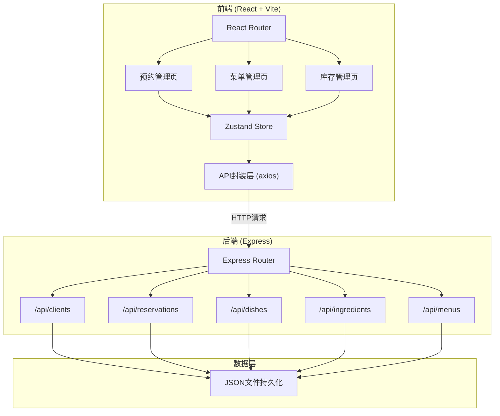
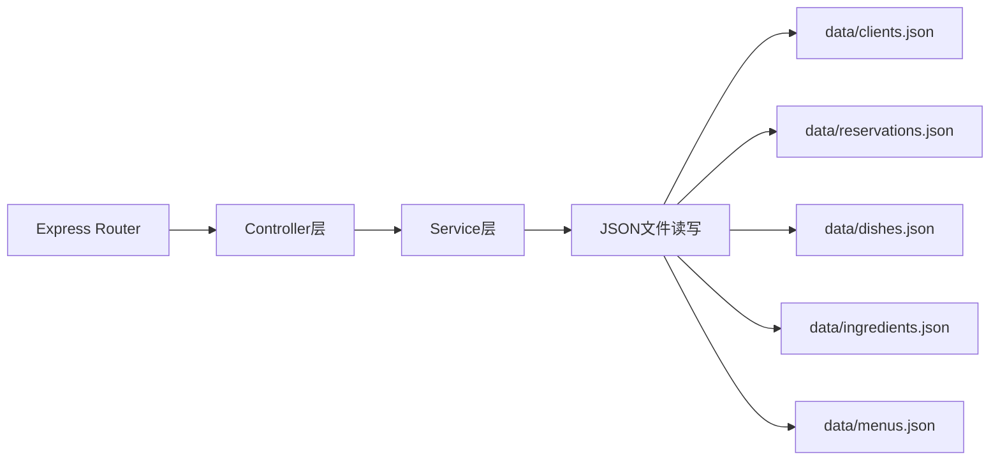
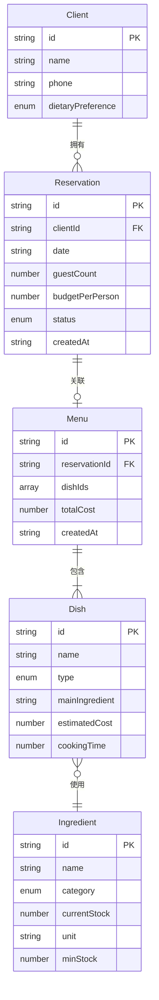

## 1. 架构设计



## 2. 技术说明

- 前端：React@18 + TypeScript + TailwindCSS@3 + Vite
- 初始化工具：vite-init (react-express-ts模板)
- 后端：Express@4 + TypeScript
- 数据库：JSON文件持久化（data/目录）
- 状态管理：Zustand（预约、菜单、食材三个独立slice）
- HTTP客户端：axios
- 路由：react-router-dom v6

## 3. 路由定义

| 路由 | 用途 |
|------|------|
| / | 重定向到预约管理页 |
| /reservations | 预约管理页（含客户信息与时间线视图） |
| /menus | 菜单管理页（菜单生成、卡片展示、替换） |
| /inventory | 食材库存管理页（预警、搜索、筛选） |

## 4. API定义

### 4.1 客户管理

| 方法 | 路径 | 描述 | 请求体 | 响应 |
|------|------|------|--------|------|
| GET | /api/clients | 获取所有客户 | - | Client[] |
| POST | /api/clients | 创建客户 | { name, phone, dietaryPreference } | Client |
| PUT | /api/clients/:id | 更新客户 | { name?, phone?, dietaryPreference? } | Client |
| DELETE | /api/clients/:id | 删除客户 | - | { success: boolean } |

### 4.2 预约管理

| 方法 | 路径 | 描述 | 请求体 | 响应 |
|------|------|------|--------|------|
| GET | /api/reservations | 获取所有预约 | - | Reservation[] |
| POST | /api/reservations | 创建预约 | { clientId, date, guestCount, budgetPerPerson, status } | Reservation |
| PUT | /api/reservations/:id | 更新预约 | { date?, guestCount?, budgetPerPerson?, status? } | Reservation |
| DELETE | /api/reservations/:id | 删除预约 | - | { success: boolean } |

### 4.3 菜品管理

| 方法 | 路径 | 描述 | 请求体 | 响应 |
|------|------|------|--------|------|
| GET | /api/dishes | 获取所有菜品 | - | Dish[] |
| POST | /api/dishes | 创建菜品 | { name, type, mainIngredient, estimatedCost, cookingTime } | Dish |

### 4.4 菜单管理

| 方法 | 路径 | 描述 | 请求体 | 响应 |
|------|------|------|--------|------|
| GET | /api/menus | 获取所有菜单 | - | Menu[] |
| POST | /api/menus/generate | 根据预约生成菜单 | { reservationId } | Menu |
| PUT | /api/menus/:id/replace | 替换菜单中某道菜 | { menuId, dishIndex, newDishId } | Menu |

### 4.5 食材库存

| 方法 | 路径 | 描述 | 请求体 | 响应 |
|------|------|------|--------|------|
| GET | /api/ingredients | 获取所有食材 | - | Ingredient[] |
| POST | /api/ingredients | 添加食材 | { name, category, currentStock, unit, minStock } | Ingredient |
| PUT | /api/ingredients/:id | 更新食材 | { currentStock?, minStock? } | Ingredient |
| DELETE | /api/ingredients/:id | 删除食材 | - | { success: boolean } |

## 5. 服务器架构图



## 6. 数据模型

### 6.1 数据模型定义



### 6.2 TypeScript类型定义

```typescript
enum DietaryPreference {
  Vegetarian = 'vegetarian',
  GlutenFree = 'gluten_free',
  LowCalorie = 'low_calorie',
  NoRestriction = 'no_restriction',
}

enum ReservationStatus {
  Pending = 'pending',
  Confirmed = 'confirmed',
  Completed = 'completed',
  Cancelled = 'cancelled',
}

enum DishType {
  Appetizer = 'appetizer',
  Soup = 'soup',
  MainCourse = 'main_course',
  Dessert = 'dessert',
}

enum IngredientCategory {
  Vegetable = 'vegetable',
  Meat = 'meat',
  Seafood = 'seafood',
  Dairy = 'dairy',
  DryGoods = 'dry_goods',
  Seasoning = 'seasoning',
}

interface Client {
  id: string;
  name: string;
  phone: string;
  dietaryPreference: DietaryPreference;
}

interface Reservation {
  id: string;
  clientId: string;
  date: string;
  guestCount: number;
  budgetPerPerson: number;
  status: ReservationStatus;
  createdAt: string;
}

interface Dish {
  id: string;
  name: string;
  type: DishType;
  mainIngredient: string;
  estimatedCost: number;
  cookingTime: number;
}

interface Menu {
  id: string;
  reservationId: string;
  dishes: Dish[];
  totalCost: number;
  createdAt: string;
}

interface Ingredient {
  id: string;
  name: string;
  category: IngredientCategory;
  currentStock: number;
  unit: string;
  minStock: number;
}
```
