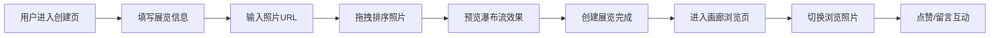

## 1. 产品概述

个人摄影作品画廊是一个为摄影爱好者打造的线上展览平台，用户可以创建主题化的摄影展览，将不同地点拍摄的照片按叙事顺序整理，访客能够沉浸式浏览并进行互动。

- 核心价值：让每一组摄影作品拥有独立的叙事空间，为摄影爱好者提供优雅的作品展示与交流平台
- 目标用户：摄影爱好者、视觉创作者、艺术欣赏者

## 2. 核心功能

### 2.1 用户角色

| 角色 | 注册方式 | 核心权限 |
|------|----------|----------|
| 创作者 | 无需注册，本地存储 | 创建展览、编辑照片、设置主题 |
| 访客 | 无需注册 | 浏览展览、点赞照片、发表留言 |

### 2.2 功能模块

1. **展览创建页**：表单输入、照片管理、拖拽排序、进度显示、瀑布流预览
2. **画廊浏览页**：全屏幻灯片、照片切换动画、点赞互动、留言系统、响应式适配

### 2.3 页面详情

| 页面名称 | 模块名称 | 功能描述 |
|---------|---------|----------|
| 展览创建页 | 表单模块 | 输入展览名称、描述，从10种预设柔和色调中选择主题色 |
| 展览创建页 | 照片上传模块 | 支持最多20张图片URL输入，支持png和jpg格式 |
| 展览创建页 | 拖拽排序模块 | 照片列表支持拖拽调整展示顺序 |
| 展览创建页 | 进度条模块 | 顶部渐变色进度条实时反映上传进度 |
| 展览创建页 | 预览模块 | 底部预览按钮展示瀑布流缩略图效果 |
| 画廊浏览页 | 全屏幻灯片 | 暗色背景全屏展示照片，沉浸式浏览体验 |
| 画廊浏览页 | 切换导航 | 左右半透明箭头，悬停变白放大，0.3秒横向滑动过渡 |
| 画廊浏览页 | 照片信息 | 显示照片标题、拍摄地点、当前点赞数 |
| 画廊浏览页 | 点赞交互 | 心形图标点击变粉色并弹出+1动画 |
| 画廊浏览页 | 留言系统 | 底部输入框，浅色气泡从左到右排列，实时刷新 |

## 3. 核心流程

## 4. 用户界面设计

### 4.1 设计风格
- **主色调**：支持10种预设柔和色调，展览主题色可定制
- **辅助色**：深色背景（#1a1a2e）、半透明遮罩、柔和粉色（#ff6b9d）用于点赞状态
- **按钮风格**：圆角16px，微阴影（box-shadow: 0 4px 20px rgba(0,0,0,0.1)）
- **字体**：标题使用 'Playfair Display' 衬线字体，正文使用 'Inter' 无衬线字体
- **布局风格**：卡片式布局，柔和圆角，微妙阴影，营造温馨展览氛围
- **动画风格**：流畅过渡（0.3s ease-out），微交互反馈，帧率不低于55fps

### 4.2 页面设计概述

| 页面名称 | 模块名称 | UI元素 |
|---------|---------|--------|
| 展览创建页 | 表单区 | 渐变进度条、输入框卡片、主题色选择器网格 |
| 展览创建页 | 照片列表 | 可拖拽卡片、缩略图预览、删除按钮、序号标识 |
| 展览创建页 | 预览区 | 瀑布流布局、照片错落排列、悬停放大效果 |
| 画廊浏览页 | 幻灯片 | 全屏暗色背景、居中照片、左右导航箭头 |
| 画廊浏览页 | 信息区 | 照片标题、拍摄地点、点赞数、心形图标 |
| 画廊浏览页 | 留言区 | 气泡消息、输入框、发送按钮、实时更新 |

### 4.3 响应式设计
- **桌面端**：横屏双列/多列布局，左右箭头切换照片
- **平板端**：保持桌面布局，适当缩小元素尺寸
- **移动端**：竖屏单列布局，上下滑动切换照片，优化触摸区域

### 4.4 动效设计
- 照片切换：横向滑动动画，持续0.3秒，缓动函数ease-out
- 点赞动画：心形图标从白色→粉色缩放动画，+1数字向上弹出渐隐
- 悬停效果：箭头半透明→白色并放大1.2倍
- 页面过渡：渐入渐出效果，营造画廊空间感
- 性能要求：所有动画帧率不低于55fps
