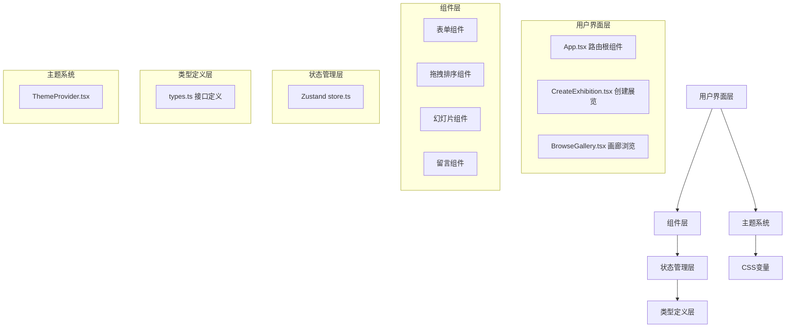
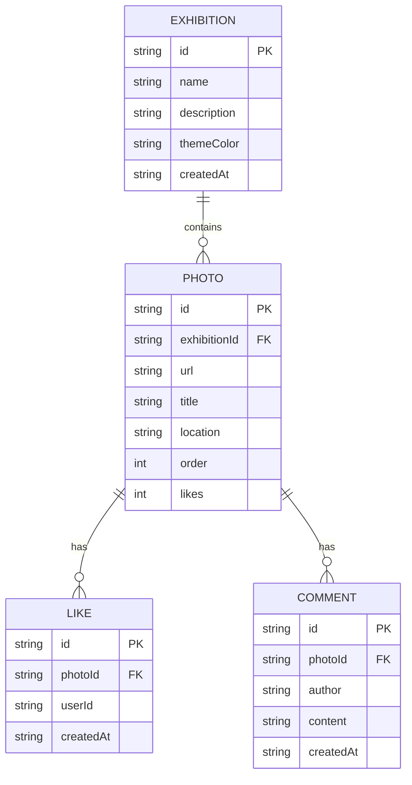

## 1. 架构设计



## 2. 技术描述

- **前端框架**：React 18 + TypeScript
- **构建工具**：Vite 5
- **状态管理**：Zustand 4
- **路由管理**：React Router DOM 6
- **样式方案**：CSS Modules
- **唯一ID生成**：uuid 9
- **开发服务器**：Vite 内置开发服务器

## 3. 目录结构

```
src/
├── modules/
│   ├── gallery/
│   │   ├── types.ts          # 类型定义
│   │   ├── store.ts          # Zustand 状态管理
│   │   ├── CreateExhibition.tsx   # 创建展览组件
│   │   ├── CreateExhibition.module.css
│   │   ├── BrowseGallery.tsx      # 画廊浏览组件
│   │   └── BrowseGallery.module.css
│   └── theme/
│       ├── ThemeProvider.tsx      # 主题提供组件
│       └── ThemeProvider.module.css
├── App.tsx                   # 路由根组件
├── App.module.css
├── main.tsx                  # 应用入口
└── index.css                 # 全局样式
```

## 4. 路由定义

| 路由 | 页面组件 | 用途 |
|------|---------|------|
| / | CreateExhibition | 创建展览页面 |
| /gallery/:id | BrowseGallery | 画廊浏览页面 |

## 5. 数据模型

### 5.1 数据模型定义



### 5.2 TypeScript 类型定义

```typescript
// 展览接口
interface Exhibition {
  id: string;
  name: string;
  description: string;
  themeColor: string;
  photos: Photo[];
  createdAt: string;
}

// 照片接口
interface Photo {
  id: string;
  url: string;
  title: string;
  location: string;
  order: number;
  likes: number;
  isLiked: boolean;
}

// 留言接口
interface Comment {
  id: string;
  photoId: string;
  author: string;
  content: string;
  createdAt: string;
}

// 预设主题色
type ThemeColor = 
  | 'dusty-rose'
  | 'sage-green'
  | 'lavender'
  | 'peach'
  | 'sky-blue'
  | 'mint'
  | 'coral'
  | 'periwinkle'
  | 'amber'
  | 'sage';
```

## 6. 核心技术点

### 6.1 拖拽排序
- 使用原生 HTML5 Drag and Drop API
- 照片列表项可拖拽，实时更新排序状态
- 视觉反馈：拖拽时半透明效果，放置区域高亮

### 6.2 动画性能
- 使用 CSS transform 和 opacity 实现高性能动画
- 照片切换使用 translateX 实现横向滑动
- 所有动画持续时间统一为 0.3s，缓动函数 ease-out
- 使用 will-change 优化渲染性能

### 6.3 响应式设计
- 桌面端：媒体查询 ≥ 1024px，左右箭头导航
- 平板端：媒体查询 768px - 1023px，保持桌面布局
- 移动端：媒体查询 < 768px，上下滑动切换，单列布局
- 触摸事件支持：touchstart, touchmove, touchend

### 6.4 状态管理
- Zustand store 管理全局状态
- 展览列表、当前展览、照片数据、点赞留言状态
- 支持 localStorage 持久化

### 6.5 主题系统
- ThemeProvider 组件根据展览主题色动态设置 CSS 变量
- 10 种预设柔和色调可供选择
- 渐变进度条颜色跟随主题色变化
