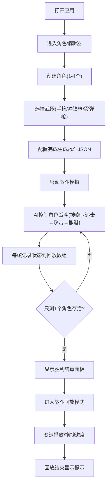

## 1. 产品概述

多人竞技场射击战斗模拟器是一款面向游戏策划的可视化交互工具，用于在游戏开发前期验证战斗机制设计。通过可配置的角色与武器系统、实时AI战斗模拟、以及完整的战斗回放功能，帮助策划快速迭代和验证弹道分布、角色移动碰撞、技能冷却循环等核心战斗机制。

## 2. 核心特性

### 2.1 用户角色
| 角色 | 登录方式 | 核心权限 |
|------|----------|----------|
| 游戏策划 | 本地访问 | 创建角色配置、启动战斗模拟、查看回放、导出战斗数据 |

### 2.2 功能模块
1. **角色与武器编辑器**：创建和配置最多4个角色，选择武器类型，预览角色属性，生成战斗配置JSON
2. **战斗模拟模块**：800x600 Canvas实时战斗，AI状态机控制，粒子特效，碰撞检测，胜利结算
3. **战斗回放模块**：帧级状态记录，变速回放（2x/4x），进度控制，完整动画复现

### 2.3 页面详情
| 页面名称 | 模块名称 | 功能描述 |
|----------|----------|----------|
| 主界面 | 角色编辑器 | 角色创建、武器选择、生命值预览、JSON导出、战斗启动 |
| 主界面 | 战斗模拟器 | 实时战斗渲染、AI行为、粒子特效、碰撞检测、结算面板 |
| 主界面 | 回放控制器 | 播放/暂停、进度拖拽、速度切换、播放完成提示 |

## 3. 核心流程

## 4. 用户界面设计

### 4.1 设计风格
- **深色科技主题**：主背景#1a1a2e，副背景#16213e，文字#e0e0e0，强调色#e94560
- **圆角卡片设计**：所有面板8px圆角，阴影0 4px 15px rgba(0,0,0,0.3)，悬停加深至20px
- **渐变按钮**：从#e94560到#c73659，悬停亮度提高20%，0.2s ease-out过渡
- **武器选中效果**：金色边框#ffd700 + 发光效果box-shadow: 0 0 15px #ffd700
- **字体**：使用JetBrains Mono作为代码字体，Orbitron作为标题字体，营造科技竞技感

### 4.2 页面设计概述
| 页面名称 | 模块名称 | UI元素 |
|----------|----------|----------|
| 主界面 | 角色编辑器 | 角色卡片(圆形头像+渐变生命条)、武器选择卡片、生成JSON按钮、启动战斗按钮 |
| 主界面 | 战斗画布 | 800x600 Three.js场景、角色精灵、地面阴影、头顶生命条、粒子特效、血雾动画 |
| 主界面 | 回放控制条 | 半透明黑底rgba(0,0,0,0.7)、高度60px、播放/暂停按钮、进度滑块、速度切换按钮 |
| 主界面 | 结算面板 | 角色排名、存活时间、总伤害、命中率、击杀/死亡/助攻统计 |

### 4.3 响应式设计
- **桌面端**：左右分栏布局，左栏编辑器40%，右栏战斗模拟器60%
- **移动端(<768px)**：上下堆叠布局，编辑器在上，战斗模拟器在下
- **触控优化**：所有按钮和滑块最小点击区域44px，适应移动端触控

### 4.4 3D场景指导
- **环境**：深色竞技场背景，网格地板增强空间感
- **光照**：半球光 + 方向光，模拟竞技场顶灯效果
- **相机**：正交相机，俯视45度角，固定800x600视野
- **粒子系统**：枪口火焰(5颗短生命粒子，持续0.2秒)、血雾溅射(红色粒子扩散0.3秒)
- **性能**：60fps稳定帧率，requestAnimationFrame + 帧跳过机制
