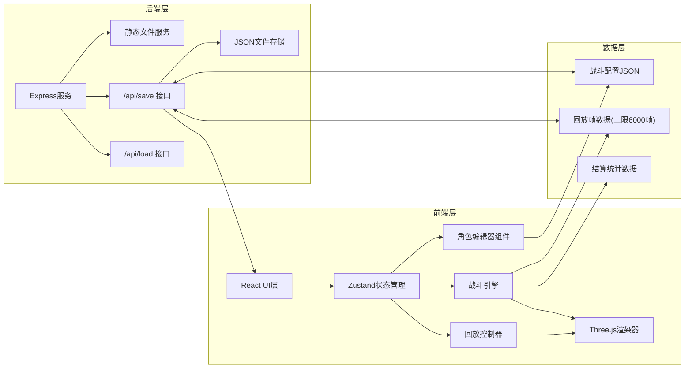
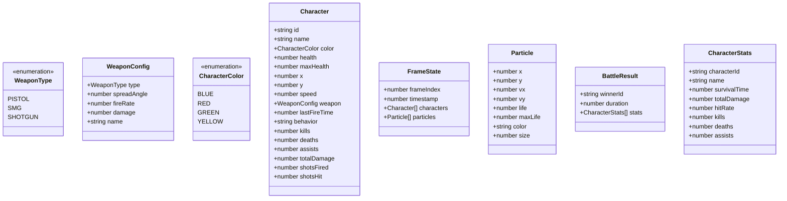

## 1. 架构设计



## 2. 技术描述

- **前端框架**：React@18 + TypeScript@5
- **构建工具**：Vite@5
- **3D渲染**：Three.js@0.160 + @types/three
- **状态管理**：Zustand@4
- **后端服务**：Express@4 + cors
- **HTTP客户端**：Axios@1
- **样式方案**：原生CSS + CSS变量 + 响应式媒体查询

## 3. 目录结构

```
e:\solo\VersionFastPro\tasks\auto70\
├── package.json
├── index.html
├── tsconfig.json
├── vite.config.js
├── backend/
│   └── server.ts
└── src/
    ├── main.tsx
    ├── App.tsx
    ├── models/
    │   └── arena.ts
    ├── simulation/
    │   └── battleEngine.ts
    ├── editor/
    │   └── characterEditor.tsx
    ├── renderer/
    │   └── gameRenderer.ts
    ├── playback/
    │   └── replayController.ts
    └── store/
        └── useGameStore.ts
```

## 4. 核心数据模型

### 4.1 类型定义



### 4.2 武器配置常量

| 武器类型 | 散射角度 | 射速 | 伤害 |
|----------|----------|------|------|
| 手枪 | 15° | 0.3秒/发 | 20 |
| 冲锋枪 | 30° | 0.1秒/发 | 10 |
| 霰弹枪 | 60° | 0.5秒/发 | 35 |

## 5. API 定义

### 5.1 保存配置
- **路径**：POST `/api/save`
- **请求体**：
```typescript
interface SaveRequest {
  type: 'config' | 'replay';
  data: CharacterConfig[] | FrameState[];
  filename: string;
}
```
- **响应**：
```typescript
interface SaveResponse {
  success: boolean;
  filename: string;
}
```

### 5.2 加载配置
- **路径**：GET `/api/load/:filename`
- **响应**：
```typescript
interface LoadResponse {
  success: boolean;
  data: CharacterConfig[] | FrameState[];
}
```

## 6. 核心模块说明

### 6.1 战斗引擎 (battleEngine.ts)
- AI状态机：搜索目标→追击→攻击→撤退
- 碰撞检测：圆形碰撞检测（角色半径20px）
- 弹道计算：基于武器散射角度的随机偏移
- 粒子系统：枪口火焰、血雾溅射管理
- 帧记录：每帧状态存入循环数组（上限6000帧）

### 6.2 渲染器 (gameRenderer.ts)
- Three.js场景初始化：正交相机、光照、网格地板
- 角色渲染：圆形精灵 + 地面阴影 + 头顶生命条
- 粒子渲染：基于BufferGeometry的高性能粒子系统
- 生命条渐变：绿(100%)→橙(50%)→红(0%)

### 6.3 回放控制器 (replayController.ts)
- 变速播放：1x/2x/4x 速度切换
- 进度控制：可拖拽滑块定位任意帧
- 状态同步：将回放帧数据传递给渲染器

## 7. 性能保障

| 指标 | 目标值 | 实现方案 |
|------|--------|----------|
| 战斗帧率 | 60fps | requestAnimationFrame + 帧跳过(>16ms跳渲染) |
| 回放帧率(4x) | ≥30fps | 预计算 + 批量渲染 |
| 编辑器延迟 | ≤50ms | Zustand轻量状态 + 防抖处理 |
| 回放数据上限 | 6000帧 | 循环数组覆盖最旧帧 |
