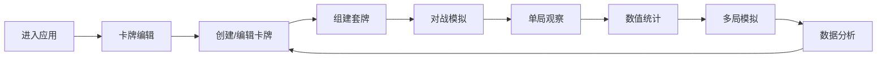

## 1. 产品概述
纸牌对战核心机制测试工具，帮助独立桌游设计师在浏览器中快速验证卡牌对战玩法，解决手工摆牌低效、数值平衡难以观察、无法模拟多次对局的问题。

- 目标用户：独立桌游设计师、卡牌游戏爱好者
- 核心价值：快速迭代卡牌设计，可视化对战过程，数据驱动平衡调整

## 2. 核心功能

### 2.1 用户角色
| 角色 | 注册方式 | 核心权限 |
|------|----------|----------|
| 设计师 | 无需注册，本地使用 | 创建编辑卡牌、运行模拟对战、查看统计分析 |

### 2.2 功能模块
1. **对战模拟模块**：AI自动对战、实时日志、状态面板、胜负判定
2. **卡牌编辑模块**：卡牌CRUD、套牌组建、效果预设
3. **数值统计模块**：多局模拟、胜率分析、出场率统计、贡献度排名

### 2.3 页面详情
| 页面名称 | 模块名称 | 功能描述 |
|----------|----------|----------|
| 对战模拟页 | 战斗日志区 | 滚动展示每步行动详情，支持自动滚动 |
| 对战模拟页 | 状态面板 | 双方生命值、水晶、手牌数、牌库数、持续效果 |
| 对战模拟页 | 控制区 | 开始/暂停/重置单局对战 |
| 卡牌编辑页 | 卡牌列表 | 网格展示所有卡牌，悬停放大发光效果 |
| 卡牌编辑页 | 编辑表单 | 名称、类型、消耗、效果选择、数值参数 |
| 卡牌编辑页 | 套牌构建 | 从卡牌库选10张组建套牌，同名限3张 |
| 数值统计页 | 结果柱状图 | 红方胜/蓝方胜/平局次数，带数字标签 |
| 数值统计页 | 回合数统计 | 平均/最短/最长回合数 |
| 数值统计页 | 出场率条形图 | Top5卡牌出场次数横向条形图 |
| 数值统计页 | 胜率贡献榜 | Top3卡牌胜率贡献百分比 |

## 3. 核心流程

用户进入应用 → 导航到卡牌编辑 → 创建/编辑卡牌 → 组建两套套牌 → 导航到对战模拟 → 选择套牌开始单局对战观察 → 导航到数值统计 → 运行10局模拟 → 查看统计数据 → 迭代卡牌设计

## 4. 用户界面设计

### 4.1 设计风格
- **主色调**：深蓝色背景（#1a1a2e），浅灰蓝文字（#e0e0ff）
- **能量水晶**：紫色渐变（#7b2ff7 → #b388ff）
- **生命值**：红色渐变（#ff4444 → #ff8888）
- **稀有度边框**：1-2费绿色、3-4费橙色、5费紫色
- **整体风格**：深色科技感，卡牌游戏UI风格，微动画丰富

### 4.2 页面设计概览
| 页面名称 | 模块名称 | UI元素 |
|----------|----------|--------|
| 全局 | 顶部导航 | 三个标签页，下划线滑动动画，固定定位 |
| 对战模拟 | 三栏布局 | 左侧日志、中央战场动画、右侧状态面板 |
| 卡牌编辑 | 网格布局 | 卡片悬停放大发光，左上角能量珠，左下角类型图标 |
| 数值统计 | 分栏布局 | 上排柱状图，下排条形图和数据卡片 |

### 4.3 响应式设计
- **≥1024px**：三栏并排完整布局
- **768-1023px**：主区域占宽，侧面板折叠为图标
- **<768px**：全部垂直堆叠，侧面板转为点击图标弹出overlay

### 4.4 动画与交互
- 标签切换：下划线滑动 0.25s，面板淡入 0.2s
- 卡牌打出：从中央向两边飞入 0.3s
- 受击效果：红色闪烁 + 微震动
- 治疗效果：绿色光晕闪现
- 卡牌悬停：放大1.1倍 + 边缘发光
- 统计面板：淡入动画效果
