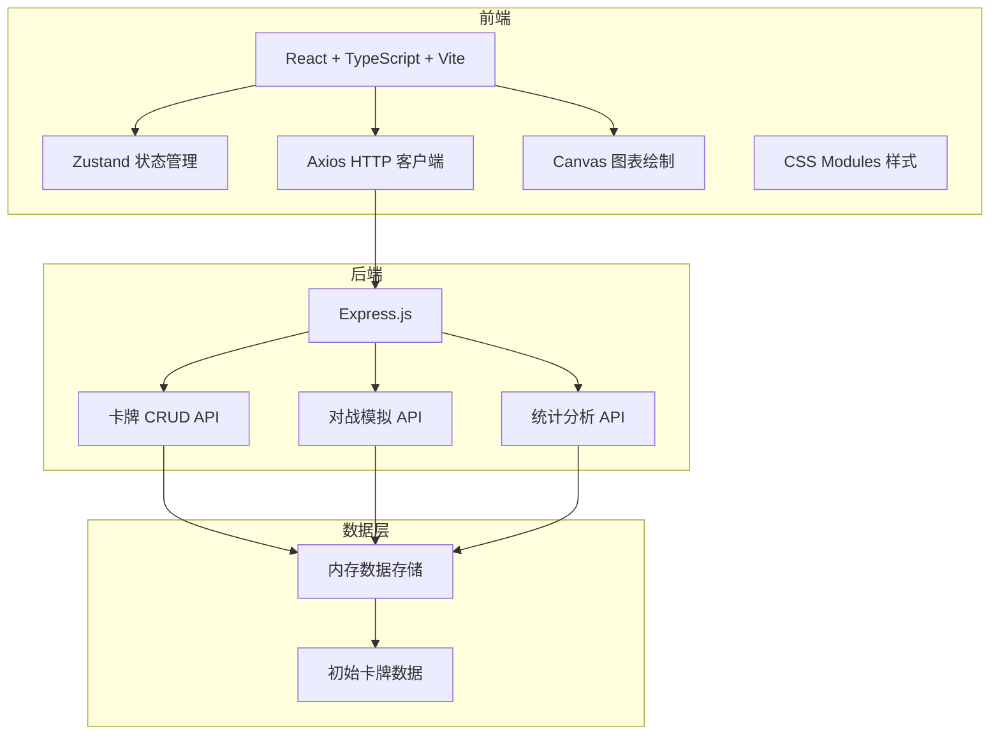
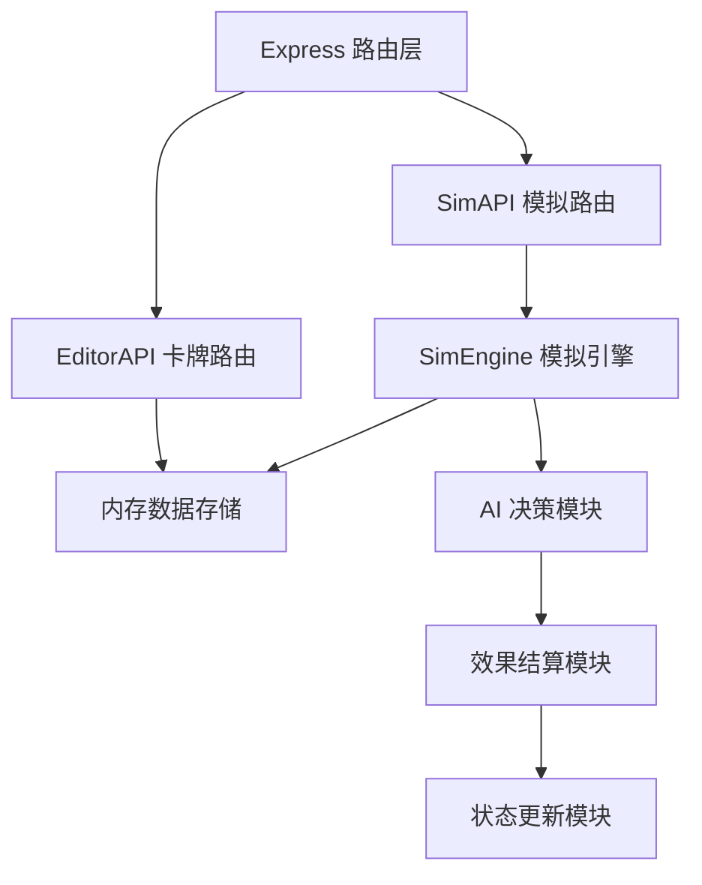

## 1. 架构设计



## 2. 技术说明
- **前端**：React 18 + TypeScript + Vite
- **状态管理**：Zustand
- **HTTP客户端**：Axios
- **路由**：React Router DOM
- **后端**：Express 4
- **数据存储**：内存存储（开发阶段）
- **图表**：原生 Canvas 2D
- **构建工具**：Vite

## 3. 路由定义
| 路由 | 用途 |
|------|------|
| / | 默认重定向到对战模拟 |
| /simulator | 对战模拟页面 |
| /editor | 卡牌编辑页面 |
| /analytics | 数值统计页面 |

## 4. API 定义

### 4.1 卡牌相关
```typescript
interface Card {
  id: string;
  name: string;
  type: 'minion' | 'spell' | 'equipment';
  cost: number;
  effectType: 'damage' | 'heal' | 'draw' | 'burn' | 'shield' | 'mana';
  effectValue: number;
}
```

- `GET /api/cards` → 返回所有卡牌数组
- `POST /api/cards` → 新增卡牌，返回新卡牌对象
- `PUT /api/cards/:id` → 更新卡牌，返回更新后对象
- `DELETE /api/cards/:id` → 删除卡牌，返回成功状态

### 4.2 模拟相关
```typescript
interface PlayerState {
  hp: number;
  maxHp: number;
  mana: number;
  maxMana: number;
  tempMana: number;
  hand: Card[];
  deck: Card[];
  effects: { type: string; stacks: number }[];
}

interface GameState {
  turn: number;
  currentPlayer: 'red' | 'blue';
  phase: 'draw' | 'resource' | 'play' | 'end';
  red: PlayerState;
  blue: PlayerState;
  log: string[];
  winner: 'red' | 'blue' | 'draw' | null;
}

interface SimulationResult {
  winner: 'red' | 'blue' | 'draw';
  turns: number;
  log: string[];
  cardPlays: { cardId: string; count: number }[];
}

interface SeriesStats {
  redWins: number;
  blueWins: number;
  draws: number;
  avgTurns: number;
  minTurns: number;
  maxTurns: number;
  cardPlayRates: { cardId: string; name: string; count: number }[];
  winContribution: { cardId: string; name: string; contribution: number }[];
}
```

- `POST /api/start-simulation` → 接收 `{ redDeck: string[], blueDeck: string[] }`，返回 `GameState`
- `POST /api/simulate-series` → 接收 `{ redDeck: string[], blueDeck: string[], count: number }`，返回 `SeriesStats`

## 5. 服务端架构图



## 6. 项目文件结构

```
.
├── package.json
├── vite.config.js
├── tsconfig.json
├── index.html
├── server.js
├── src/
│   ├── App.tsx
│   ├── main.tsx
│   ├── index.css
│   ├── store/
│   │   └── useGameStore.ts
│   ├── modules/
│   │   ├── simulator/
│   │   │   ├── SimEngine.ts
│   │   │   ├── SimAPI.ts
│   │   │   ├── SimulatorPanel.tsx
│   │   │   └── BattleLog.tsx
│   │   ├── editor/
│   │   │   ├── EditorAPI.ts
│   │   │   ├── EditorPanel.tsx
│   │   │   ├── CardEditor.tsx
│   │   │   └── CardGrid.tsx
│   │   └── analytics/
│   │       ├── AnalyticsPanel.tsx
│   │       ├── BarChart.tsx
│   │       └── StatsCards.tsx
│   └── components/
│       ├── Card.tsx
│       ├── Navbar.tsx
│       └── PlayerStatus.tsx
```

## 7. 性能指标
- AI决策响应时间：< 100ms
- 连续10局模拟总时间：< 5秒
- 卡牌列表滚动帧率：≥ 50fps
- 首屏加载时间：< 2秒
