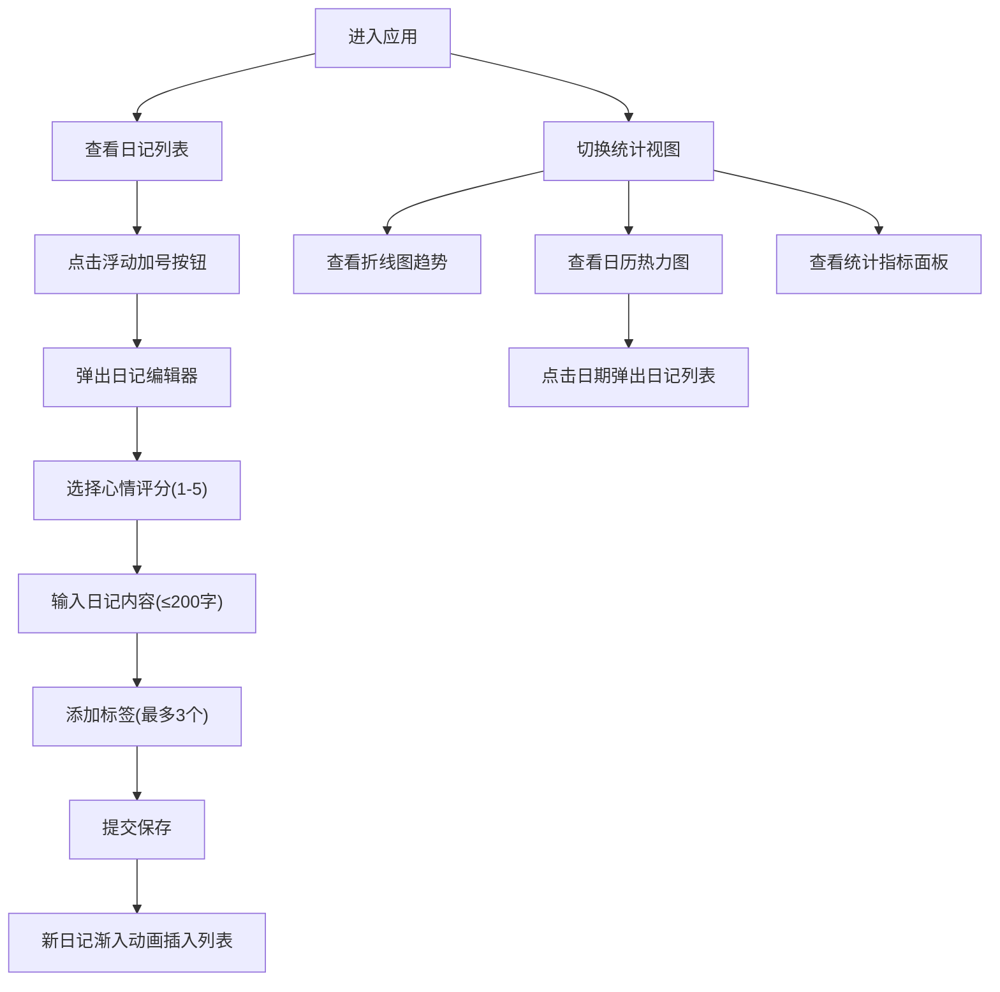

## 1. 产品概述

个人禅意日记与情绪追踪应用，帮助用户通过极简水墨风格的界面记录每日心情与生活感悟，搭配可视化图表直观回顾情绪变化趋势，培养自我觉察与情绪管理能力。

- 面向关注心理健康、喜欢记录生活的用户群体
- 核心价值：极简优雅的记录体验 + 数据化的情绪洞察

## 2. 核心功能

### 2.1 用户角色

| 角色 | 注册方式 | 核心权限 |
|------|----------|----------|
| 普通用户 | 无需注册（本地存储） | 记录日记、查看统计、筛选回顾 |

### 2.2 功能模块

1. **日记记录模块**：浮动按钮创建日记、心情评分、文字输入、标签选择
2. **日记列表模块**：瀑布流展示、心情筛选、日期范围筛选、滚动加载
3. **情绪分析模块**：折线图趋势、日历热力图、统计指标面板
4. **标签管理**：预设标签快速分类

### 2.3 页面详情

| 页面名称 | 模块名称 | 功能描述 |
|---------|---------|----------|
| 主应用 | 导航Tab | 切换日记视图和统计视图 |
| 日记视图 | 日记列表 | 瀑布流三列布局，按日期倒序展示，支持筛选和滚动加载 |
| 日记视图 | 日记卡片 | 展示日期、心情指数、简短文字，悬停显示完整内容 |
| 日记视图 | 浮动添加按钮 | 点击弹出日记编辑器 |
| 日记视图 | 日记编辑器 | 选择心情、输入文字、添加标签、提交保存 |
| 统计视图 | 情绪趋势图表 | 折线图展示日均值，支持7/30/90天切换 |
| 统计视图 | 日历热力图 | 月历网格展示每日心情，点击查看当天日记 |
| 统计视图 | 统计面板 | 展示核心指标：总数、连续天数、月均值、最高/最低心情日 |

## 3. 核心流程

用户进入应用 → 查看日记列表/切换统计视图 → 点击浮动加号按钮 → 弹出编辑器 → 选择心情评分 → 输入日记内容 → 添加标签 → 提交保存 → 新日记以渐入动画插入列表 → 切换到统计视图查看趋势分析

## 4. 用户界面设计

### 4.1 设计风格

- **整体风格**：极简水墨风格，东方禅意美学
- **主背景色**：米白 #F9F6EE
- **卡片背景**：白色 #FFFFFF，圆角16px，阴影 0 2px 8px rgba(0,0,0,0.08)
- **心情色系**：1=浅蓝#B3D4FC → 2=浅绿#A8D8B9 → 3=浅黄#FCE4A8 → 4=浅橙#FFB785 → 5=红色#FF8A80
- **字体**：系统字体栈 -apple-system, 'Noto Serif SC', serif
- **交互过渡**：所有元素 transition: all 0.3s ease

### 4.2 页面设计概述

| 页面名称 | 模块名称 | UI元素 |
|---------|---------|--------|
| 主应用 | Tab导航 | 极简下划线风格，当前页高亮 |
| 日记视图 | 筛选栏 | 心情圆点按钮（选中放大1.2倍）、日期范围选择器 |
| 日记视图 | 日记卡片 | 渐变背景（根据心情）、悬停左移8px、淡入动画 |
| 日记视图 | 浮动按钮 | 直径50px圆形，悬停旋转180度并变暗 |
| 日记视图 | 编辑器弹窗 | 半透明遮罩、居中面板、心情圆点单选、文本域、标签选择 |
| 统计视图 | 折线图 | 高度300px，面积填充，Y轴1-5，时间范围切换按钮 |
| 统计视图 | 热力图 | 7列网格，30px方格，月份切换箭头，点击弹出日记 |
| 统计视图 | 统计卡片 | 220×100px，半透明白色，左上角emoji图标 |

### 4.3 响应式设计

- **桌面端**：左右8%留白，瀑布流三列布局
- **移动端（≤768px）**：单列布局，筛选栏折叠为下拉菜单，图表高度200px，卡片间距8px
- **触摸优化**：按钮最小44px点击区域，滑动手势支持

### 4.4 动画效果

- 页面加载：卡片依次淡入（staggered animation）
- 新日记插入：透明度0→1，向上位移20px
- 筛选变化：列表淡出→数据更新→淡入
- 图表切换：水平滑动过渡
- 悬停交互：卡片左移、按钮放大、颜色渐变
