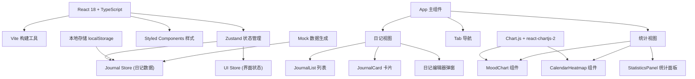
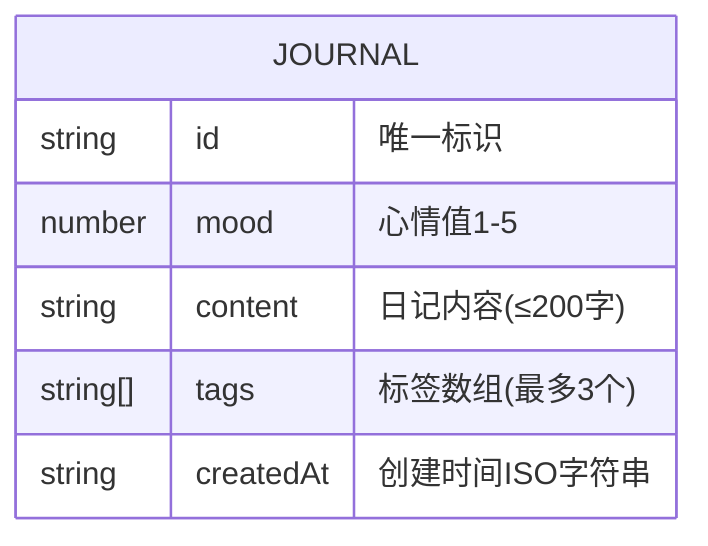

## 1. 架构设计



## 2. 技术描述

- **前端框架**：React@18 + TypeScript@5
- **构建工具**：Vite@5
- **状态管理**：Zustand@4（轻量级，支持持久化）
- **样式方案**：styled-components@6（CSS-in-JS）
- **图表库**：Chart.js@4 + react-chartjs-2@5
- **工具库**：uuid@9（生成唯一ID）
- **数据存储**：localStorage（本地持久化）
- **无后端**：纯前端应用，使用Mock数据初始化

## 3. 项目结构

```
src/
├── app/
│   └── App.tsx                 # 主应用组件，Tab切换
├── modules/
│   ├── journal/
│   │   ├── JournalCard.tsx     # 日记卡片组件
│   │   └── JournalList.tsx     # 日记列表模块
│   └── analytics/
│       ├── MoodChart.tsx       # 情绪趋势折线图
│       ├── CalendarHeatmap.tsx # 日历热力图
│       └── StatisticsPanel.tsx # 统计指标面板
├── store/
│   └── useJournalStore.ts      # Zustand状态管理
├── types/
│   └── index.ts                # TypeScript类型定义
├── utils/
│   ├── mockData.ts             # Mock数据生成
│   └── dateUtils.ts            # 日期工具函数
├── styles/
│   └── GlobalStyle.ts          # 全局样式
├── main.tsx                    # 应用入口
└── vite-env.d.ts               # Vite类型声明
```

## 4. 数据模型

### 4.1 数据模型定义



### 4.2 TypeScript类型定义

```typescript
type Mood = 1 | 2 | 3 | 4 | 5;

type Tag = '工作' | '学习' | '生活' | '健康' | '旅行' | '美食' | '其他';

interface Journal {
  id: string;
  mood: Mood;
  content: string;
  tags: Tag[];
  createdAt: string;
}

interface JournalState {
  journals: Journal[];
  filterMood: Mood | null;
  dateRange: { start: string; end: string };
  page: number;
  pageSize: number;
  isEditorOpen: boolean;
}

interface JournalActions {
  addJournal: (journal: Omit<Journal, 'id' | 'createdAt'>) => void;
  setFilterMood: (mood: Mood | null) => void;
  setDateRange: (range: { start: string; end: string }) => void;
  loadMore: () => void;
  openEditor: () => void;
  closeEditor: () => void;
}
```

## 5. 核心模块说明

### 5.1 状态管理 (Zustand)

- **持久化**：使用 `persist` middleware 自动同步到 localStorage
- **选择器优化**：使用 shallow 比较避免不必要重渲染
- **计算属性**：派生过滤后的日记列表、统计指标

### 5.2 日记列表模块

- **瀑布流布局**：CSS columns 实现三列布局
- **虚拟滚动优化**：IntersectionObserver 实现无限加载
- **筛选逻辑**：按心情值和日期范围组合过滤
- **动画过渡**：列表切换时使用 CSS opacity 动画

### 5.3 图表模块

- **折线图**：按日期分组计算日均值，渐变色折线，面积填充
- **热力图**：Grid布局实现月历，点击交互弹出详情
- **性能优化**：useMemo 缓存计算结果，避免重复计算

### 5.4 性能优化策略

- 列表项使用 React.memo 包裹
- 大数据量时使用分页加载（每次12条）
- 图表数据使用 useMemo 缓存
- 状态更新使用批量处理
- CSS 动画使用 transform 和 opacity 保证GPU加速

## 6. 构建配置

- **Vite**：快速热更新，按需编译
- **TypeScript**：严格模式 (strict: true)
- **路径别名**：@/ 指向 src 目录
- **生产构建**：代码分割、Tree Shaking、压缩优化
