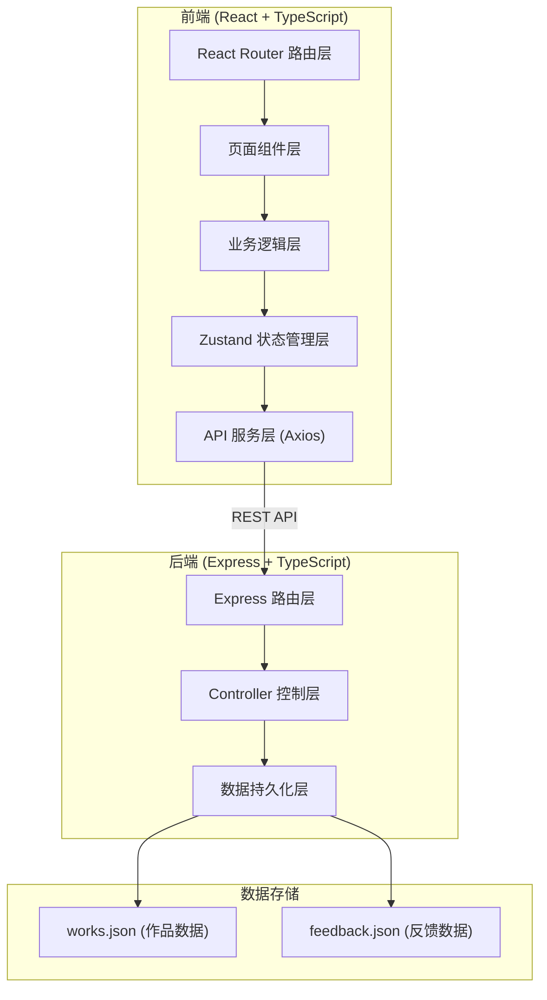

## 1. 架构设计



## 2. 技术描述

### 2.1 前端技术栈
- **框架**: React 18 + TypeScript（严格模式）
- **构建工具**: Vite 5
- **状态管理**: Zustand 4
- **路由**: React Router DOM 6
- **HTTP客户端**: Axios
- **轮播组件**: Swiper 11
- **唯一ID生成**: uuid
- **样式**: CSS Modules + CSS Variables（主题系统）

### 2.2 后端技术栈
- **框架**: Express 4
- **语言**: TypeScript
- **跨域**: cors
- **数据持久化**: JSON文件（server/data/works.json, server/data/feedback.json）
- **ID生成**: uuid

### 2.3 开发工具
- **启动脚本**: `npm run dev` - 同时启动Vite前端开发服务器和Express后端服务
- **代理配置**: Vite代理 `/api` 到后端Express服务

## 3. 项目目录结构

```
auto80/
├── package.json
├── vite.config.js
├── tsconfig.json
├── index.html
├── src/
│   ├── main.tsx                 # 应用入口
│   ├── App.tsx                  # 根组件（路由+主题）
│   ├── types/                   # TypeScript类型定义
│   │   └── index.ts
│   ├── store/                   # Zustand状态管理
│   │   ├── useWorkStore.ts      # 作品状态
│   │   ├── useFeedbackStore.ts  # 反馈状态
│   │   └── useThemeStore.ts     # 主题状态
│   ├── api/                     # API服务层
│   │   ├── works.ts             # 作品API
│   │   └── feedback.ts          # 反馈API
│   ├── workspace/               # 作品管理模块
│   │   ├── WorkspaceManager.ts  # 核心管理逻辑
│   │   ├── WorkForm.tsx         # 作品表单组件
│   │   └── WorkList.tsx         # 作品列表组件
│   ├── gallery/                 # 画廊展示模块
│   │   ├── GalleryLayer.ts      # 画廊核心逻辑
│   │   ├── GalleryGrid.tsx      # 瀑布流网格组件
│   │   ├── WorkCard.tsx         # 作品卡片组件
│   │   ├── WorkDetail.tsx       # 作品详情组件
│   │   └── ClientFeedback.ts    # 反馈交互核心逻辑
│   ├── components/              # 公共组件
│   │   ├── Sidebar.tsx          # 侧边导航
│   │   ├── BottomNav.tsx        # 底部导航
│   │   ├── ThemeProvider.tsx    # 主题提供者
│   │   └── ConfirmDialog.tsx    # 确认对话框
│   ├── pages/                   # 页面组件
│   │   ├── HomePage.tsx         # 画廊首页
│   │   ├── DetailPage.tsx       # 详情页
│   │   ├── ManagePage.tsx       # 管理页
│   │   └── SettingsPage.tsx     # 设置页
│   ├── styles/                  # 样式文件
│   │   ├── themes.css           # 主题变量定义
│   │   └── global.css           # 全局样式
│   └── utils/                   # 工具函数
│       ├── formatTime.ts        # 时间格式化
│       └── validation.ts        # 表单验证
└── server/
    ├── server.ts                # Express服务入口
    ├── routes/
    │   ├── works.ts             # 作品路由
    │   └── feedback.ts          # 反馈路由
    ├── controllers/
    │   ├── worksController.ts   # 作品控制器
    │   └── feedbackController.ts # 反馈控制器
    └── data/
        ├── works.json           # 作品数据
        └── feedback.json        # 反馈数据
```

## 4. 路由定义

| 路由路径 | 页面 | 功能 |
|----------|------|------|
| `/` | 画廊首页 | 瀑布流展示所有作品，支持筛选排序 |
| `/work/:id` | 作品详情页 | 轮播展示作品图片，查看描述和反馈 |
| `/manage` | 作品管理页 | 添加、编辑、删除作品 |
| `/settings` | 主题设置页 | 选择画廊主题 |

## 5. API 定义

### 5.1 类型定义

```typescript
// 作品类型
interface Work {
  id: string;
  title: string;
  description: string;
  styleTags: string[]; // 古风/幻想/科幻/水墨/扁平/涂鸦
  imageUrls: string[]; // 最多8张，首张为封面
  createdAt: string;
  updatedAt: string;
}

// 反馈类型
interface Feedback {
  id: string;
  workId: string;
  nickname: string;
  content: string;
  createdAt: string;
}

// 主题类型
interface Theme {
  id: string;
  name: string;
  colors: {
    background: string;
    cardBackground: string;
    textPrimary: string;
    textSecondary: string;
    primary: string;
    border: string;
    badgeBackground: string;
    buttonText: string;
  };
}
```

### 5.2 作品API

| 方法 | 路径 | 描述 | 请求参数 | 响应 |
|------|------|------|----------|------|
| GET | `/api/works` | 获取作品列表 | 可选query: sortBy, tag | `Work[]` |
| POST | `/api/works` | 创建作品 | body: `{title, description, styleTags, imageUrls}` | `Work` |
| PUT | `/api/works/:id` | 更新作品 | body: `{title, description, styleTags, imageUrls}` | `Work` |
| DELETE | `/api/works/:id` | 删除作品 | - | `{success: boolean}` |

### 5.3 反馈API

| 方法 | 路径 | 描述 | 请求参数 | 响应 |
|------|------|------|----------|------|
| GET | `/api/works/:id/feedback` | 获取作品的反馈列表 | - | `Feedback[]` |
| POST | `/api/works/:id/feedback` | 提交反馈 | body: `{nickname, content}` | `Feedback` |

## 6. 数据流向

### 6.1 作品管理数据流
```
用户输入 → WorkspaceManager → useWorkStore → Axios POST → /api/works 
→ Express Controller → works.json → 返回成功 → Store更新 → GalleryLayer重新渲染
```

### 6.2 画廊展示数据流
```
页面加载 → GalleryLayer → useWorkStore.getWorks() → Axios GET → /api/works
→ 返回作品列表 → Store更新 → GalleryGrid瀑布流渲染
```

### 6.3 反馈提交数据流
```
用户输入 → ClientFeedback验证 → useFeedbackStore → Axios POST → /api/works/:id/feedback
→ Express Controller → feedback.json → 返回成功 → Store更新 → 评论列表实时显示
```

### 6.4 主题切换数据流
```
用户选择主题 → useThemeStore.setTheme() → localStorage持久化 
→ CSS Variables更新 → 全局样式实时生效
```

## 7. 核心模块调用关系

### 7.1 作品管理模块
- [WorkspaceManager.ts](file:///e:/solo/VersionFastPro/tasks/auto80/src/workspace/WorkspaceManager.ts) 
  - 调用: `useWorkStore` 状态管理, `api/works.ts` API服务
  - 被调用: `WorkForm.tsx`, `WorkList.tsx`

### 7.2 画廊展示模块
- [GalleryLayer.ts](file:///e:/solo/VersionFastPro/tasks/auto80/src/gallery/GalleryLayer.ts)
  - 调用: `useWorkStore` 获取作品数据
  - 被调用: `GalleryGrid.tsx`, `HomePage.tsx`

### 7.3 反馈交互模块
- [ClientFeedback.ts](file:///e:/solo/VersionFastPro/tasks/auto80/src/gallery/ClientFeedback.ts)
  - 调用: `useFeedbackStore`, `api/feedback.ts`
  - 被调用: `WorkDetail.tsx`, `DetailPage.tsx`

## 8. 性能优化策略

- **图片懒加载**: 使用 `loading="lazy"` 和 Intersection Observer
- **瀑布流优化**: CSS columns 布局避免JS重排
- **状态选择器**: Zustand 使用 selector 避免不必要重渲染
- **防抖处理**: 搜索筛选使用防抖
- **本地缓存**: 主题状态持久化到localStorage
- **组件按需渲染**: React.memo 优化列表项渲染
- **过渡动画**: 使用CSS transition而非JS动画保证60fps
