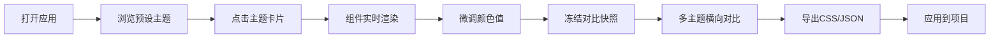

## 1. 产品概述

CSS主题对比工具是一款面向前端开发者和设计初学者的浏览器端配色方案预览与导出应用，解决设计初期频繁切换主题、手动记录色值、难以快速评估整体视觉一致性的痛点。

- 目标用户：前端开发者、UI设计师、设计初学者
- 核心价值：在真实UI组件上即时对比不同CSS颜色主题效果，一键导出可用的配色方案

## 2. 核心功能

### 2.1 用户角色
| 角色 | 注册方式 | 核心权限 |
|------|----------|----------|
| 访客用户 | 无需注册 | 完整使用所有功能，包括主题预览、编辑、对比和导出 |

### 2.2 功能模块
1. **预设主题库**：5种内置主题卡片网格展示，点击切换，悬停放大预览
2. **颜色编辑器**：8个语义色值微调面板，支持颜色选择器和HEX/RGB输入
3. **组件预览区**：8种常用UI组件实时渲染，样式跟随主题变化
4. **对比快照栏**：冻结当前主题生成快照，支持拖拽排序，最多3个并排对比
5. **方案导出**：一键导出CSS变量（自动复制）和JSON文件下载

### 2.3 页面详情
| 页面名称 | 模块名称 | 功能描述 |
|---------|---------|---------|
| 主页面 | 左侧边栏 | 280px宽度，包含主题卡片网格和颜色编辑面板 |
| 主页面 | 右侧主区域 | 组件预览区（8个组件4列布局）+ 顶部操作栏 + 对比快照栏 |
| 主页面 | 操作栏 | 冻结对比按钮、导出CSS按钮、导出JSON按钮 |
| 主页面 | Toast提示 | 操作反馈提示，绿色成功提示持续2秒淡出 |

## 3. 核心流程

用户打开应用 → 浏览预设主题卡片 → 点击主题卡片应用 → 查看组件实时预览效果 → 微调颜色值 → 点击"冻结对比"保存快照 → 切换另一主题对比 → 点击"导出方案"获取CSS变量和JSON → 应用到实际项目

## 4. 用户界面设计

### 4.1 设计风格
- **主色调**：暗色背景 #1a1b1e，微亮边框 #2a2b2e，现代仪表盘风格
- **按钮样式**：圆角8px，悬停缩放0.97→1.0，阴影变化过渡0.3s
- **字体**：Google Fonts - Inter，现代无衬线字体
- **布局风格**：左侧固定侧边栏 + 右侧流体主区域，卡片式组件容器
- **动效**：所有颜色切换和组件重绘使用0.3s渐变过渡，毛玻璃模糊效果

### 4.2 页面设计概述
| 页面名称 | 模块名称 | UI元素 |
|---------|---------|--------|
| 主页面 | 主题卡片 | 8个小色块2px间距，圆角12px，悬停放大预览 |
| 主页面 | 颜色编辑器 | 半透明毛玻璃背景(backdrop-filter: blur(8px))，输入框聚焦边框高亮为当前色 |
| 主页面 | 组件预览区 | 每行4个组件，响应式布局，合理间距 |
| 主页面 | 对比快照栏 | 横向排列，拖拽排序，每个快照含8色块+简化组件缩略图 |
| 主页面 | Toast提示 | 右上角绿色提示，2秒淡出动画 |

### 4.3 响应式
- **桌面端（≥768px）**：左侧280px侧边栏，右侧4列组件网格
- **移动端（<768px）**：侧边栏折叠为顶部栏，组件网格变为每行2个
- **触摸优化**：按钮最小高度44px，增加触控区域

### 4.4 性能要求
- 主题切换时所有组件重新渲染总时间 ≤ 100ms
- 使用CSS变量驱动样式更新，避免不必要的React重渲染
