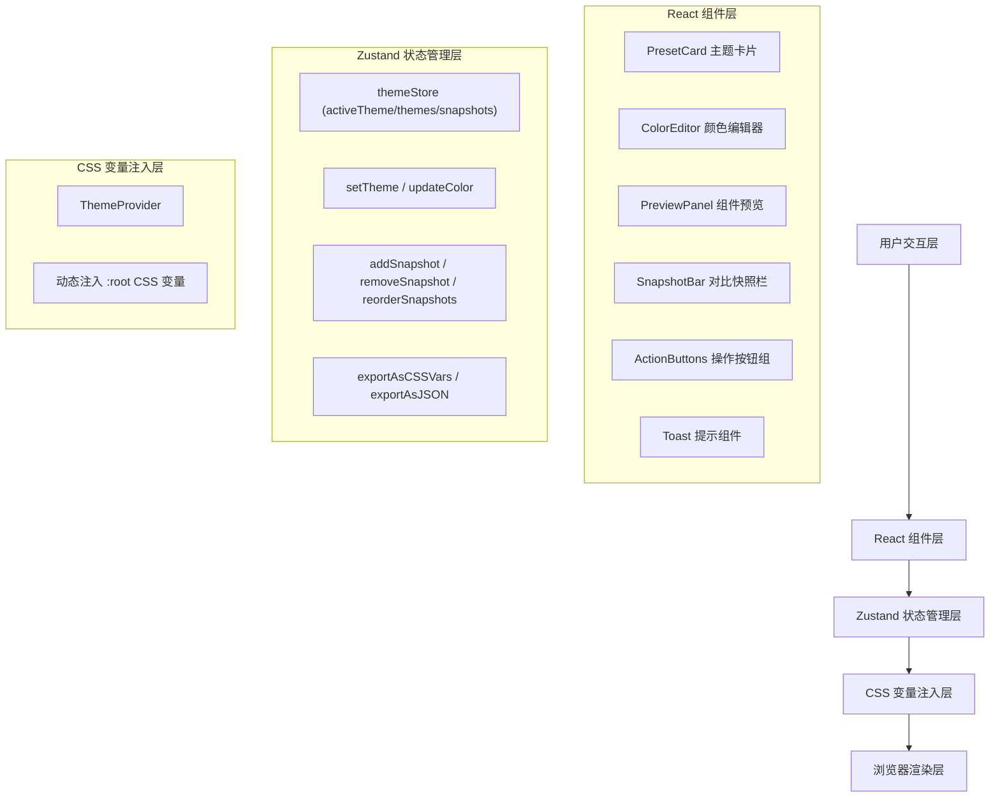

## 1. 架构设计



## 2. 技术描述

- **前端框架**：React@18 + TypeScript@5
- **构建工具**：Vite@5
- **状态管理**：Zustand@4（轻量级状态管理，避免不必要的重渲染）
- **颜色选择器**：react-colorful（轻量级、高性能颜色选择器）
- **拖拽排序**：@dnd-kit/sortable + @dnd-kit/utility（现代化拖拽库）
- **唯一ID生成**：uuid
- **样式方案**：CSS Modules + CSS变量（实现主题切换零JS重渲染）
- **字体**：Google Fonts - Inter

## 3. 目录结构

```
├── src/
│   ├── modules/
│   │   ├── themeStore.ts        # Zustand 主题状态管理
│   │   └── ThemeProvider.tsx    # CSS变量注入提供者
│   ├── components/
│   │   ├── PresetCard.tsx       # 预设主题卡片
│   │   ├── ColorEditor.tsx      # 颜色编辑面板
│   │   ├── PreviewPanel.tsx     # 8种UI组件预览
│   │   ├── SnapshotBar.tsx      # 对比快照栏（新增）
│   │   ├── SnapshotCard.tsx     # 单个快照卡片（新增）
│   │   ├── ActionButtons.tsx    # 操作按钮组（新增）
│   │   └── Toast.tsx            # Toast提示组件（新增）
│   ├── App.tsx                  # 主应用组件
│   ├── main.tsx                 # 入口文件
│   └── index.css                # 全局样式
├── package.json
├── tsconfig.json
├── vite.config.js
└── index.html
```

## 4. 数据模型

### 4.1 主题数据结构
```typescript
interface ThemeColors {
  bgPrimary: string;      // 背景主色
  bgSecondary: string;    // 背景辅色
  cardBg: string;         // 卡片底色
  textPrimary: string;    // 主文本色
  textSecondary: string;  // 辅助文本色
  buttonPrimary: string;  // 按钮主色
  buttonHover: string;    // 按钮悬停色
  borderColor: string;    // 边框色
}

interface Theme {
  id: string;
  name: string;
  colors: ThemeColors;
}

interface Snapshot {
  id: string;
  themeId: string;
  themeName: string;
  colors: ThemeColors;
  timestamp: number;
}
```

### 4.2 预设主题数据
```typescript
const PRESET_THEMES: Theme[] = [
  {
    id: 'minimal-white',
    name: '极简白',
    colors: {
      bgPrimary: '#ffffff',
      bgSecondary: '#f8f9fa',
      cardBg: '#ffffff',
      textPrimary: '#1a1b1e',
      textSecondary: '#6b7280',
      buttonPrimary: '#3b82f6',
      buttonHover: '#2563eb',
      borderColor: '#e5e7eb',
    }
  },
  // ... 其他4个主题
];
```

## 5. 核心模块说明

### 5.1 themeStore.ts (Zustand Store)
- 管理当前活跃主题 `activeThemeId`
- 管理所有主题列表 `themes`
- 管理对比快照列表 `snapshots`（最多3个）
- 提供 `setTheme(id)`、`updateColor(themeId, colorKey, value)` 方法
- 提供 `addSnapshot()`、`removeSnapshot(id)`、`reorderSnapshots(activeId, overId)` 方法
- 提供 `exportAsCSSVars()` 返回格式化的CSS变量字符串
- 提供 `exportAsJSON()` 触发JSON文件下载

### 5.2 ThemeProvider.tsx
- 订阅 `themeStore` 中当前主题的颜色值
- 将颜色值转换为CSS变量（`--color-bg-primary` 等格式）
- 通过内联 `style` 属性注入到根元素
- 提供 `getCSSVariables()` 方法供导出模块使用
- 使用 `useEffect` 监听主题变化，确保CSS变量实时更新

### 5.3 PreviewPanel.tsx
- 纯CSS变量驱动，不订阅Zustand状态
- 8种UI组件：导航栏、卡片、表单输入框、按钮（主/次/禁用）、提示条、加载旋转器、标签、下拉菜单
- 组件数据硬编码，只做样式展现
- 每行4个组件，响应式布局
- 所有样式通过 `var(--color-xxx)` 获取

## 6. 性能优化策略

1. **CSS变量驱动样式**：主题切换仅更新CSS变量，无需React重渲染组件
2. **Zustand 选择器优化**：组件仅订阅必要的状态切片
3. **React.memo 包裹**：所有组件使用 `React.memo` 避免不必要重渲染
4. **过渡动画**：使用CSS `transition: all 0.3s ease` 实现平滑过渡
5. **懒加载**：颜色选择器按需加载，减少首屏体积

## 7. 性能指标验证

- 主题切换 → 所有组件样式更新总时间 ≤ 100ms
- 使用 `performance.now()` 在 `setTheme` 前后打点验证
- 开发环境启用 React DevTools Profiler 监控重渲染
