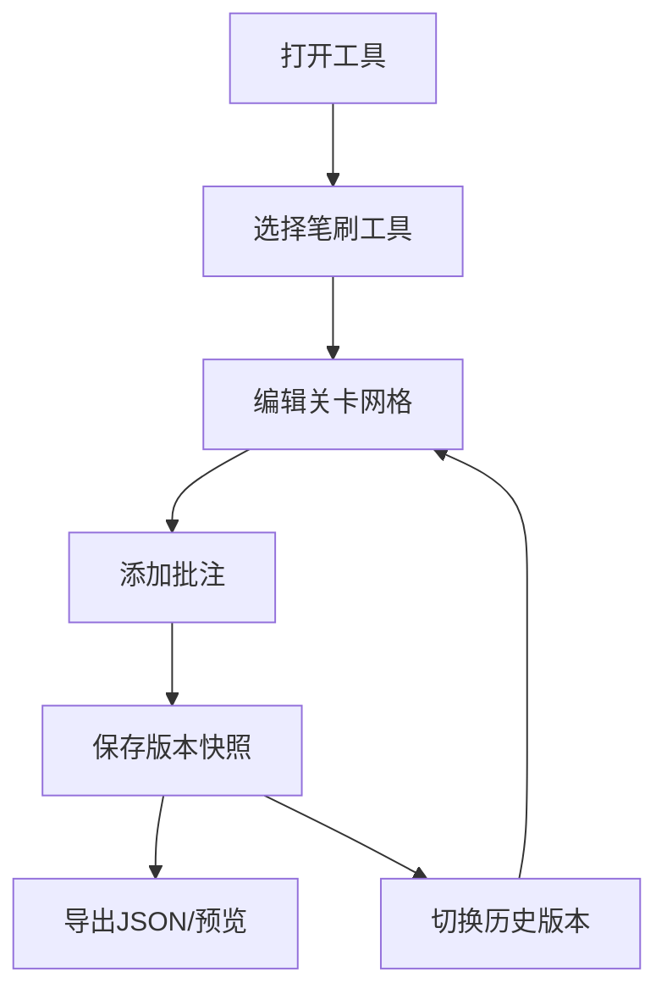

## 1. 产品概述

关卡地图协同规划工具是一款面向小型游戏开发团队（2-3人）的浏览器应用，旨在解决多人通过共享Excel或截图沟通关卡布局时效率低下、难以直观定位问题和版本混乱的痛点。

- 核心价值：提供可视化的关卡网格编辑器、实时批注协作和版本快照管理，提升团队沟通效率
- 目标用户：独立游戏开发者、小型游戏工作室的关卡设计师和策划人员

## 2. 核心功能

### 2.1 用户角色

| 角色 | 注册方式 | 核心权限 |
|------|----------|----------|
| 团队成员 | 无需注册，直接使用 | 编辑关卡、添加批注、管理版本快照、导出数据 |

### 2.2 功能模块

1. **关卡网格编辑器**：20x15网格画布，多种笔刷工具，支持缩放和平移
2. **批注与协作模块**：地图批注添加、回复、状态管理，批注列表展示
3. **版本快照管理**：快照保存、预览、切换、版本说明
4. **导出与预览**：JSON格式导出、只读预览模式

### 2.3 页面详情

| 页面名称 | 模块名称 | 功能描述 |
|----------|----------|----------|
| 主编辑页 | 工具面板 | 6种笔刷工具选择（地板、墙壁、玩家起点、敌人刷新点、收集品、出口），当前笔刷高亮显示 |
| 主编辑页 | 网格编辑器 | 20x15可交互网格，左键放置/右键擦除，Shift批量填充，缩放(50%-200%)和滚轮平移 |
| 主编辑页 | 批注面板 | 批注列表（按时间倒序），支持回复（嵌套2层）和标记已解决，可折叠隐藏 |
| 主编辑页 | 版本栏 | 底部横向快照卡片，保存快照功能，左右箭头切换相邻版本 |
| 主编辑页 | 导出预览 | 导出JSON到剪贴板，只读预览模式 |

## 3. 核心流程

### 3.1 关卡编辑流程

用户打开工具 → 选择笔刷工具 → 在网格上点击/拖动放置元素 → 右键擦除元素 → 按住Shift批量填充 → 缩放/平移查看细节 → 保存版本快照

### 3.2 批注协作流程

用户在地图上点击添加批注 → 输入批注文字（最多500字） → 批注以黄色气泡显示 → 团队成员查看批注列表 → 回复批注（最多嵌套2层） → 标记为已解决（气泡变绿色）

### 3.3 版本管理流程

用户编辑完成 → 点击保存快照 → 输入版本说明（30字以内） → 快照以缩略图卡片展示在底部 → 点击卡片切换版本 → 左右箭头快速切换相邻版本

## 4. 用户界面设计

### 4.1 设计风格

- **设计主题**：深色游戏开发工具风格，专业且沉浸
- **主色调**：#1a1a2e（深靛蓝）作为主背景
- **辅色调**：#16213e（深蓝）作为面板背景
- **强调色**：#e94560（珊瑚红）作为高亮和交互元素
- **文字色**：#e0e0e0（浅灰）确保可读性
- **网格背景**：#333（深灰）
- **分割线**：#444（1px实线）

### 4.2 布局结构

整体采用 **左（工具）+ 中（主画布）+ 右（批注）+ 底（版本历史）** 的四栏布局：

- **左侧工具面板**：280px宽，4x2网格排列的笔刷图标按钮
- **中间主画布区**：自适应宽度，包含可缩放平移的20x15网格编辑器
- **右侧批注面板**：可折叠，最大高度400px，带自定义滚动条
- **底部版本栏**：固定高度，横向滚动的快照缩略图卡片

### 4.3 交互设计

- **笔刷按钮**：悬停时缩放1.05倍并显示阴影，选中时亮蓝色边框高亮
- **批注气泡**：黄色（待解决）→ 绿色（已解决）0.3秒渐变过渡
- **面板切换**：批注面板展开/收起动画毫秒级响应
- **版本切换**：0.5秒内完成画布重绘
- **编辑器性能**：缩放/平移保持60FPS

### 4.4 视觉元素

| 元素类型 | 颜色 | 图标/标识 |
|----------|------|-----------|
| 地板 | #5a5a7a | 方形填充 |
| 墙壁 | #2d2d4a | 实心方块 |
| 玩家起点 | #4ade80 | 人形图标/P |
| 敌人刷新点 | #f87171 | 骷髅图标/E |
| 收集品 | #facc15 | 星星图标/C |
| 出口 | #a78bfa | 门图标/X |
| 批注气泡（待解决） | #fbbf24 | 黄色圆形 |
| 批注气泡（已解决） | #22c55e | 绿色圆形 |

### 4.5 响应式

- 桌面端优先设计，最小支持宽度1280px
- 批注面板可折叠以节省横向空间
- 版本栏支持横向滚动查看更多快照

### 4.6 动画与过渡

- 所有状态变化使用CSS过渡（transition: all 0.3s ease）
- 批注状态变化：黄色到绿色的渐变持续0.3s
- 笔刷悬停：transform: scale(1.05) + box-shadow
- 面板展开/收起：height过渡 + opacity过渡
