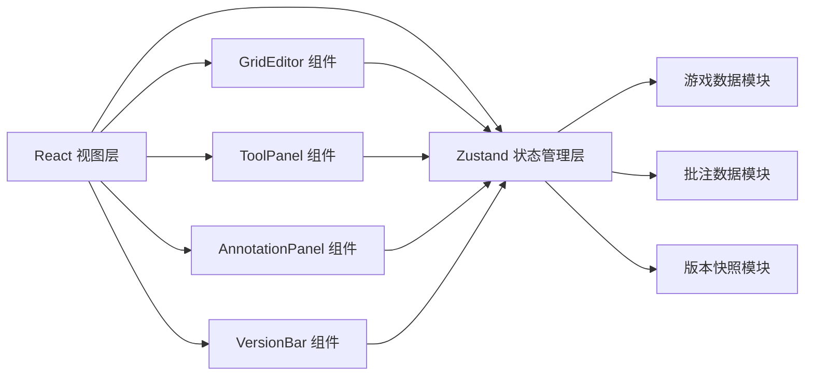

## 1. 架构设计



整体采用 **单页应用 (SPA)** 架构，使用 React 作为视图层，Zustand 作为全局状态管理。所有状态集中管理，组件通过订阅 store 实现响应式更新。

## 2. 技术描述

- **前端框架**：React 18 + TypeScript
- **构建工具**：Vite 5
- **状态管理**：Zustand 4
- **样式方案**：原生 CSS (CSS Modules 思想，使用类名约定)
- **唯一ID生成**：uuid
- **HTTP库**：axios（预留扩展，当前版本纯前端）

## 3. 文件结构

```
├── index.html                    # 入口HTML
├── package.json                  # 项目依赖
├── tsconfig.json                 # TypeScript配置
├── vite.config.js                # Vite配置
└── src/
    ├── App.tsx                   # 主布局组件
    ├── store/
    │   └── gameStore.ts          # Zustand状态管理
    └── components/
        ├── GridEditor.tsx        # 网格编辑器组件
        ├── ToolPanel.tsx         # 工具面板组件
        ├── AnnotationPanel.tsx   # 批注面板组件
        └── VersionBar.tsx        # 版本栏组件
```

## 4. 数据模型

### 4.1 核心类型定义

```typescript
// 格子元素类型
type CellType = 'empty' | 'floor' | 'wall' | 'player' | 'enemy' | 'collectible' | 'exit';

// 网格数据 - 20列 x 15行
interface GridData {
  cells: CellType[][]; // [row][col]
}

// 批注回复
interface AnnotationReply {
  id: string;
  author: string;
  content: string;
  timestamp: number;
}

// 批注
interface Annotation {
  id: string;
  x: number;          // 网格坐标列
  y: number;          // 网格坐标行
  author: string;
  content: string;
  timestamp: number;
  resolved: boolean;
  replies: AnnotationReply[];
}

// 版本快照
interface VersionSnapshot {
  id: string;
  version: number;
  description: string;
  timestamp: number;
  gridData: CellType[][];
  annotations: Annotation[];
}

// 工具类型
type ToolType = 'floor' | 'wall' | 'player' | 'enemy' | 'collectible' | 'exit' | 'annotation';
```

### 4.2 Zustand Store 状态

```typescript
interface GameState {
  // 网格数据
  gridData: CellType[][];
  
  // 当前工具
  currentTool: ToolType;
  
  // 缩放与平移
  zoom: number;        // 50% - 200%
  offsetX: number;
  offsetY: number;
  
  // 批注列表
  annotations: Annotation[];
  
  // 版本快照
  snapshots: VersionSnapshot[];
  currentSnapshotIndex: number;
  
  // UI状态
  annotationPanelOpen: boolean;
  previewMode: boolean;
  
  // Actions
  setCell: (row: number, col: number, type: CellType) => void;
  setCurrentTool: (tool: ToolType) => void;
  setZoom: (zoom: number) => void;
  setOffset: (x: number, y: number) => void;
  addAnnotation: (x: number, y: number, content: string, author: string) => void;
  toggleAnnotationResolved: (id: string) => void;
  addReply: (annotationId: string, content: string, author: string) => void;
  saveSnapshot: (description: string) => void;
  restoreSnapshot: (index: number) => void;
  goToPrevSnapshot: () => void;
  goToNextSnapshot: () => void;
  toggleAnnotationPanel: () => void;
  togglePreviewMode: () => void;
  exportToJSON: () => string;
}
```

## 5. 组件职责

### 5.1 GridEditor (网格编辑器)
- 渲染 20x15 的网格画布
- 处理鼠标事件（点击、拖动、滚轮）
- 绘制各种元素（地板、墙壁、玩家、敌人、收集品、出口）
- 绘制批注气泡
- 支持缩放和平移变换
- 处理左键放置、右键擦除、Shift批量填充

### 5.2 ToolPanel (工具面板)
- 展示6种笔刷工具（4x2网格布局）
- 管理当前选中工具状态
- 高亮显示当前选中的笔刷
- 提供缩放控制（50%-200%）
- 提供导出和预览按钮

### 5.3 AnnotationPanel (批注面板)
- 展示批注列表（按时间倒序）
- 支持展开/收起面板
- 支持回复批注（嵌套2层）
- 支持标记批注为已解决
- 自定义滚动条样式
- 最大高度400px

### 5.4 VersionBar (版本栏)
- 底部横向展示快照缩略图卡片（80x60像素）
- 提供保存快照按钮
- 左右箭头切换相邻版本
- 显示当前版本号和说明
- 支持横向滚动

## 6. 性能优化策略

1. **Canvas 渲染**：使用 Canvas API 绘制网格，保证60FPS缩放/平移性能
2. **状态优化**：Zustand 使用 selector 避免不必要的重渲染
3. **节流/防抖**：鼠标拖动和滚轮事件使用 requestAnimationFrame 节流
4. **批量更新**：Shift批量填充时一次性更新状态，避免逐格触发
5. **缩略图缓存**：版本快照的缩略图在保存时生成并缓存

## 7. 导出数据格式

```json
{
  "width": 20,
  "height": 15,
  "cells": [
    { "x": 0, "y": 0, "type": "wall" },
    { "x": 1, "y": 0, "type": "floor" }
  ],
  "annotations": [
    {
      "id": "...",
      "x": 5,
      "y": 3,
      "author": "设计师A",
      "content": "这里需要增加一个平台",
      "timestamp": 1234567890,
      "resolved": false,
      "replies": []
    }
  ],
  "exportTime": 1234567890
}
```
